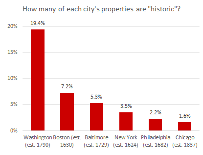
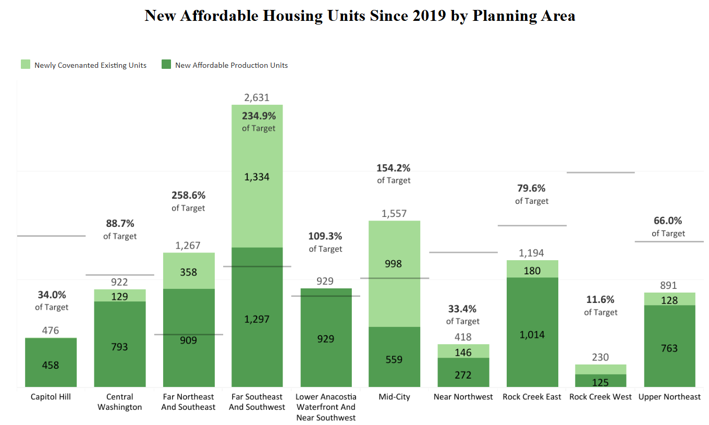
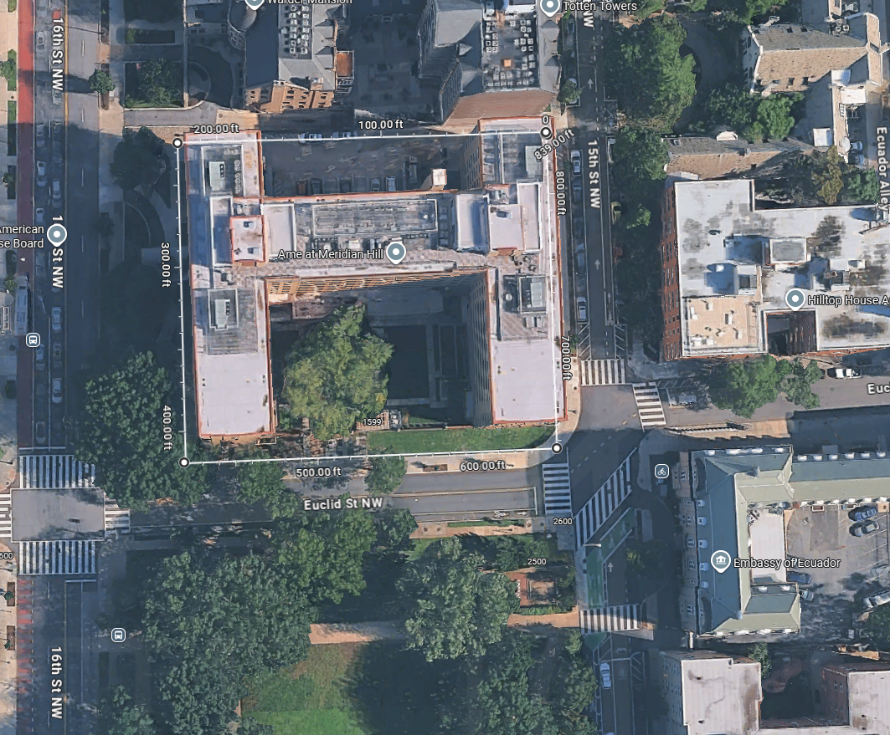
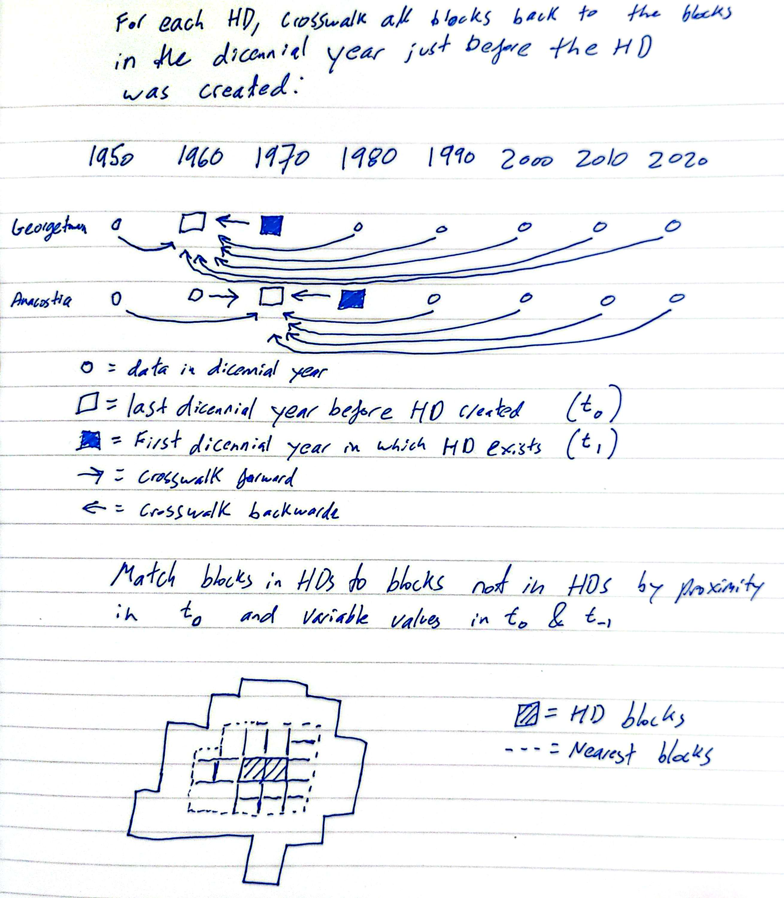

```{css, echo=FALSE}
#table-of-contents {
  display: none;
}
.Wrap {
  width: 100% !important;
  margin: 2px !important;
  padding: 2px !important;
  max-width: 3000px !important;
}
.Sidebar {
  position: fixed !important;
  left: 0 !important;
  top: 0 !important;
  height: 100% !important;
  overflow-y: auto !important;
  z-index: 999 !important;
}
.Main {
  margin-left: 250px !important;
  margin-right: 0px !important;
  padding: 20px !important;
  width: auto !important;
}


/* Style for the toggle button */
#sidebar-toggle {
  position: fixed;
  top: 10px;
  left: 10px;
  z-index: 1000;
  padding: 8px 12px;
  background-color: #3b3b3b;
  color: white;
  border: none;
  border-radius: 4px;
  cursor: pointer;
  font-size: 14px;
}

#sidebar-toggle:hover {
  background-color: #3b3b3b;
}

/* Adjust layout when sidebar is hidden */
.Sidebar.hidden {
  display: none !important;
}

.Main.sidebar-hidden {
  margin-left: 20px !important;
}
```

```{js, echo=FALSE}
// Add toggle button and functionality
document.addEventListener('DOMContentLoaded', function() {
  // Create toggle button
  var btn = document.createElement('button');
  btn.id = 'sidebar-toggle';
  btn.innerHTML = '☰ Hide Sidebar';
  document.body.appendChild(btn);
  
  // Get sidebar and main content elements
  var sidebar = document.querySelector('.Sidebar');
  var main = document.querySelector('.Main');
  
  // Toggle function
  btn.addEventListener('click', function() {
    if (sidebar && main) {
      sidebar.classList.toggle('hidden');
      main.classList.toggle('sidebar-hidden');
      
      // Update button text
      if (sidebar.classList.contains('hidden')) {
        btn.innerHTML = '☰ Show Sidebar';
      } else {
        btn.innerHTML = '☰ Hide Sidebar';
      }
    }
  });
});
```

# !!!WORK IN PROGRESS!!!

running list of TODOs:

1. Finish summary section
2. Revise policy section
3. Share to be torn apart by critics

<br>


<br>

# Summary


This report probes relationships between historic districts (HDs) and neighborhood change in Washington DC. 

The main findings from the literature review:

1. It's challenging to tease out the specific causal impact of HD designation on neighborhood demographics. This because HD designation itself is almost certainly correlated with wealth, residents' levels of formal education, residents' policy preferences concerning density, and the local share of white residents. 
2. HDs neighborhoods often accrue wealthier, more educated residents over time.
3. There's evidence they become/remain whiter as well.
4. The specific impacts are obviously context dependent. We have to be careful generalizing from a study in another city to DC. (athough that's not to say we can't learn from other places)

Main findings from the DC-specific analysis:

1. HDs cover a lot of DC: almost 20% of all residential-zoned land. This is significantly higher than in comparable cities.
2. HDs tend to overlap more with "residential flat" zones (think rowhouses), because rowhouse areas are more likely to be in older parts of the District. Conversely, outside of HDs, there's both suburban zone and apartment zone area.
3. There is some heterogeneity among historic districts, but in general, DC's HDs are significantly wealthier and whiter than the rest of the District. HDs are 59% residents that identify as "white alone" compared to 37% of DC as a whole. The median household income in HDs is almost \$27,000 higher than non-HD parts of DC. That said, moderate-income renters, making less than \$75,000/year, are 10 percentage points more likely to be rent burdened in HDs than moderate-income renters outside of HDs.
4. After HD designation, HDs tended to become whiter and less dense, relative to non-HD areas nearby. The difference is approximately 9 people per acre. If HDs's population density had grown apace with similar nearby areas, 27,404 more people might be living in HDs now. That is roughly the number of people that live within a mile of the Van Ness Metro station.
5. There's a pattern in which some HDs, especially in Northwest, don't seem to have many new affordable housing projects (or new housing construction in general) relative to areas outside HDs. Overall, HDs have half the affordable housing projects you would expect, based on their share of DC's land area. (Some HDs have been building more new housing, at least in certain areas; Takoma is one example).
6. Like many neighborhoods in DC, many HDs have a significant share of homes that were subject to racially-discriminatory covenants. The HD nomination documents sometimes do not address this, or address it in odd ways. 
7. Overall, houses in HDs lag in terms of solar adoption, especially in detached house neighborhoods. We do not find large differences in building energy performance inside versus outside HDs for bigger buildings, although in general older buildings have worse energy efficiency.

<br>


# Analysis

## Basics

```{r setup, warning=F, message=F, echo=F, results="hide"}
knitr::opts_chunk$set(echo=F, message=F, warning=F, out.width = "90%")


# Session and package info:

# R version 4.5.1 (2025-06-13 ucrt)
# Platform: x86_64-w64-mingw32/x64
# Running under: Windows 11 x64 (build 26100)
# 
# Matrix products: default
#   LAPACK version 3.12.1
# 
# locale:
# [1] LC_COLLATE=English_United States.utf8  LC_CTYPE=English_United States.utf8    LC_MONETARY=English_United States.utf8
# [4] LC_NUMERIC=C                           LC_TIME=English_United States.utf8    
# 
# time zone: America/New_York
# tzcode source: internal
# 
# attached base packages:
# [1] stats     graphics  grDevices utils     datasets  methods   base     
# 
# other attached packages:
#  [1] lfe_3.1.1            Matrix_1.7-3         lmtest_0.9-40        zoo_1.8-14           HonestDiD_0.2.6      haven_2.5.5         
#  [7] here_1.0.2           SnowballC_0.7.1      tm_0.7-16            NLP_0.3-2            ggdark_0.2.1         gtools_3.9.5        
# [13] fixest_0.12.1        did_2.1.2            plotly_4.11.0        gridExtra_2.3        dplyr_1.1.4          rstudioapi_0.17.1   
# [19] leaflet.extras_2.0.1 leaflet_2.2.2        sf_1.0-21            readr_2.1.5          ggplot2_3.5.2       
# 
# loaded via a namespace (and not attached):
#   [1] DBI_1.2.3            pROC_1.19.0.1        remotes_2.5.0        sandwich_3.1-1       rlang_1.1.6         
#   [6] magrittr_2.0.4       dreamerr_1.5.0       otel_0.2.0           e1071_1.7-16         compiler_4.5.1      
#  [11] vctrs_0.6.5          reshape2_1.4.4       stringr_1.6.0        pkgconfig_2.0.3      fastmap_1.2.0       
#  [16] backports_1.5.0      rmarkdown_2.30       prodlim_2025.04.28   tzdb_0.5.0           purrr_1.1.0         
#  [21] xfun_0.52            jsonlite_2.0.0       stringmagic_1.2.0    recipes_1.3.1        broom_1.0.11        
#  [26] parallel_4.5.1       R6_2.6.1             stringi_1.8.7        RColorBrewer_1.1-3   parallelly_1.45.1   
#  [31] car_3.1-3            rpart_4.1.24         numDeriv_2016.8-1.1  lubridate_1.9.4      Rcpp_1.1.0          
#  [36] iterators_1.0.14     BMisc_1.4.8          knitr_1.51           future.apply_1.20.1  splines_4.5.1       
#  [41] nnet_7.3-20          timechange_0.3.0     tidyselect_1.2.1     abind_1.4-8          yaml_2.3.10         
#  [46] timeDate_4051.111    codetools_0.2-20     listenv_0.10.0       lattice_0.22-7       tibble_3.3.0        
#  [51] plyr_1.8.9           withr_3.0.2          evaluate_1.0.5       future_1.68.0        survival_3.8-3      
#  [56] units_0.8-7          proxy_0.4-27         xml2_1.4.0           pillar_1.11.1        ggpubr_0.6.2        
#  [61] carData_3.0-5        KernSmooth_2.23-26   foreach_1.5.2        stats4_4.5.1         generics_0.1.4      
#  [66] rprojroot_2.1.1      hms_1.1.4            scales_1.4.0         xtable_1.8-4         globals_0.18.0      
#  [71] slam_0.1-55          class_7.3-23         glue_1.8.0           lazyeval_0.2.2       tools_4.5.1         
#  [76] data.table_1.17.8    ModelMetrics_1.2.2.2 gower_1.0.2          ggsignif_0.6.4       forcats_1.0.1       
#  [81] grid_4.5.1           tidyr_1.3.1          crosstalk_1.2.2      ipred_0.9-15         nlme_3.1-168        
#  [86] Formula_1.2-5        cli_3.6.5            viridisLite_0.4.2    lava_1.8.2           gtable_0.3.6        
#  [91] rstatix_0.7.3        digest_0.6.37        classInt_0.4-11      caret_7.0-1          htmlwidgets_1.6.4   
#  [96] farver_2.1.2         htmltools_0.5.8.1    lifecycle_1.0.4      hardhat_1.4.2        httr_1.4.7          
# [101] MASS_7.3-65  

# load required libraries
# remove.packages("ggplot2")
# remotes::install_version("ggplot2", version = "3.5.2")
library(readr)             # package to help us load csv and excel files
library(sf)                # geospatial analysis package
library(leaflet)           # spatial data plotting package
library(leaflet.extras)
library(rstudioapi)        # package to let us set the working directory
library(dplyr)             # data manipulation package
library(ggplot2)           # charts package
library(gridExtra)         # package to plot multiple charts beside each other
library(plotly)            # interactive visualization package
library(did)               # difference-in-difference analysis package
library(fixest)            # difference-in-difference analysis package
library(gtools)
library(ggdark)            # dark plotting theme
library(tm)                # text mining package
library(SnowballC)         # word stemming algo package

# Getting the path of your current open file
# current_path = rstudioapi::getActiveDocumentContext()$path 
# setwd(dirname(current_path))
# load functions we've written to help with the analysis below
# (we've stored those in a separate file to make the code easier to read)
source("supporting_functions.R")

# whether to print some messages that can help w/ debugging, etc
VERBOSE = FALSE
# whether to load saved data objects for the diff-in-diff analysis,
# or recalculate them from scratch
# set this to true if you want to change different parameters in the 
# functions that create the xwalks and time series objects
# otherwise, the script will load the xwalks and time series data frame
# from the main results run:
RUN_EVERYTHING_FROM_SCRATCH = FALSE
# Whether to run all of the code chunks or just a subset 
# (this is just for debugging while working on the markdown script)
EVALUATE_ADDITIONAL_CHUNKS = TRUE


# turn off spherical geometry (s2)
sf_use_s2(FALSE)


# load data that has the dates the historic districts were designated
# comes from here: https://planning.dc.gov/page/dc-historic-districts
hd_data <- readr::read_csv("https://docs.google.com/spreadsheets/d/1Ajl1iAS0NRB7vk_UFDveeWzGkwf3tuiDo-zV9_wtzRM/gviz/tq?tqx=out:csv&sheet=data")
# hd_data <- readr::read_csv("./hd_data/data.csv")

# load urban turf apartment projects data:
ut <- readr::read_csv("https://docs.google.com/spreadsheets/d/1Y6aoKym6u7dMvHhZEkFeRAyowqTzstwRuAKzk2XLg9A/gviz/tq?tqx=out:csv&sheet=data")
# ut <- readr::read_csv("temp_data/urban turf pipeline projects.csv") %>% mutate(size = as.numeric(size))

# load affordable housing data from Open Data DC:
ah <- readr::read_csv("https://docs.google.com/spreadsheets/d/1vVJ_AshZVdxJpXrbSutCfHxK3tfgoi1Q-fIus-hm7RA/gviz/tq?tqx=out:csv&sheet=data")
# ah <- readr::read_csv("temp_data/affordable_housing.csv")

# load the historic district boundary shape files
# comes from here: https://opendata.dc.gov/datasets/DCGIS::historic-districts/about 
hd_shp <- sf::st_read("Historic_Districts/Historic_Districts.shp", quiet=T)
hd_shp_copy <- sf::st_read("Historic_Districts/Historic_Districts.shp", quiet=T)

# load the 2022 ward shape files
# comes from here: https://opendata.dc.gov/datasets/DCGIS::wards-from-2022/about
ward_shp <- sf::st_read("Wards_from_2022/Wards_from_2022.shp", quiet=T)


# Building footprint data from here: https://opendata.dc.gov/datasets/DCGIS::building-footprints/explore
bf <- 
  sf::st_read("Building_Footprints/Building_Footprints.shp", quiet=T) %>%
  sf::st_transform(26918) %>%
  filter(DESCRIPTIO == "Building")

# load data at the tract level 
# (not done in main analysis; ended up using blocks because they're smaller)
# t50_shp <- load_clean_tracts("GISJOIN", "BOA03", "BOA01", "BZ801", 1950)
# t60_shp <- load_clean_tracts("GISJOIN", "B58013", "B58011", "CA4001", 1960)
# t70_shp <- load_clean_tracts("GISJOIN", "CEB03", "CEB01", "CY7001", 1970)
# t80_shp <- load_clean_tracts("GISJOIN", "C9D003", "C9D001", "C7L001", 1980)
# t90_shp <- load_clean_tracts("TRACTNO", "BLACK", "WHITE", "POPULATION", 1990)
# t00_shp <- load_clean_tracts("TRACTNO", "BLACK", "WHITE", "TOTAL", 2000)
# t10_shp <- load_clean_tracts("TRACT", "P0010004", "P0010003", "P0010001", 2010)
# t20_shp <- load_clean_tracts("TRACT", "P0010004", "P0010003", "P0010001", 2020)
# invisible(gc())

# Load raw block data:
# 1950 and 1960 block data from here: https://blogs.gwu.edu/centerforwashingtonareastudies/resources/. Compiled by Leah Brooks and team.
b40_shp <- sf::st_read("block_shapes/1940_block_shapefiles/1940_census_DC_joined.shp", quiet=T)
b50_shp <- sf::st_read("block_shapes/1950_block_shapefiles/1950_census_blocks_joined.shp", quiet=T)
b60_shp <- sf::st_read("block_shapes/1960_block_shapefiles/1960_census_blocks_joined.shp", quiet=T)
# other block data come from IPUMS NHGIS
b70_shp <- sf::st_read("block_shapes/DC_block_1970/DC_block_1970.shp", quiet=T)
b80_shp <- sf::st_read("block_shapes/DC_block_1980/DC_block_1980.shp", quiet=T)
b90_shp <- sf::st_read("block_shapes/nhgis0092_shapefile_tl2000_110_block_1990/DC_block_1990.shp", quiet=T)
b00_shp <- sf::st_read("block_shapes/nhgis0092_shapefile_tl2000_110_block_2000/DC_block_2000.shp", quiet=T)
b10_shp <- sf::st_read("block_shapes/nhgis0092_shapefile_tl2010_110_block_2010/DC_block_2010.shp", quiet=T)
b20_shp <- sf::st_read("block_shapes/nhgis0092_shapefile_tl2020_110_block_2020/DC_block_2020.shp", quiet=T)

b70_df <- readr::read_csv("block_data/nhgis0093_ds96_1970_block.csv")
b80_df <- readr::read_csv("block_data/nhgis_ds104_1980_block_11.csv")
b90_df <- readr::read_csv("block_data/nhgis0092_ds120_1990_block.csv")
b00_df <- readr::read_csv("block_data/nhgis0092_ds147_2000_block.csv")
b10_df <- readr::read_csv("block_data/nhgis0092_ds172_2010_block.csv")
b20_df <- readr::read_csv("block_data/nhgis0092_ds258_2020_block.csv")

invisible(gc())

# rework 1940, 1950 and 1960 data a little bit:
b40_shp <- 
  b40_shp %>% 
  mutate(n_tot = as.numeric(tot_occ), 
         n_white = as.numeric(tot_occ) - as.numeric(nw_occ),
         n_black = n_tot - n_white) %>% 
  select(n_tot, n_black, n_white) %>% 
  mutate(geo_id = as.character(row_number())) %>% mutate(year=1940) %>% 
  sf::st_transform(., 26918) %>%
  mutate(geo_area_meters = sf::st_area(.))
b50_shp <- 
  b50_shp %>% 
  mutate(n_tot = as.numeric(total_occ), 
         n_white = as.numeric(total_occ) - as.numeric(non_white_),
         n_black = n_tot - n_white) %>% 
  select(n_tot, n_black, n_white) %>% 
  mutate(geo_id = as.character(row_number())) %>% mutate(year=1950) %>% 
  sf::st_transform(., 26918) %>%
  mutate(geo_area_meters = sf::st_area(.))

b60_shp <- 
  b60_shp %>% 
  # the 1960 data doesn't have race cross tabs by individual person,
  # but we can take the household race breakdown and apply it to the 
  # population. this is probably roughly accurate. 
  # as a robustness check we can just use the household data and rerun
  # the analysis; see the commented out code.
  mutate(n_tot = as.numeric(stringr::str_remove_all(total_pop, "\\*")), 
         pct_white = (as.numeric(total_occ) - as.numeric(nonwhite_o)) / as.numeric(total_occ)) %>% 
  # mutate(n_tot = as.numeric(total_occ), 
  #        n_white = as.numeric(total_occ) - as.numeric(nonwhite_o)) %>% 
  mutate(n_white = pct_white * n_tot,
         n_black = n_tot - n_white) %>%
  select(n_tot, n_black, n_white) %>% 
  mutate(geo_id = as.character(row_number())) %>% mutate(year=1960) %>% 
  sf::st_transform(., 26918) %>%
  mutate(geo_area_meters = sf::st_area(.))

# 1970 block data has to be specially cleaned, see https://forum.ipums.org/t/race-ethnicity-data-at-a-block-level-from-1970/6178
b70_df$c_black <- b70_df$CM6001 + b70_df$CM6002
b70_df$c_other <- b70_df$CM6003 + b70_df$CM6004
b70_df$c_white <- b70_df$CM5001 + b70_df$CM5002 - b70_df$c_black - b70_df$c_other

# merge the data and the shapefiles and clean up the data:
b70_shp <- clean_block_data(b70_shp, b70_df, "GISJOIN", "GISJOIN", "c_", "c_black", "c_white", year=1970)
b80_shp <- clean_block_data(b80_shp, b80_df, "GISJOIN", "GISJOIN", "C9D0", "C9D002", "C9D001", year=1980)
b90_shp <- clean_block_data(b90_shp, b90_df, "GISJOIN", "GISJOIN", "EUY0", "EUY002", "EUY001", year=1990)
b00_shp <- clean_block_data(b00_shp, b00_df, "GISJOIN", "GISJOIN", "FYE0", "FYE002", "FYE001", year=2000)
b10_shp <- clean_block_data(b10_shp, b10_df, "GISJOIN", "GISJOIN", "H7X", "H7X003", "H7X002", "H7X001", year=2010)
b20_shp <- clean_block_data(b20_shp, b20_df, "GISJOIN", "GISJOIN", "U7J", "U7J003", "U7J002", "U7J001", year=2020)

# remove data we don't need anymore to keep our workspace neat
rm(b70_df, b80_df, b90_df, b00_df, b10_df, b20_df)
invisible(gc())

# fix any broken geometries:
# t50_shp <- fix_geo_if_broken(t50_shp)
# t60_shp <- fix_geo_if_broken(t60_shp)
# t70_shp <- fix_geo_if_broken(t70_shp)
# t80_shp <- fix_geo_if_broken(t80_shp)
# t90_shp <- fix_geo_if_broken(t90_shp)
# t00_shp <- fix_geo_if_broken(t00_shp)
# t10_shp <- fix_geo_if_broken(t10_shp)
# t20_shp <- fix_geo_if_broken(t20_shp)
b40_shp <- fix_geo_if_broken(b40_shp)
b50_shp <- fix_geo_if_broken(b50_shp)
b60_shp <- fix_geo_if_broken(b60_shp)
b70_shp <- fix_geo_if_broken(b70_shp)
b80_shp <- fix_geo_if_broken(b80_shp)
b90_shp <- fix_geo_if_broken(b90_shp)
b10_shp <- fix_geo_if_broken(b10_shp)
b20_shp <- fix_geo_if_broken(b20_shp)

# combine shapes into one big object, remove individual objects:
# tracts_shp <- dplyr::bind_rows(t50_shp, t60_shp, t70_shp, t80_shp,
#                                t90_shp, t00_shp, t10_shp, t20_shp)
geos_shp <- dplyr::bind_rows(b40_shp, b50_shp, b60_shp, b70_shp, b80_shp, 
                             b90_shp, b00_shp, b10_shp, b20_shp)
# create a truly unique block/tract ID:
geos_shp$geo_id <- paste0(geos_shp$year, "_", geos_shp$geo_id)
# tracts_shp$geo_id <- paste0(tracts_shp$year, "_", tracts_shp$geo_id)


# remove objects we don't need anymore
rm(list=ls(pattern="^b[0-9]{2}"))
rm(list=ls(pattern="^t[0-9]{2}"))
# garbage collection
invisible(gc())

# load and simplify the zoning map:
# comes from here: https://opendata.dc.gov/datasets/DCGIS::zoning-boundaries-zoning-regulations-of-2016/about
zone_shp <- sf::st_read("zoning/Zoning_Boundaries_(Zoning_Regulations_of_2016).shp", quiet=T)

# list zones in the ZR16 data:
zones_list <- sort(unique(zone_shp$ZR16))
housing_zones <- zones_list[grep(x=zones_list, pattern = "^R|^MU|^NMU")]
# get unzoned areas:
unzoned_shp <- filter(zone_shp, ZR16=='UNZONED')
# subset zones to mostly-housing zones 
zone_shp <- zone_shp[zone_shp$ZR16 %in% housing_zones,]

# create simplified labels
zone_shp$ZR16_simple <- "Other"
zone_shp$ZR16_simple[grep(x=zone_shp$ZR16, pattern="^RA-")] <- "Apartment zones"
zone_shp$ZR16_simple[grep(x=zone_shp$ZR16, pattern="^R-")] <- "Residential zones"
zone_shp$ZR16_simple[grep(x=zone_shp$ZR16, pattern="^RF-")] <- "Residential flat zones"
zone_shp$ZR16_simple[grep(x=zone_shp$ZR16, pattern="^MU-")] <- "Mixed use zones"
zone_shp$ZR16_simple[grep(x=zone_shp$ZR16, pattern="^NMU-")] <- "Mixed use zones"

# Merge historic district (HD) data onto HD shapefile, subset to only look at neighborhood HDs:
hd_shp <- dplyr::left_join(x = hd_shp, y = hd_data, by = "UNIQUEID")
hd_shp <- hd_shp %>% filter(Neighborhood_HD==1)

# fix any broken geometries:
zone_shp <- fix_geo_if_broken(zone_shp)
unzoned_shp <- fix_geo_if_broken(unzoned_shp)
hd_shp <- fix_geo_if_broken(hd_shp)
ward_shp <- fix_geo_if_broken(ward_shp)

# convert to mercator projection
zone_shp <- sf::st_transform(zone_shp, 26918)
unzoned_shp <- sf::st_transform(unzoned_shp, 26918)
hd_shp <- sf::st_transform(hd_shp, 26918)
ward_shp <- sf::st_transform(ward_shp, 26918)

hd_shp$desig_decade <- hd_shp$desig_date - (hd_shp$desig_date %% 10)
hd_shp$LABEL <- gsub(pattern = " HD", replacement = "", x = hd_shp$LABEL)


rm(hd_data)
```


```{r percent_coverage, include=F, eval=F}
# water bodies
# https://opendata.dc.gov/datasets/1d544196d7044aef9a0ffc809de6e60c_14/explore?location=38.893201%2C-77.015700%2C12.56
wtr_shp <- sf::st_read("Waterbodies_2021/Waterbodies_2021.shp", quiet=T)

# potential additional HDs + expansions:
new_hd_file_names <- list.files("potential_new_hds")

for (ii in 1:length(new_hd_file_names)) {
  temp <- sf::st_read(paste0("potential_new_hds/", new_hd_file_names[ii])) %>% sf::st_transform(26918)
  if (ii == 1) {
    new_hds <- temp
  } else {
    new_hds <- dplyr::bind_rows(new_hds, temp)
  }
}
new_hds <- sf::st_union(sf::st_as_sf(new_hds))
existing_new_hds <- sf::st_union(hd_shp_copy %>% sf::st_transform(26918), new_hds)

# get % of DC that is covered by HDs:

# including water area
as.vector(round( 100 *
                   sf::st_area(
                     sf::st_union(hd_shp_copy) %>% sf::st_transform(26918)
                     ) /
                   sf::st_area(
                     sf::st_union(ward_shp) %>% sf::st_transform(26918) ),
                 0 ))

# just land area:
as.vector(round( 100 *
                   sf::st_area(
                     sf::st_difference( sf::st_union(hd_shp_copy) %>% sf::st_transform(26918), sf::st_union(wtr_shp) %>% sf::st_transform(26918) )
                     ) /
                   sf::st_area(
                     sf::st_difference( sf::st_union(ward_shp) %>% sf::st_transform(26918), sf::st_union(wtr_shp) %>% sf::st_transform(26918) )
                     ),
                 0 ))

# just land area including potential new HDs
as.vector(round( 100 *
                   sf::st_area(
                     sf::st_difference( sf::st_union(existing_new_hds %>% filter(!is.na(st_is_valid(.)))) %>% 
                                          sf::st_transform(26918), 
                                        sf::st_union(wtr_shp) %>% sf::st_transform(26918) )
                     ) /
                   sf::st_area(
                     sf::st_difference( sf::st_union(ward_shp) %>% sf::st_transform(26918), 
                                        sf::st_union(wtr_shp) %>% sf::st_transform(26918) )
                     ),
                 0 ))
```


In 2020, roughly 132,000 DC residents, or 19% of our population, lived in neighborhood historic districts. DC has significantly more historic properties than similar cities.



This is partly because of the way historic districts (HDs) are designated in DC.

HD designations in DC aren't voted on by the public. Instead, basically anyone can bring a nomination to DC's Historic Preservation Review Board (HPRB): "Property owners, government agencies, Advisory Neighborhood Commissions, and community organizations that include historic preservation among their purposes are eligible applicants for historic designation. HPRB and HPO [DC's Historic Preservation Office, part of the Office of Planning] can also nominate properties to the Inventory." 

The HPRB is supposed to have 9 members, all of which must be appointed by the Mayor and confirmed by DC Council. According to the HPRB website (accessed Nov. 2025), there are currently only 6 members on the board. (Three of them live in Ward 3 and one each live in Wards 4, 5, and 6. None live in Wards 1, 7, or 8).

Here is the high-level standard the board uses for reviewing HD nominations: "Properties are eligible for designation in the DC Inventory if they possess significance, retain integrity, and can be judged from a historical perspective." 

In other words, if the buildings are more or less intact and have a "significant" amount of history, the HPRB can approve the nomination. Whether or not the community actually supports the designation is [not one of the criteria](https://ggwash.org/view/67466/historic-district-in-kingman-park-poised-for-approval-despite-continued-debate), a fact HPRB states on their [own website](https://planning.dc.gov/page/apply-historic-preservation-review-board-concept-review), on their "apply for historic designation" page.

Other things to know:

* HPO and HPRB also deal with nominations for individual properties/buildings to get historic designation, but we're not going to discuss that process here, as we'll be focusing on HDs--specifically residential, "neighborhood HDs." (there are other types of HDs--Rock Creek Park is a historic district, for example).
* Finally, it's worth knowing that there's both a national historic registry, and a DC historic registry. Historic districts & buildings can be on either or both registries.


<br>

The map below shows different HDs and when they were created. Hover over each district for more info. Expansions of existing districts are not depicted; all districts are shown at their full 2025 extent. Some of the designation dates are a little fuzzy: Georgetown was part of DC's preservation regime in the 50s, for example.


```{r plot_hds, eval=EVALUATE_ADDITIONAL_CHUNKS}
pal <- colorNumeric(palette = "viridis", domain = hd_shp$desig_decade)

leaflet() %>% 
  addProviderTiles(providers$CartoDB.Positron) %>%
  addPolygons(data=hd_shp %>% st_transform(4326),
              fillColor = ~pal(hd_shp$desig_decade), 
              fillOpacity = 0.9,
              weight = 1,
              opacity = 1,
              color = "white",
              label=~paste0(LABEL, ": ", desig_date),
              highlightOptions = highlightOptions(weight = 3,
                                                  color = "white",
                                                  bringToFront = FALSE
        ) 
  ) %>%
  addLegend(pal = pal, values = hd_shp$desig_decade, opacity = 0.7, 
             labFormat = labelFormat(big.mark = ""),
            title = "HD created in this decade:")
```

```{r, include=F, eval=F}
# number of buildings per HD:
# sf::st_intersection(x = bf, y = hd_shp) %>%
#   sf::st_drop_geometry(.) %>%
#   group_by(LABEL) %>%
#   arrange(LABEL) %>%
#   summarize(n = n()) %>%
#   View(.)

# ggplot(hd_shp) +
#   geom_segment(aes(y = desig_date, yend=desig_date, x = sig_year_begin, xend=sig_year_end)) +
#   ggdark::dark_theme_gray()
```

<br>


```{r, eval=F, include=F}
# ggplot(hd_shp %>% 
#          mutate(
#            contrib_blg_pct = stringr::str_replace_all(contrib_blg_pct, "[^0-9.]", ""),
#            contrib_blg_pct = as.numeric(contrib_blg_pct),
#                 ),
#        aes(x=desig_date, y=contrib_blg_pct)
#        ) +
#   geom_point() +
#   # geom_text(aes(label=LABEL), position = position_jitter(width = 5, height = 10)) + 
#   ggdark::dark_theme_gray() + 
#   geom_smooth(method = "loess") +
#   xlab("HD designation date") +
#   ylab('Beginning of "period of significance" for HD') +
#   ggtitle('HD\'s "periods of significance" are getting younger')
```

<br><br>

Here's that same information in table form. Some HDs were expanded more than once; only the first expansion is shown. This infomation comes from the HPO's main historic district page, so it's possible a few expansions are missing if that page hasn't been fully updated.

<br>

```{r}
hd_shp %>%
  sf::st_drop_geometry(.) %>%
  select(NAME, desig_date, Expanded_date) %>%
  mutate(Expanded_date = ifelse(is.na(Expanded_date), "", Expanded_date)) %>%
  arrange(desig_date) %>%
  rename(Name = NAME, `designation date`=desig_date, `Expansion date`=Expanded_date) %>%
  filter(!is.na(Name)) %>%
  knitr::kable()

```

<br>

In the plot below, each HD designation is shown as a bar. The x-axis represents when the HD was designated (e.g. Georgetown was the first designated). The bottom of the bar denotes when that HD's "period of historical significance" begins, and the top of the bar shows when the period of historical significance ends (e.g. Georgetown's ranges from the 1700s until 1950).

The yellow lines show the average begin and end date over time.

While the average end date has been roughly constant over time (mostly ending in ~1950), HDs designated in the last two decades have generally had later "start dates" for their periods of historic significance.  


```{r, fig.height=8, fig.width=12}
  ggplot(hd_shp %>% 
         mutate(sig_year_mean = (sig_year_begin + sig_year_end) / 2,
                name_short = substr(LABEL, 1, 8))) +
  geom_text(aes(label=name_short, x=desig_date, y=1780), 
            # size=5,
            angle=45, position=position_jitter(width = 0, height = 15)) +
  geom_segment(
    aes(
      x=jitter(desig_date, 5), 
      # xend=jitter(desig_date, .5), 
      y=sig_year_begin, yend=sig_year_end
      ), 
    alpha=.6, linewidth=2) +
  ggdark::dark_theme_gray() + 
  geom_smooth(method = "loess", se = F, aes(x=desig_date, y=sig_year_begin)) +
  geom_smooth(method = "loess", se = F, aes(x=desig_date, y=sig_year_end)) +
  xlab("HD designation date") +
  ylab('Beginning of "period of significance" for HD') +
  ggtitle('HD\'s "periods of significance" have gotten younger') #+
  # theme(plot.title = element_text(size = 20), axis.text.x = element_text(size = 15), axis.text.y=element_text(size = 15))
```


<br><br><br>

The map below shows the HDs with a simplified zoning map overlaid. Click the check boxes to show/hide different layers.

```{r zoning_map, eval=EVALUATE_ADDITIONAL_CHUNKS}
# show on a map:
factpal <- colorFactor(palette = "Set1", domain = zone_shp$ZR16_simple)

leaflet(zone_shp %>% st_transform(4326)) %>%
  addProviderTiles(providers$CartoDB.Positron) %>%
  addPolygons(group="ZR16 zones",
              fillColor = ~factpal(ZR16_simple), # Apply the color function
              fillOpacity = 0.7,
              weight = 1,
              opacity = 1,
              color = "white",
              label=~ZR16,
              highlightOptions = highlightOptions(weight = 3,
                                                  color = "white",
                                                  bringToFront = F
        )
  ) %>%
  addPolygons(group= "HDs",
              data=hd_shp %>% st_transform(4326),
              fillColor = "hotpink",
              fillOpacity = 0.6,
              weight = 1,
              opacity = 1,
              color = "white",
              label=~LABEL,
              highlightOptions = highlightOptions(weight = 3,
                                                  color = "white",
                                                  bringToFront = FALSE
        ))  %>%
  addLegend(pal = factpal, values = ~ZR16_simple, opacity = 0.7, title = NULL,
    position = "bottomright") %>%
  addLayersControl(
    overlayGroups = c("ZR16 zones", "HDs"),
    options = layersControlOptions(collapsed = FALSE)
  )
invisible(gc())
```

<br><br><br>

The graphs below show how much of the land area currently covered in residential and MU zones in 2025 has been covered by HDs over time, as new HDs were created. Again, expansions of existing HDs are not depicted.

```{r hd_growth_charts, eval=EVALUATE_ADDITIONAL_CHUNKS}
# get each zone's acreage:
zone_shp$area_meters <- sf::st_area(zone_shp)
zone_shp$area_acres <- as.vector(zone_shp$area_meters * 0.000247105)
total_zone_acres <- sum(zone_shp$area_acres, na.rm=T)

# get historic district areas:
hd_shp$area_meters <- sf::st_area(hd_shp)
hd_shp$area_acres <- as.vector(hd_shp$area_meters * 0.000247105)

# get the amount of land area covered by historic districts in each year:
years <- c(1960, 1970, 1980, 1990, 2000, 2010, 2025)
land_areas <- rep(NA, length(years))
counter <- 1
for (year in years) { # Land area covered by HDs by year:
  land_area <- sum(hd_shp$area_acres[hd_shp$desig_date < year], na.rm=T)
  land_areas[counter] <- land_area
  counter <- counter + 1
}

# create a data frame from the data so we can plot it:
p <- data.frame(years, land_areas, round(100*land_areas / total_zone_acres,0))
names(p) <- c("Year", 
              "Area covered by Historic Districts, in Acres",
              "Percent of 2016 residential zone covered by Neighborhood HD")
# make the first plot
plot1 <-
  ggplot(p, 
       aes(x=Year, 
           y=`Area covered by Historic Districts, in Acres`)) + 
  geom_bar(stat = "identity") + #, fill="#0f9535") +
  geom_text(aes(label = round(`Area covered by Historic Districts, in Acres`, 0), vjust = -1.7)) +
  scale_y_continuous(limits = c(0, 4700)) +
  ylab("Acres") +
  theme_minimal() +
  ggtitle('Acres covered by neighborhood\nhistoric districts increasing') +
  ggdark::dark_theme_gray()

# make the second plot
plot2 <-
  ggplot(p, 
       aes(x=Year, 
           y=`Percent of 2016 residential zone covered by Neighborhood HD`)) + 
  geom_line(#color="#0f9535", 
            size=.75) +
  geom_point() + #color="#0f9535") +
  geom_text(aes(label = paste0(`Percent of 2016 residential zone covered by Neighborhood HD`, "%")), vjust = -1.7) +
  scale_y_continuous(limits = c(0, 20)) +
  theme_minimal() +
  ylab("Percent") +
  ggtitle('And the % of residential area covered\nby HDs has more than doubled since 1980') +
  ggdark::dark_theme_gray()

grid.arrange(plot1, plot2, ncol = 2) # Arranges plot1 and plot2 in two columns

# remove objects we don't need anymore
rm(p, plot1, plot2, counter, housing_zones, total_zone_acres)
invisible(gc())
```
<br><br><br>

The bar chart below shows the percent of HDs that are made of apartment zones, vs mixed use, vs residential flat, etc. The chart jives with our intuitions about post-war development patterns:

* Before WWII, Washingtonians built a lot of rowhouses and what we now call "mixed-use" developments. Before suburbanization, cheap oil, and the ubiquity of personal motor vehicles, this was the predominant development pattern, creating many of the walkable places we know and love today. ([good YT essay on this](https://www.youtube.com/watch?v=y_SXXTBypIg&list=PLJp5q-R0lZ0_FCUbeVWK6OGLN69ehUTVa&index=2)). This kind of development happened earlier in the district's history, in the places near the urban core that have been designated as HDs. As a result, HDs have more "RF" (think, townhouses) and "MU" (mixed use) zone area.
* Conversely, there aren't many HDs in the parts of DC that were built post-WWII. These parts of DC also have more "R" zones (think more detached houses, although some of the R zones can have duplexes and rowhouses too).

Non-HD areas have a slightly higher percentage of apartment zone coverage, although "mixed-use" zones often imply the presence of apartments.

A few questions this raises:

1. How much of the desire to preserve HDs is rooted in a desire to preserve the history itself, and how much is a desire to have leafy, walkable neighborhoods? (These motivations obviously aren't not mutually exclusive, but wondering for the average person, for historic preservationists, for residents, etc, which of these reasons might feel more important)
2. If we like the urban fabric of HDs so much, such that we have strict rules governing rehab & construction inside them, why don't we have more MU and RF development in other parts of the District?

<br>

```{r zoning_in_out_of_hds, eval=EVALUATE_ADDITIONAL_CHUNKS}
hd_zones_info <- 
  sf::st_intersection(x = hd_shp, y = zone_shp) %>%
  mutate(area = sf::st_area(.)) %>%
  group_by(ZR16_simple) %>%
  summarize(area_sq_meters = sum(area, na.rm=T)) %>%
  sf::st_drop_geometry(.) %>%
  ungroup() %>%
  mutate(pct = area_sq_meters / sum(area_sq_meters, na.rm=T),
         type = "In an HD") %>%
  select(-area_sq_meters)
invisible(gc())

other_zones_info <- 
  sf::st_difference(x = zone_shp, y = hd_shp) %>%
  mutate(area = sf::st_area(.)) %>%
  group_by(ZR16_simple) %>%
  summarize(area_sq_meters = sum(area, na.rm=T)) %>%
  sf::st_drop_geometry(.) %>%
  ungroup() %>%
  mutate(pct = area_sq_meters / sum(area_sq_meters, na.rm=T),
         type = "Outside HD") %>%
  select(-area_sq_meters)
invisible(gc())

zones_plot <- dplyr::bind_rows(hd_zones_info, other_zones_info)
zones_plot$pct <- round(as.vector(zones_plot$pct) * 100, 0)
zones_plot$ZR16_simple <- factor(zones_plot$ZR16_simple, 
                                 levels = c("Residential flat zones", 
                                            "Residential zones", 
                                            "Apartment zones",
                                            "Mixed use zones"))

ggplot(zones_plot, aes(x = ZR16_simple, y = pct, fill=type)) +
  geom_bar(stat = "identity", position = "dodge") +
  geom_text(
    aes(label = pct, y = pct + 0.07),
    position = position_dodge(0.9),
    vjust = -.05
  ) +
  labs(title = "More zone area in Historic Districts is Residential Flat (RF), less is Residential (R)", 
       x = "Zone type", y = "Percent", fill="") +
  ggdark::dark_theme_gray()

rm(hd_zones_info, other_zones_info, zones_plot)
invisible(gc())

```

<br><br><br>

For the subsequent analysis, we'll remove some very small HDs (under 10 acres), because we don't have geospatial data available at that small level (the best we can do is Census blocks). This means omitting HDs that are a single circle, for example. The list of excluded HDs includes,

1. Emerald St
2. Grant Rd
3. Mount Vernon Triangle
4. Grant Circle
5. Union Market

<br>


```{r filter_out_small_hds}
# Drop some very small HDs that are like a single circle
# We just dropped anything smaller than 10 acres
hd_shp <-
  hd_shp %>%
  filter(!(LABEL %in% c("Emerald St", "Grant Rd", "Mount Vernon Triangle",
                       "Grant Circle", "Union Market")
           )
         )
```


<br><br><br>

```{r load_detailed_data, eval=EVALUATE_ADDITIONAL_CHUNKS}
# Load 2006-2010 5-year ACS block group data and 2019-2023 5-year ACS block group data, along with the corresponding shapefiles. 
# load 2010 and 2023 shapefiles
bg_10_shp <- sf::st_read("block_group_shapes/nhgis0095_shapefile_tl2010_110_blck_grp_2010/DC_blck_grp_2010.shp", quiet=T) %>% sf::st_transform(., 26918)
bg_23_shp <- sf::st_read("block_group_shapes/nhgis0095_shapefile_tl2023_110_blck_grp_2023/DC_blck_grp_2023.shp", quiet=T) %>% sf::st_transform(., 26918)
# load crosswalk between 2010 and 2020
bg_10_23_xwalk <- readr::read_csv("block_group_data/2010_2020_xwalk/nhgis_bg2010_bg2020_11.csv")
# now load the 2010 and 2023 data:
bg_10_df <- readr::read_csv("block_group_data/nhgis0095_ds176_20105_blck_grp.csv") %>% slice(-1)
bg_23_df <- readr::read_csv("block_group_data/nhgis0095_ds267_20235_blck_grp.csv") %>% slice(-1)
# merge data onto shapefiles
bg_10_shp <- dplyr::left_join(bg_10_shp, bg_10_df, by="GISJOIN")
bg_23_shp <- dplyr::left_join(bg_23_shp, bg_23_df, by="GISJOIN")
rm(bg_10_df, bg_23_df)

# clean the shapefiles
bg_10_shp <- clean_blockgroup_data(shp = bg_10_shp, year = 2010)
bg_23_shp <- clean_blockgroup_data(shp = bg_23_shp, year = 2023)


# get geographies in HDs in each year
bg_hd_geos_10 <- get_geos_in_shp(shp=bg_10_shp, min_pct=.2, parent_shp=hd_shp, geo_id="GISJOIN", parent_id = "LABEL")
bg_hd_geos_23 <- get_geos_in_shp(shp=bg_23_shp, min_pct=.2, parent_shp=hd_shp, geo_id="GISJOIN", parent_id = "LABEL")
# merge info about which geos are in which HDs onto shapefiles
bg_10_shp <- dplyr::left_join(bg_10_shp, bg_hd_geos_10, "GISJOIN") %>% 
  mutate(LABEL=ifelse(is.na(LABEL), "outside HD", LABEL)) %>% mutate(in_hd=ifelse(LABEL=="outside HD", 0, 1))
bg_23_shp <- dplyr::left_join(bg_23_shp, bg_hd_geos_23, "GISJOIN") %>% 
  mutate(LABEL=ifelse(is.na(LABEL), "outside HD", LABEL))  %>% mutate(in_hd=ifelse(LABEL=="outside HD", 0, 1))

# We'll use the map to make some small manual adjustments
bg_23_shp$in_hd[bg_23_shp$GISJOIN == "G11000100111003"] <- 0
bg_23_shp$LABEL[bg_23_shp$GISJOIN == "G11000100111003"] <- "outside HD"
bg_10_shp$in_hd[bg_10_shp$GISJOIN == "G11000100111003"] <- 0
bg_10_shp$LABEL[bg_10_shp$GISJOIN == "G11000100111003"] <- "outside HD"

bg_23_shp$in_hd[bg_23_shp$GISJOIN == "G11000100005011"] <- 1
bg_23_shp$LABEL[bg_23_shp$GISJOIN == "G11000100005011"] <- "Woodley Park"
bg_10_shp$in_hd[bg_10_shp$GISJOIN == "G11000100005011"] <- 1
bg_10_shp$LABEL[bg_10_shp$GISJOIN == "G11000100005011"] <- "Woodley Park"
```

## Socioeconomic comparisons


Now we'll use block group data from the 2006-2010 5-year American Community Survey (ACS) and the 2019-2023 5-year ACS to describe differences between HDs and non-HD areas. Below is what the block groups look like in each year, grouped into different HDs based on their overlap. The overlap isn't perfect, (there are some block groups half-in and half-out of the HDs) but they align pretty well.

```{r map_block_groups, eval=EVALUATE_ADDITIONAL_CHUNKS}
# plot 2023, just to look at:
factpal <- colorFactor(palette = "Set1", domain = bg_23_shp$LABEL)
leaflet() %>%
  addProviderTiles(providers$CartoDB.Positron) %>%
  addPolygons(group="2023 BGs",
              data=bg_23_shp %>% st_transform(4326),
              fillColor = ~factpal(LABEL), 
              fillOpacity = 0.7,
              weight = 1,
              opacity = 1,
              color = "white",
              label=~paste0(LABEL, ": ", GISJOIN, "; median home value: ", median_home_val_),
              highlightOptions = highlightOptions(weight = 3,
                                                  color = "white",
                                                  bringToFront = FALSE
        )) %>%
  addPolygons(group="2010 BGs",
              data=bg_10_shp %>% st_transform(4326),
              fillColor = ~factpal(LABEL), 
              fillOpacity = 0.7,
              weight = 1,
              opacity = 1,
              color = "white",
              label=~paste0(LABEL, ": ", GISJOIN, "; median home value: ", median_home_val_),
              highlightOptions = highlightOptions(weight = 3,
                                                  color = "white",
                                                  bringToFront = FALSE
        )) %>%
  addPolygons(group= "HDs",
              data=hd_shp %>% st_transform(4326),
              fillColor = "hotpink", 
              fillOpacity = 0.5,
              weight = 1,
              opacity = 1,
              color = "white",
              label=~LABEL,
              highlightOptions = highlightOptions(weight = 3,
                                                  color = "white",
                                                  bringToFront = FALSE
        )) %>%
  addLayersControl(
    overlayGroups = c("2010 BGs", "2023 BGs", "HDs"),
    options = layersControlOptions(collapsed = FALSE)
  )
```


<br><br>


##### Overall HD vs non-HD comparisons {.tabset}

Click the tabs below to see the distributions of different descriptive variables.

###### Median home age

In the 2023 data, there are more pre-war houses in HDs. There is also fewer new homes in HDs (see the differences in the right tail).

<br>

```{r, warning=F, eval=EVALUATE_ADDITIONAL_CHUNKS}
hd_color = "#F8766D"
nohd_color = "#619CFF"

ggplot(bg_23_shp, aes(x=median_year_str_built_, fill=forcats::fct_rev(as.factor(bg_23_shp$in_hd)))) +
  geom_density(alpha=.5, aes(weights=tot_housing_units_/sum(tot_housing_units_, na.rm=T))) +
  ggtitle("Median year structure built, in historic and non-historic block groups:\nMore pre-war housing in HDs, fewer new homes") +
  ylab("Frequency") +
  xlab("Median year of construction in block group") +
  guides(fill = guide_legend(title = "")) +
  scale_fill_discrete(labels = c("in HDs", "outside HDs")) +
  scale_x_continuous(breaks = seq(1940, 2020, 10)) +
  geom_vline(aes(xintercept = 
                   matrixStats::weightedMedian(
                     x = bg_23_shp$median_year_str_built_[bg_23_shp$in_hd==0], 
                     w = bg_23_shp$tot_housing_units_[bg_23_shp$in_hd==0], 
                     na.rm = T)),
             linetype="dashed",
             color=nohd_color) +
  geom_vline(aes(xintercept = 
                   matrixStats::weightedMedian(
                     x = bg_23_shp$median_year_str_built_[bg_23_shp$in_hd==1], 
                     w = bg_23_shp$tot_housing_units_[bg_23_shp$in_hd==1], 
                     na.rm = T)),
             linetype="dashed",
             color=hd_color) +
  geom_vline(aes(xintercept = 
                   weighted.mean(
                     x = bg_23_shp$median_year_str_built_[bg_23_shp$in_hd==0], 
                     w = bg_23_shp$tot_housing_units_[bg_23_shp$in_hd==0], 
                     na.rm = T)),
             color=nohd_color) +
  geom_vline(aes(xintercept = 
                   weighted.mean(
                     x = bg_23_shp$median_year_str_built_[bg_23_shp$in_hd==1], 
                     w = bg_23_shp$tot_housing_units_[bg_23_shp$in_hd==1], 
                     na.rm = T)),
             color=hd_color) +
  labs(caption = paste0("NB: variable bottom-coded at 1938 and truncated towards the 2020s. See NHGIS for more.\nThe unit of observation here is a block group.\n", 
                        "The observed value is the median vintage of housing in that block group.\n",
                        "The dashed lines show the median across all observations within each group; solid lines show the means.")) +
  ggdark::dark_theme_gray() +
  theme(plot.caption = element_text(hjust = 0))
```

###### Median household income

HD block groups tend to have higher-income residents; the typical block group in an HD has a median income almost $27,000 higher.

<br>

```{r, eval=EVALUATE_ADDITIONAL_CHUNKS}
ggplot(bg_23_shp, 
       aes(x=median_hhinc_, 
           fill=forcats::fct_rev(as.factor(bg_23_shp$in_hd)), 
           group=forcats::fct_rev(as.factor(bg_23_shp$in_hd))
           )
       ) +
  geom_density(alpha=.5, aes(weights=tot_housing_units_/sum(tot_housing_units_, na.rm=T))) +
  ggtitle("Median household income in historic and non-historic block groups:\nHD residents median income is ~$27k higher") +
  ylab("Frequency") +
  xlab("Median household income in block groups") +
  guides(fill = guide_legend(title = "")) +
  scale_fill_discrete(labels = c("in HDs", "outside HDs")) +
  scale_x_continuous(labels = scales::comma) +
  geom_vline(aes(xintercept = 
                   matrixStats::weightedMedian(
                     x = bg_23_shp$median_hhinc_[bg_23_shp$in_hd==0], 
                     w = bg_23_shp$tot_pov_status_[bg_23_shp$in_hd==0], 
                     na.rm = T)),
             linetype="dashed",
             color=nohd_color) +
  geom_vline(aes(xintercept = 
                   matrixStats::weightedMedian(
                     x = bg_23_shp$median_hhinc_[bg_23_shp$in_hd==1], 
                     w = bg_23_shp$tot_pov_status_[bg_23_shp$in_hd==1], 
                     na.rm = T)),
             linetype="dashed",
             color=hd_color) +
  geom_vline(aes(xintercept = 
                   weighted.mean(
                     x = bg_23_shp$median_hhinc_[bg_23_shp$in_hd==0], 
                     w = bg_23_shp$tot_pov_status_[bg_23_shp$in_hd==0], 
                     na.rm = T)),
             color=nohd_color) +
  geom_vline(aes(xintercept = 
                   weighted.mean(
                     x = bg_23_shp$median_hhinc_[bg_23_shp$in_hd==1], 
                     w = bg_23_shp$tot_pov_status_[bg_23_shp$in_hd==1], 
                     na.rm = T)),
             color=hd_color) +
  labs(caption = paste0("NB: This variable is top-coded at $250,000. The unit of observation here is a block group.\n", 
                        "The observed value is the median household income in that block group.\n",
                        "The dashed lines show the median across all observations within each group; solid lines show the means.")) +
  ggdark::dark_theme_gray() +
  theme(plot.caption = element_text(hjust = 0))
```

###### Median home value

HD block groups tend to have pricier homes. Sometimes this is pitched as proof that "HDs increase home values" but we'd want to know how much of that price difference is the history itself serving as a desirable amenity and how much of the price difference reflects the presence of leafy, walkable neighborhoods (although per the little bit of history above, those two things are related in practice).

We took a cursory look at this in DC, using [sale price](https://www.kaggle.com/datasets/christophercorrea/dc-residential-properties?select=DC_Properties.csv) data and found that, controlling for a bunch of other factors (house characteristics, zoning, the ward, local income and poverty), HD designation raises an average sale prices somewhere around 13%. (It's possible that our regression was still missing important predictor variables, but adding many additional variables did not chage the estimated relationship between HD-designation and sale price much). This 13% estimate is roughly in line with estimates from other cities. See code for details.

<br>

```{r, eval=EVALUATE_ADDITIONAL_CHUNKS}
ggplot(bg_23_shp, 
       aes(x=median_home_val_, 
           fill=forcats::fct_rev(as.factor(bg_23_shp$in_hd)), 
           group=forcats::fct_rev(as.factor(bg_23_shp$in_hd))
           )
       ) +
  geom_density(alpha=.5, aes(weights=tot_housing_units_/sum(tot_housing_units_, na.rm=T))) +
  ggtitle("Median home values higher in HD block groups") +
  ylab("Frequency") +
  xlab("Median home value in block groups") +
  guides(fill = guide_legend(title = "")) +
  scale_fill_discrete(labels = c("in HDs", "outside HDs")) +
  scale_x_continuous(labels = scales::comma) +
  geom_vline(aes(xintercept = 
                   matrixStats::weightedMedian(
                     x = bg_23_shp$median_home_val_[bg_23_shp$in_hd==0], 
                     w = bg_23_shp$tot_pov_status_[bg_23_shp$in_hd==0], 
                     na.rm = T)),
             linetype="dashed",
             color=nohd_color) +
  geom_vline(aes(xintercept = 
                   matrixStats::weightedMedian(
                     x = bg_23_shp$median_home_val_[bg_23_shp$in_hd==1], 
                     w = bg_23_shp$tot_pov_status_[bg_23_shp$in_hd==1], 
                     na.rm = T)),
             linetype="dashed",
             color=hd_color) +
  geom_vline(aes(xintercept = 
                   weighted.mean(
                     x = bg_23_shp$median_home_val_[bg_23_shp$in_hd==0], 
                     w = bg_23_shp$tot_pov_status_[bg_23_shp$in_hd==0], 
                     na.rm = T)),
             color=nohd_color) +
  geom_vline(aes(xintercept = 
                   weighted.mean(
                     x = bg_23_shp$median_home_val_[bg_23_shp$in_hd==1], 
                     w = bg_23_shp$tot_pov_status_[bg_23_shp$in_hd==1], 
                     na.rm = T)),
             color=hd_color) +
  labs(caption = paste0("NB: This variable is top-coded at $2M. The unit of observation here is a block group.\n", 
                        "The observed value is the median home value in that block group.\n",
                        "The dashed lines show the median across all observations within each group; solid lines show the means.")) +
  ggdark::dark_theme_gray() +
  theme(plot.caption = element_text(hjust = 0))
```

```{r home_price_reg, eval=F, include=F}
# Data from here:
# https://www.kaggle.com/datasets/christophercorrea/dc-residential-properties?select=DC_Properties.csv
home_val <- 
  readr::read_csv("dc_residential_data/DC_properties.csv", 
                  show_col_types = F) %>%
  filter(!is.na(X)) %>%
  mutate(unique_id = 1:nrow(.)) %>%
  sf::st_as_sf(x=., coords = c("X", "Y"), crs=4326) %>%
  sf::st_transform(sf::st_crs(hd_shp)) %>%
  sf::st_join(y = zone_shp, join = st_intersects, how="left") %>%
  sf::st_join(y = bg_23_shp, join = st_intersects, how="left")

homes_in_hds <- sf::st_intersection(x = home_val, y = hd_shp) %>% 
  sf::st_drop_geometry(.) %>%
  pull(unique_id)

home_val <- 
  home_val %>%
  sf::st_drop_geometry(.) %>%
  mutate(in_hd = ifelse(unique_id %in% homes_in_hds, 1, 0)) %>%
  mutate(sell_date = as.numeric(substr(SALEDATE, 1, 4))) %>%
  filter(!is.na(SALEDATE)) %>%
  mutate(pct_walked = n_walked_to_work_ / tot_commute_mode_,
         pct_pov    = n_in_pov_ / tot_pov_status_)

# kitchen sink regression:
mod <- 
  lm(
    data = home_val,
    formula = PRICE ~ 
      as.factor(in_hd) +
      as.factor(HEAT) + 
      as.factor(AC) +
      GBA +
      poly(sell_date, 8) +
      AYB +
      BATHRM + 
      HF_BATHRM + 
      NUM_UNITS +
      ROOMS +
      BEDRM + 
      STORIES +
      YR_RMDL +
      as.factor(GRADE) +
      as.factor(STRUCT) +
      as.factor(WARD) +
      as.factor(ZR16_simple) +
      median_hhinc_ +
      pct_walked +
      pct_pov
    )

# parsimonious regression:
mod <- 
  lm(
    data = home_val,
    formula = PRICE ~ 
      as.factor(in_hd) +
      GBA +
      poly(sell_date, 5) +
      AYB +
      BATHRM + 
      NUM_UNITS +
      BEDRM + 
      as.factor(WARD)
    )


lm_res <- summary(mod)

lm_res$coefficients[2] / mean(home_val$PRICE, na.rm=T)

plot(mod)
```

###### Population density 

```{r}
to_plot_pop_dens <-
  bg_23_shp %>% 
       mutate(area_meters = as.vector(sf::st_area(.))) %>%
        mutate(pop_density_acre = tot_pop_ / area_meters * 4046.86)

no_hd_pop_dens <-
  round(
  matrixStats::weightedMedian(
                     x = to_plot_pop_dens$pop_density_acre[to_plot_pop_dens$in_hd==0],
                     w = to_plot_pop_dens$tot_pop_[to_plot_pop_dens$in_hd==0],
                     na.rm = T), 
  0)


in_hd_pop_dens <-
  round(matrixStats::weightedMedian(
                     x = to_plot_pop_dens$pop_density_acre[to_plot_pop_dens$in_hd==1],
                     w = to_plot_pop_dens$tot_pop_[to_plot_pop_dens$in_hd==1],
                     na.rm = T), 
  0)
```

The mean population density is higher in HDs: `r in_hd_pop_dens` people per acre, versus `r no_hd_pop_dens` outside of HDs. As discussed above, this has a lot to do with the fact that residential flat zones have more overlap with HDs, while non-HD areas have more detached (R-) zones.
  

<br>

```{r, eval=EVALUATE_ADDITIONAL_CHUNKS}

  
ggplot(to_plot_pop_dens, 
       aes(x=pop_density_acre, 
           fill=forcats::fct_rev(as.factor(bg_23_shp$in_hd)), 
           group=forcats::fct_rev(as.factor(bg_23_shp$in_hd))
           )
       ) +
  geom_density(alpha=.5, aes(weights=tot_housing_units_/sum(tot_housing_units_, na.rm=T))) +
  ggtitle("Population density in historic and non-historic block groups") +
  ylab("Frequency") +
  xlab("Population density in block group") +
  guides(fill = guide_legend(title = "")) +
  scale_fill_discrete(labels = c("in HDs", "outside HDs")) +
  geom_vline(aes(xintercept =
                   matrixStats::weightedMedian(
                     x = to_plot_pop_dens$pop_density_acre[to_plot_pop_dens$in_hd==0],
                     w = to_plot_pop_dens$tot_pop_[to_plot_pop_dens$in_hd==0],
                     na.rm = T)),
             linetype="dashed",
             color=nohd_color) +
  geom_vline(aes(xintercept =
                   matrixStats::weightedMedian(
                     x = to_plot_pop_dens$pop_density_acre[to_plot_pop_dens$in_hd==1],
                     w = to_plot_pop_dens$tot_pop_[to_plot_pop_dens$in_hd==1],
                     na.rm = T)),
             linetype="dashed",
             color=hd_color) +
  geom_vline(aes(xintercept =
                   weighted.mean(
                     x = to_plot_pop_dens$pop_density_acre[to_plot_pop_dens$in_hd==0],
                     w = to_plot_pop_dens$tot_pop_[to_plot_pop_dens$in_hd==0],
                     na.rm = T)),
             color=nohd_color) +
  geom_vline(aes(xintercept =
                   weighted.mean(
                     x = to_plot_pop_dens$pop_density_acre[to_plot_pop_dens$in_hd==1],
                     w = to_plot_pop_dens$tot_pop_[to_plot_pop_dens$in_hd==1],
                     na.rm = T)),
             color=hd_color) +
  labs(caption = paste0("The unit of observation here is a block group.\n", 
                        "The observed value is the population density (people per acre) in each block group.\n",
                        "The dashed lines show the median across all observations within each group; solid lines show the means.")) +
  ggdark::dark_theme_gray() +
  theme(plot.caption = element_text(hjust = 0))
```


###### Median resident age

There are more block groups where the median age is around 36 in HDs.

<br>

```{r, eval=EVALUATE_ADDITIONAL_CHUNKS}
ggplot(bg_23_shp, 
       aes(x=median_age_, 
           fill=forcats::fct_rev(as.factor(bg_23_shp$in_hd)), 
           group=forcats::fct_rev(as.factor(bg_23_shp$in_hd))
           )
       ) +
  geom_density(alpha=.5, aes(weights=tot_housing_units_/sum(tot_housing_units_, na.rm=T))) +
  ggtitle("Median age in historic and non-historic block groups") +
  ylab("Frequency") +
  xlab("Median age in block group") +
  guides(fill = guide_legend(title = "")) +
  scale_fill_discrete(labels = c("in HDs", "outside HDs")) +
  geom_vline(aes(xintercept = 
                   matrixStats::weightedMedian(
                     x = bg_23_shp$median_age_[bg_23_shp$in_hd==0], 
                     w = bg_23_shp$tot_pop_[bg_23_shp$in_hd==0], 
                     na.rm = T)),
             linetype="dashed",
             color=nohd_color) +
  geom_vline(aes(xintercept = 
                   matrixStats::weightedMedian(
                     x = bg_23_shp$median_age_[bg_23_shp$in_hd==1], 
                     w = bg_23_shp$tot_pop_[bg_23_shp$in_hd==1], 
                     na.rm = T)),
             linetype="dashed",
             color=hd_color) +
  geom_vline(aes(xintercept = 
                   weighted.mean(
                     x = bg_23_shp$median_age_[bg_23_shp$in_hd==0], 
                     w = bg_23_shp$tot_pop_[bg_23_shp$in_hd==0], 
                     na.rm = T)),
             color=nohd_color) +
  geom_vline(aes(xintercept = 
                   weighted.mean(
                     x = bg_23_shp$median_age_[bg_23_shp$in_hd==1], 
                     w = bg_23_shp$tot_pop_[bg_23_shp$in_hd==1], 
                     na.rm = T)),
             color=hd_color) +
  labs(caption = paste0("The unit of observation here is a block group.\n", 
                        "The observed value is the median person's age in that block group.\n",
                        "The dashed lines show the median across all observations within each group; solid lines show the means.")) +
  ggdark::dark_theme_gray() +
  theme(plot.caption = element_text(hjust = 0))
```


###### Home-ownership & vacancy rates

```{r}
# occupancy/vacancy data from IPUMS NHGIS from the 5-year 2015-2019 ACS at the block group level
vac_shp <- 
  sf::read_sf("vacancy_data/nhgis0098_shape/nhgis0098_shapefile_tl2019_110_blck_grp_2019/DC_blck_grp_2019.shp", 
              quiet=T) %>%
  sf::st_transform(sf::st_crs(hd_shp)) %>%
  dplyr::left_join(y = readr::read_csv("vacancy_data/nhgis0099_csv/nhgis0099_ds244_20195_blck_grp.csv", show_col_types = F), 
                   by = "GISJOIN") %>%
  mutate(n_tot = ALZKE001,
         n_occ = ALZKE002,
         n_vac = ALZKE003,
         n_own = AL1LE001,
         p_own = AL1LE001 / ALZKE001,
         p_vac = ALZKE003 / ALZKE001) %>%
  select(GISJOIN, p_vac, p_own, starts_with("n_"))

vac_shp <- 
  vac_shp %>% 
  dplyr::left_join(y = get_geos_in_shp(shp = vac_shp, 
                                       min_pct = .5, 
                                       parent_shp = hd_shp, 
                                       geo_id = "GISJOIN", 
                                       parent_id = "LABEL"), 
                   by = "GISJOIN") %>%
  mutate(LABEL = ifelse(is.na(LABEL), "outside HD", LABEL),
         in_hd = ifelse(LABEL=="outside HD", 0, 1))

vac_shp <-
  vac_shp %>% 
  st_join(y = ward_shp %>% select(WARD), 
          join = st_intersects, 
          left = T, 
          largest = T)
```


The average home ownership rate is slightly higher in HDs, although there are more blocks with high and low ownership rates. 


```{r}
ggplot(vac_shp) + geom_density(aes(x=p_own, fill=as.factor(in_hd)), alpha=.4) + ggdark::dark_theme_gray() +
  xlab("Home ownership rate") + ggtitle("Home ownership rate slightly higher in HDs") +
  geom_vline(mapping=aes(xintercept = weighted.mean(vac_shp$p_own[vac_shp$in_hd==1], na.rm=T, w = vac_shp$n_tot[vac_shp$in_hd==1] )), color="hotpink") +
  geom_vline(mapping=aes(xintercept = weighted.mean(vac_shp$p_own[vac_shp$in_hd==0], na.rm=T, w = vac_shp$n_tot[vac_shp$in_hd==0] )), color="skyblue") +
  scale_x_continuous(labels = scales::percent) +
  labs(fill="") + scale_fill_discrete(labels = c("In HD\n(Mean ownership rate: 40%)", "Outside HD\n(Mean ownership rate: 37%)")) +
  theme(legend.position = "bottom") +
  labs(caption = "Data from the 2015-2019 5-year ACS, calculated at the block group level.")
```


Between 2015 and 2019, the housing vacancy rate in HDs was about 1 percentage point lower in HDs: 9% vs 10%. 

```{r vacancy_rates}
ggplot(vac_shp) + geom_density(aes(x=p_vac, fill=as.factor(in_hd)), alpha=.4) + ggdark::dark_theme_gray() +
  xlab("Vacancy rate") + ggtitle("Housing vacancy rate lower in HDs") +
  geom_vline(mapping=aes(xintercept = weighted.mean(vac_shp$p_vac[vac_shp$in_hd==1], na.rm=T, w = vac_shp$n_tot[vac_shp$in_hd==1] )), color="hotpink") +
  geom_vline(mapping=aes(xintercept = weighted.mean(vac_shp$p_vac[vac_shp$in_hd==0], na.rm=T, w = vac_shp$n_tot[vac_shp$in_hd==0] )), color="skyblue") +
  scale_x_continuous(labels = scales::percent) +
  labs(fill="") + scale_fill_discrete(labels = c("In HD\n(Mean vac. rate: 8.8%)", "Outside HD\n(Mean vac. rate: 10%)")) +
  theme(legend.position = "bottom") +
  labs(caption = "Data from the 2015-2019 5-year ACS, calculated at the block group level.\nNB: these figures may be a little different from vacancy rates you see elsewhere, using different data sets.")
```


We can break this out by ward (within wards, there's slightly more similar housing). 

When we do this, we find that:

* HDs tend to have higher ownership rates than surrounding areas
* In the wealthier wards, HDs tend to have lower vacancy rates. This could point to (a) relatively higher demand for housing in HDs, and (b) a housing supply shortage in HDs in wealthier areas. 


```{r}
# uncomment to show mean vacancy rates inside and outside of HDs
to_plot <- 
  vac_shp %>%
  sf::st_drop_geometry(.) %>%
  group_by(WARD, in_hd) %>%
  summarise(p_vac = round(sum(n_vac, na.rm=T) / sum(n_tot, na.rm=T)*100,1),
            p_own = round(sum(n_own, na.rm=T) / sum(n_tot, na.rm=T)*100,1) ) 
p1 <-
  to_plot %>%
  ggplot(aes(fill=forcats::fct_rev(as.factor(in_hd)), y=p_vac, x=as.factor(WARD))) +
  geom_bar(stat="identity", position="dodge") + 
  ggdark::dark_theme_gray() +
  theme(legend.position = "bottom") +
  xlab("Ward") + ylab("") + ggtitle("Vacancy rate") + 
  scale_fill_discrete(name="", labels = c("In HD", "Outside HD"))
p2 <-
  to_plot %>%
  ggplot(aes(fill=forcats::fct_rev(as.factor(in_hd)), y=p_own, x=as.factor(WARD))) +
  geom_bar(stat="identity", position="dodge") + 
  ggdark::dark_theme_gray() +
  theme(legend.position = "bottom") +
  xlab("Ward") + ylab("%") + ggtitle("Ownership rate") +
  scale_fill_discrete(name="", labels = c("In HD", "Outside HD"))

grid.arrange(p2, p1, ncol=2)
```

Here's a quick map showing vacancy rates:


```{r}
pal <- colorNumeric(palette = "viridis", domain = vac_shp$p_vac)
pal_bin <- colorBin(palette = "YlGn", domain = vac_shp$p_vac, bins = 4)

leaflet() %>% 
  addProviderTiles(providers$CartoDB.Positron) %>%
  addPolygons(group="block groups in HDs",
              data=vac_shp %>% filter(LABEL != "outside HD") %>% st_transform(4326),
              fillColor = ~pal_bin(p_vac), 
              fillOpacity = 0.9,
              weight = 1,
              opacity = 1,
              color = "white",
              label=~paste0("# units: ", n_tot, "\nvacancy rate: ", round(p_vac*100,0), "%"),
              highlightOptions = highlightOptions(weight = 3,
                                                  color = "white",
                                                  bringToFront = FALSE
        ) 
  ) %>% 
  addPolygons(group="block groups outside HDs",
              data=vac_shp %>% filter(LABEL == "outside HD") %>% st_transform(4326),
              fillColor = ~pal_bin(p_vac), 
              fillOpacity = 0.9,
              weight = 1,
              opacity = 1,
              color = "white",
              label=~paste0("# units: ", n_tot, "\nvacancy rate: ", round(p_vac*100,0), "%"),
              highlightOptions = highlightOptions(weight = 3,
                                                  color = "white",
                                                  bringToFront = FALSE
        ) 
  ) %>% 
  addPolygons(group="Ward",
              data=ward_shp %>% st_transform(4326),
              fillColor = NA,
              color="blue",
              fillOpacity = 0,
              weight = 1,
              opacity = 1,
              label=~WARD,
              highlightOptions = highlightOptions(weight = 3,
                                                  color = "white",
                                                  bringToFront = FALSE
        ) 
  ) %>% 
  addPolygons(group="HDs",
              data=hd_shp %>% st_transform(4326),
              fillColor = "hotpink", 
              fillOpacity = 0.6,
              weight = 1,
              opacity = 1,
              color = "white",
              label=~paste0(LABEL, ": ", desig_date),
              highlightOptions = highlightOptions(weight = 3,
                                                  color = "white",
                                                  bringToFront = FALSE
        ) 
  ) %>% 
  addLegend(pal = pal_bin, values = vac_shp$p_vac, opacity = 0.7, 
             labFormat = labelFormat(big.mark = ""),
            title = "Vacancy rate") %>%
  addLayersControl(overlayGroups = c("block groups in HDs", "block groups outside HDs", "HDs", "Ward"), 
                   options = layersControlOptions(collapsed = FALSE))
```


###### Rent burden

```{r, eval=F, include=F}
bg_23_shp %>%
  mutate(pct_rent_30 = n_rent_30_ / tot_rent_30_*100) %>%
  sf::st_join(y = ward_shp, join = st_intersects, left = T, largest = T) %>%
  sf::st_drop_geometry(.) %>%
  group_by(in_hd) %>%
  summarise(pct_rent_30 = round(mean(pct_rent_30, na.rm=T), 0))
```

Overall, fewer households in HDs are rent burdened, paying more than 30% of their income in rent. (39% of households in HDs versus 47% outside HDs). 

But this appears to be entirely due to compositional effects: HDs have more rich residents, and rich residents tend to be rent burdened at lower rates. This phenomenon is sometimes referred to as "Simpson's Paradox," although it is not really a paradox. 

Note that wards 7 and 8 below have many rent-burdened households, while areas like Cleveland Park and Capitol Hill have few such households.

When we break out the percentage of rent-burdened households by income bracket within each group (in HDs versus outside HDs), we see that HD residents in each income bracket are more likely to be rent-burdened than residents outside HDs.

Again, this suggests that the demand to live in HD areas is high, and the housing supply perhaps isn't keeping pace with demand.

```{r}
rb <- load_rent_breakdown_data()

rb %>%
  sf::st_drop_geometry(.) %>%
  rename(`In HD (1=yes)` = in_hd) %>%
  group_by(`In HD (1=yes)`) %>%
  summarise(`Among HH making < $100k, % rent burdened` = round(mean(pct_lt100k_b, na.rm=T)*100, 0),
            `Among HH making > $100k, % rent burdened` = round(mean(pct_100k_b, na.rm=T)*100, 0),
            
            `Among HH making < $75k, % rent burdened` = round(mean(pct_lt75k_b, na.rm=T)*100, 0),
            `Among HH making > $75k, % rent burdened` = round(mean(pct_75k_b, na.rm=T)*100, 0)) %>%
    knitr::kable()
```

Here is a map showing the percentage of rent burdened households in each block group in the 2019-2023 ACS:


```{r}
to_plot <-
  rb %>%
  mutate(pct_rent_30 = n_rent_30_ / tot_rent_30_*100) %>%
  mutate(
    pct_rent_30_quant = cut(x = pct_rent_30, breaks = 4),
    pct_lt75k_b_quant = cut(x = pct_lt75k_b*100, breaks = 4)
    )

pct_pal <- colorFactor(palette = "RdYlGn", 
                        reverse = T, 
                        domain = to_plot$pct_rent_30_quant, na.color = "#FFFFFF00")

pct_pal_2 <- colorFactor(palette = "RdYlGn", 
                        reverse = T, 
                        domain = to_plot$pct_lt75k_b_quant, na.color = "#FFFFFF00")

leaflet() %>%
  addProviderTiles(providers$CartoDB.Positron, group='Carto') %>%
  addPolygons(group='% rent burdened',
              data=to_plot %>% st_transform(4326),
              fillColor = ~pct_pal(pct_rent_30_quant), # Apply the color function
              fillOpacity = 0.7,
              weight = 1,
              opacity = 1,
              color = "white",
              label=~paste0(round(pct_rent_30, 0), "% HH"),
              highlightOptions = highlightOptions(weight = 3,
                                                  color = "white",
                                                  bringToFront = F
              )
  ) %>%
  addPolygons(group='% rent burdened (HH earning lt $75k)',
              data=to_plot %>% st_transform(4326),
              fillColor = ~pct_pal_2(pct_lt75k_b_quant), # Apply the color function
              fillOpacity = 0.7,
              weight = 1,
              opacity = 1,
              color = "white",
              label=~paste0(round(pct_lt75k_b*100, 0), "% HH"),
              highlightOptions = highlightOptions(weight = 3,
                                                  color = "white",
                                                  bringToFront = F
              )
  ) %>%
  addPolygons(group='hds',
              data=hd_shp %>% st_transform(4326),
              fillColor = 'grey',
              fillOpacity = .1,
              weight = 3,
              opacity = 1,
              color = "blue",
              label=~paste(LABEL),
              highlightOptions = highlightOptions(weight = 3,
                                                  color = "white",
                                                  bringToFront = FALSE
              )) %>%
  addLegend(group='% of households\nrent burdened',
            pal = pct_pal, values = to_plot$pct_rent_30_quant, 
            opacity = 0.7, 
            # labFormat = labelFormat(big.mark = ""),
            title = '% of households rent burdened') %>%
    addLegend(group="% rent burdened (HH earning lt $75k)",
            pal = pct_pal_2, values = to_plot$pct_lt75k_b_quant, 
            opacity = 0.7, 
            # labFormat = labelFormat(big.mark = ""),
            title = "% burdened (HH earning lt $75k)") %>%
  addLayersControl(overlayGroups = c("hds", '% rent burdened', "% rent burdened (HH earning lt $75k)"), 
                   options = layersControlOptions(collapsed = F)
                   ) %>%
  hideGroup("% rent burdened (HH earning lt $75k)")
```


##### {-}

***

<br><br><br>

Below is a big summary of many characteristics of HDs and non-HD areas. HDs are much whiter than the District average. In the 2023 ACS, DC was roughly 42% residents that identified as "Black alone"; in historic districts, that figure was 16%.


HDs have more "professional" industry workers, fewer service workers, and more residents with graduate degrees. More residents in HDs walk to work. There's less poverty and fewer rent burdened households, although this is almost certainly due to the fact that HD households are richer, given the large differences in income shown above.


<br>

```{r, fig.height=8, fig.width=12, eval=EVALUATE_ADDITIONAL_CHUNKS}
# summarize the block group data
bg_10_summary <- summarize_bg_data(bg_10_shp, c("in_hd")) %>% mutate(year = 2010)
bg_23_summary <- summarize_bg_data(bg_23_shp, c("in_hd")) %>% mutate(year = 2023)


ggplot(bg_23_summary %>% filter(!(variable %in% c("median_age", "median_hhinc", "median_home_val", "median_year_str_built"))),
       aes(y = round(100*value,0), 
           x=forcats::fct_rev(as.factor(in_hd)), 
           fill=forcats::fct_rev(as.factor(in_hd))
           )
       ) +
  geom_bar(stat="identity", position="dodge") +
  guides(fill = guide_legend(title = "", position="top")) +
  scale_fill_discrete(labels = c("in HDs", "outside HDs", "Entire District")) +
  xlab("") +
  ylab("Percent") +
  geom_text(aes(x=as.factor(in_hd), label=round(100*value, 0)), position = position_dodge(width = .02), vjust = 1, color = "black") +
  facet_wrap(~ variable, 
             scales="free_y",
             labeller = 
               as_labeller(c(
                 pct_20mins_or_less = "% w/ commute < 20 mins", 
                 pct_black = "% 'Black alone' residents",
                 pct_carfree = "% car free households",
                 pct_drive = "% drive alone to commute",
                 pct_hispa = "% Hispanic residents",
                 pct_in_pov = "% of households in poverty",
                 pct_married = "% married residents",
                 pct_mt_bach = "% residents w/ more than bachelors", 
                 pct_other = "% other residents",
                 pct_professional_sector = "% 'professional' industry workers",
                 pct_rent_over30 = "% households paying more than 30%\nof income in rent",
                 pct_service_sector = "% service industry workers",
                 pct_walk = "% walk to commute",
                 pct_white = "% 'White alone' residents"
                 )
                 )
             ) +
  ggdark::dark_theme_gray() +
  theme(plot.caption = element_text(hjust = 0),
        # base_size = 10,
        strip.text = element_text(size = 8)) +
  ggtitle("Characteristics of residents in and outside of historic districts")
```

<br>

In the appendix, you can see how these variables have changed between 2010-ish and 2023-ish. 

<br>

***

```{r, eval=EVALUATE_ADDITIONAL_CHUNKS}
block_group_change_plots <- dplyr::bind_rows(bg_23_summary, bg_10_summary) %>% filter(!is.na(in_hd))
```
<br><br>

If we look at individual HDs:

* All but 3 HDs are whiter than the District as a whole. 
* Most HDs have wealthier residents than the District as a whole.
* Most HDs also have higher home values than the district at large.

<br>

```{r, eval=EVALUATE_ADDITIONAL_CHUNKS}
bg_10_summary <- summarize_bg_data(bg_10_shp, c("LABEL")) %>% mutate(year = 2010)
bg_23_summary <- summarize_bg_data(bg_23_shp, c("LABEL")) %>% mutate(year = 2023)
```


<br>


<br>

##### Block group data plotted by individual HD {.tabset}

###### Demographics

```{r, fig.height=12, eval=EVALUATE_ADDITIONAL_CHUNKS}
ggplot(bg_23_summary %>% group_by(LABEL) %>% mutate(pw = max(value[variable=="pct_white"])) %>% ungroup() %>% 
         filter((variable %in% c("pct_white", "pct_black", "pct_hispa", "pct_other"))) %>%
         mutate(LABEL = ifelse(LABEL == "outside HD", "★ outside HD", LABEL)), 
       aes(x=forcats::fct_reorder(LABEL, pw), 
           y=value*100, 
           fill=as.factor(variable))) +
  geom_bar(stat="identity") +
  geom_text(aes(label=round(value*100, 0)), position = position_stack(vjust = 0.5)) +
  scale_fill_discrete(name = "Group", labels = c("Black", "Hispanic", "Other", "White")) +
  labs(x="", y="Percent") +
  coord_flip() +
  ggdark::dark_theme_gray(base_size = 10) +
  theme(legend.position = "top", legend.title = element_blank()) +
  ggtitle("All but 3 of DC's historic districts are whiter than the District as a whole")
```

###### Household income

```{r, fig.height=12, eval=EVALUATE_ADDITIONAL_CHUNKS}
ggplot(bg_23_summary %>% group_by(LABEL) %>% filter(variable=="median_hhinc") %>%
         mutate(LABEL = ifelse(LABEL == "outside HD", "★ outside HD", LABEL)), 
       aes(x=forcats::fct_reorder(LABEL, value), y=value)
       ) +
  geom_bar(stat="identity") +
  geom_text(aes(label=format(value, digits=1, big.mark=",", scientific=F)), position = position_stack(vjust = 0.5)) +
  labs(x="", y="Median of median block group household income in 2023") +
  coord_flip() +
  ggdark::dark_theme_gray(base_size = 10) +
  ggtitle("Most HDs have significantly richer residents than the District as a whole") +
  labs(caption = paste0("NB: This variable is top-coded at $250,000."))
```

###### Home values

```{r, fig.height=12, eval=EVALUATE_ADDITIONAL_CHUNKS}
ggplot(bg_23_summary %>% group_by(LABEL) %>% filter(variable=="median_home_val") %>%
         mutate(LABEL = ifelse(LABEL == "outside HD", "★ outside HD", LABEL)), 
       aes(x=forcats::fct_reorder(LABEL, value), y=value)
       ) +
  geom_bar(stat="identity") +
  geom_text(aes(label=format(value, digits=1, big.mark=",", scientific=F)), position = position_stack(vjust = 0.5)) +
  labs(x="", y="Median of median block group home value in 2023") +
  coord_flip() +
  ggdark::dark_theme_gray(base_size = 10) +
  ggtitle("Average home value in HDs is higher than the district at large") + 
  labs(caption = paste0("NB: This variable is top-coded at $2M."))
```

##### {-}

<br>


<br>

***

<br>

## Housing construction

The maps below combine data from several sources to answer questions like, 

1. Where does affordable housing get built, and 
2. How does that overlay with historic districts?

We webscraped Urban Turf's apartment/condo pipeline website to get ~450 projects that are either planned or being built, then geocoded the addresses. The affordable housing data comes from DC's Open Data portal, and shows nearly 1,000 affordable housing projects that are planned or have been built over the last decade. We hand-labelled many of the larger projects (over ~50 units) as either new housing or preservation of existing housing (we just googled them all).

You can find these data sets here:

https://docs.google.com/spreadsheets/d/1vVJ_AshZVdxJpXrbSutCfHxK3tfgoi1Q-fIus-hm7RA/edit?gid=763833816#gid=763833816

https://docs.google.com/spreadsheets/d/1Y6aoKym6u7dMvHhZEkFeRAyowqTzstwRuAKzk2XLg9A/edit?gid=0#gid=0


Circle sizes are proportional to the number of units in the projects.

The tables below show the number and percent of affordable housing projects that are built or planned in vs out of HDs. There are significantly more projects outside of HDs, disproportionate to their share of residential land area (~17%). Just glancing at the data it appears that HDs have disproportionately less affordable housing projects by more than a factor of two.

<br>

```{r, eval=EVALUATE_ADDITIONAL_CHUNKS}
# Grab Open Data DC data on affordable housing projects, from here:
# https://opendata.dc.gov/datasets/DCGIS::affordable-housing/about
# ah <- sf::st_read("Affordable_Housing/Affordable_Housing.shp")
ah <- sf::st_as_sf(
      ah,
      coords = c("LONGITUDE", "LATITUDE"), # Specify the coordinate columns
      crs = 4326,                         # Set the Coordinate Reference System 
      remove = FALSE                       # Keep the original coordinate columns in the sf object
    )
ah$Classification[is.na(ah$Classification)] <- "unknown"

# find which affordable housing projects were in HDs, glossing over some time nuances:
ah_analysis <- sf::st_intersection(x = ah %>% sf::st_transform(4326), y = hd_shp %>% select(LABEL) %>% sf::st_transform(4326))
ah_in_hds <- unique(ah_analysis$PROJECT_NAME)
ah$in_hd <- "outside HD"
ah$in_hd[ah$PROJECT_NAME %in% ah_in_hds] <- "in HD"

ah_summary <-
  ah %>% 
  sf::st_drop_geometry() %>%
  group_by(in_hd) %>% 
  summarise(
    `Total affordable units` = sum(TOTAL_AFFORDABLE_UNITS, na.rm=T),
    `# under 30% AMI` = sum(AFFORDABLE_UNITS_AT_0_30_AMI, na.rm=T),
    `# 31-50% AMI` = sum(AFFORDABLE_UNITS_AT_31_50_AMI, na.rm=T),
    `# 51-60% AMI` = sum(AFFORDABLE_UNITS_AT_51_60_AMI, na.rm=T),
    `# 61-80% AMI` = sum(AFFORDABLE_UNITS_AT_61_80_AMI, na.rm=T),
    `# 81+% AMI` = sum(AFFORDABLE_UNITS_AT_81_AMI, na.rm=T),
    preserved = sum(ifelse(Classification == "Preservation of existing affordable housing", TOTAL_AFFORDABLE_UNITS, 0), na.rm=T),
    created = sum(ifelse(Classification == "New affordable housing", TOTAL_AFFORDABLE_UNITS, 0), na.rm=T),
    unlabeled = sum(ifelse(Classification == "unknown", TOTAL_AFFORDABLE_UNITS, 0), na.rm=T)
    )

ah_pct_summary <- ah_summary %>% mutate(round(100*across(where(is.numeric), ~ . / sum(.)),0))

# ah_summary %>% knitr::kable()
ah_pct_summary %>% 
  rename(`% affordable units`=`Total affordable units`,
         `in/out of HD`=in_hd) %>% 
  rename_at(vars(starts_with('#')), 
            funs(stringr::str_replace(pattern = "#", replacement = '%', .))) %>%
  knitr::kable()
```

<br><br>

Here's a map showing where the affordable housing projects are, as well as the Urban Turf apartment projects. Some HDs have new projects, but many, especially in NW DC, have almost none. New projects often cluster just outside of HDs.

<br>


```{r, eval=EVALUATE_ADDITIONAL_CHUNKS}
ah$STATUS_PUB <- as.factor(ah$Classification)
factpal <- colorFactor(palette = "Set1", domain = ah$Classification)

leaflet() %>%
  addProviderTiles(providers$CartoDB.Positron) %>%
  addPolygons(group= "HDs",
              data=hd_shp %>% st_transform(4326),
              fillColor = "hotpink", 
              fillOpacity = 0.5,
              weight = 1,
              opacity = 1,
              color = "white",
              label=~LABEL,
              highlightOptions = highlightOptions(weight = 3,
                                                  color = "white",
                                                  bringToFront = FALSE
        ))  %>%
  addCircleMarkers(group = "Affordable housing locations",
             data = ah %>% mutate(hover_label = paste0(TOTAL_AFFORDABLE_UNITS, " units<br>", PROJECT_NAME)),
             lng = ~LONGITUDE, lat = ~LATITUDE,
             stroke = F,
             fillOpacity = .8,
             opacity = .9, 
             color = ~factpal(Classification),
             radius = ~TOTAL_AFFORDABLE_UNITS^.5,
             label=~lapply(hover_label, htmltools::HTML)) %>%
   addHeatmap(
        group = 'AH heatmap',
        data = ah,
        lng = ~LONGITUDE,
        lat = ~LATITUDE,
        intensity = ~TOTAL_AFFORDABLE_UNITS, # Use if you have an intensity column
        radius = 20,           # Adjust radius of heatmap points
        blur = 15,             # Adjust blur amount
        gradient = c("blue", "cyan", "limegreen", "yellow", "red") # Customize color gradient
      ) %>%
  addCircleMarkers(group = "Urban Turf Apartment/condo locations",
             data = ut %>% mutate(hover_label = paste0(size, " units<br>", number_and_street)),
             lng = ~lon, lat = ~lat,
             stroke = F,
             fillOpacity = .8,
             opacity = .9, 
             color = "limegreen",
             radius = ~size^.5,
             label=~lapply(hover_label, htmltools::HTML)) %>%
   addHeatmap(
        group = 'UT heatmap',
        data = ut,
        lng = ~lon,
        lat = ~lat,
        intensity = ~size, # Use if you have an intensity column
        radius = 20,           # Adjust radius of heatmap points
        blur = 15,             # Adjust blur amount
        gradient = c("blue", "cyan", "limegreen", "yellow", "red") # Customize color gradient
      ) %>%
  addLegend(pal = factpal, values = ah$STATUS_PUB, opacity = 0.7, title = NULL,
    position = "bottomright") %>%
  addLayersControl(
    overlayGroups = c("Affordable housing locations", "Urban Turf Apartment/condo locations",  "AH heatmap",  "UT heatmap", "HDs"),
    options = layersControlOptions(collapsed = FALSE)
  ) %>%
  hideGroup("Affordable housing locations") %>% hideGroup("UT heatmap") %>% hideGroup("Urban Turf Apartment/condo locations") %>%
   setView(lng = mean(ah$LONGITUDE, na.rm=T), lat = mean(ah$LATITUDE, na.rm=T), zoom = 13)
```


<br><br>

You can see some of these patterns in DC's own accounting of its progress towards its [affordable housing targets](https://open.dc.gov/36000by2025/). Capitol Hill (largely covered by an HD), Near Northwest, and Rock Creek West all perform abysmally. They are all failing to meet their affordable housing targets.





<br><br><br>

In the analysis below, we match individual blocks to HDs, to answer the question: How has the number of housing units changed since 1990 and 2000 in each block, in and out of HDs?

<br>

```{r}
starting_year = 2000
# load block level shapes again under different object names (we're only using this data temporarily for this code section):
b90_shp_hu <- sf::st_read("block_shapes/nhgis0092_shapefile_tl2000_110_block_1990/DC_block_1990.shp", quiet=T) %>%
  left_join(readr::read_csv("block_data/1990_2020_housing_unit_data/nhgis0096_ds120_1990_block.csv"), by="GISJOIN") %>% 
  select(GISJOIN, ends_with("001")) %>% rename(n_housing_units = names(.)[2]) %>% mutate(year=1990)
b00_shp_hu <- sf::st_read("block_shapes/nhgis0092_shapefile_tl2000_110_block_2000/DC_block_2000.shp", quiet=T) %>%
  left_join(readr::read_csv("block_data/1990_2020_housing_unit_data/nhgis0096_ds147_2000_block.csv"), by="GISJOIN") %>% 
  select(GISJOIN, ends_with("001")) %>% rename(n_housing_units = names(.)[2]) %>% mutate(year=2000)
b10_shp_hu <- sf::st_read("block_shapes/nhgis0092_shapefile_tl2010_110_block_2010/DC_block_2010.shp", quiet=T) %>%
  left_join(readr::read_csv("block_data/1990_2020_housing_unit_data/nhgis0096_ds172_2010_block.csv"), by="GISJOIN") %>% 
  select(GISJOIN, ends_with("001")) %>% rename(n_housing_units = names(.)[2]) %>% mutate(year=2010)
b20_shp_hu <- sf::st_read("block_shapes/nhgis0092_shapefile_tl2020_110_block_2020/DC_block_2020.shp", quiet=T) %>%
  left_join(readr::read_csv("block_data/1990_2020_housing_unit_data/nhgis0096_ds258_2020_block.csv"), by="GISJOIN") %>% 
  select(GISJOIN, ends_with("001")) %>% rename(n_housing_units = names(.)[2]) %>% mutate(year=2020)

b_shp_hu <- dplyr::bind_rows(b90_shp_hu, b00_shp_hu, b10_shp_hu, b20_shp_hu) %>% mutate(GISJOIN = paste0(year, "_", GISJOIN))
b_shp_hu <- sf::st_transform(b_shp_hu, sf::st_crs(hd_shp))
b_shp_hu$area_meters <- sf::st_area(b_shp_hu)

blocks_in_hds <- get_geos_in_shp(b_shp_hu, min_pct=.1, parent_shp=hd_shp, geo_id='GISJOIN', parent_id="LABEL")
b_shp_hu <- dplyr::left_join(b_shp_hu, blocks_in_hds, by="GISJOIN")
b_shp_hu$LABEL[is.na(b_shp_hu$LABEL)] <- "outside HD"
b_shp_hu$in_hd <- b_shp_hu$LABEL
b_shp_hu$in_hd[b_shp_hu$LABEL != "outside HD"] <- "in_hd"

plot_housing_growth <- function(shp, starting_year) {
  to_plot_detail <-
  shp %>%
  sf::st_drop_geometry() %>%
  filter((n_housing_units > 0) & (year %in% c(starting_year, 2020))) %>%
  group_by(year, LABEL) %>%
  summarise(`Number of housing units` = sum(n_housing_units, na.rm=T),
            `Area in meters` = as.vector(sum(area_meters, na.rm=T))) %>%
  ungroup() %>%
  mutate(`Housing density` = `Number of housing units` / `Area in meters` * 100) %>%
  group_by(LABEL) %>%
  arrange(LABEL, year) %>%
  mutate(raw_change_hu = (`Number of housing units` - lag(`Number of housing units`)),
         pct_change_hu = ((`Number of housing units` - lag(`Number of housing units`)) / lag(`Number of housing units`)) * 100,
         pct_change_hd = ((`Housing density` - lag(`Housing density`)) / lag(`Housing density`)) * 100)

  to_plot <-
    b_shp_hu %>%
    sf::st_drop_geometry() %>%
    filter((n_housing_units > 0) & (year %in% c(starting_year, 2020))) %>%
    group_by(year, in_hd) %>%
    summarise(`Number of housing units` = sum(n_housing_units, na.rm=T),
              `Area in meters` = as.vector(sum(area_meters, na.rm=T))) %>%
    ungroup() %>%
    mutate(`Housing density` = `Number of housing units` / `Area in meters` * 100) %>%
    group_by(in_hd) %>%
    arrange(in_hd, year) %>%
    mutate(pct_change_hu = ((`Number of housing units` - lag(`Number of housing units`)) / lag(`Number of housing units`)) * 100,
           pct_change_hd = ((`Housing density` - lag(`Housing density`)) / lag(`Housing density`)) * 100)
  
  return( list("to_plot_detail"=to_plot_detail, "to_plot" = to_plot))
}

areas_to_omit <- c("Emerald St",
                       "Grant Rd",
                       "Mount Vernon Triangle",
                       "Grant Circle",
                       "Union Market",
                       "Lafayette Square",
                       "Colony Hill",
                       "Financial",
                       "outside HD"
                       )
```


HDs have more units proportional to their land area, in part because they derive from an older, denser, pre-20th century development pattern. But they've grown more slowly in the last few decades as DC's overall population has rebounded. This is surprising, given that there is high demand to live in these neighborhoods.

<br>

```{r, eval=EVALUATE_ADDITIONAL_CHUNKS}
temp_toplot <- 
  b_shp_hu %>% 
         group_by(year, in_hd) %>% 
         sf::st_drop_geometry(.) %>% 
         summarise(n_units = sum(n_housing_units, na.rm=T)) %>%
         ungroup() %>%
         group_by(year) %>%
         mutate(n_units_year = sum(n_units, na.rm=T)) %>%
         ungroup() %>%
         mutate(pct = round(100*n_units / n_units_year, 0)) %>%
  group_by(in_hd) %>%
  arrange(year) %>%
  mutate(pct_change = round( (n_units - lag(n_units)) / lag(n_units)*100, 0)  ) %>%
  mutate(n_units_1990 = ifelse(year==1990, n_units, 0)) %>%
  mutate(n_units_1990 = max(n_units_1990)) %>%
  mutate(`% change since 1990` = round( (n_units - n_units_1990) / n_units_1990*100, 0)  ) %>%
  mutate(n_units_2000 = ifelse(year==2000, n_units, 0)) %>%
  mutate(n_units_2000 = max(n_units_2000)) %>%
  mutate(`% change since 2000` = round( (n_units - n_units_2000) / n_units_2000*100, 0)  ) %>%
  select(-n_units_1990, -n_units_2000)


ggplot(data=temp_toplot, aes(x=year, y=n_units, fill=in_hd)) +
  geom_bar(aes(x=year, y=n_units, fill=in_hd), stat="identity", position="dodge") + 
  geom_text(data = temp_toplot,
            aes(label = format(n_units, nsmall=0, big.mark=","), group=in_hd, x=year, y=n_units), 
            size = 3, vjust = -1, 
             position = position_dodge(9)) +
  geom_text(data = temp_toplot,
            aes(label = paste0(pct, "%"), group=in_hd, x=year, y=n_units), 
            size = 3, vjust = 5, 
             position = position_dodge(9)) +
  xlab('') + ylab("Number of housing units") +
  scale_y_continuous(labels = scales::comma) +
  scale_fill_manual(labels = c("in HD", "outside HD"), values=c("#F8766D", "#00BFC4")) +
  labs(fill="", caption = "For comparison's sake, remember that HDs cover ~17% of DC's residential land area.") +
  ggtitle("Number of units and % of all units over time") +
  ggdark::dark_theme_gray()

# temp_toplot %>%
#   mutate(in_hd = ifelse(in_hd == "in_hd", "in HD", "outside HD")) %>%
#   rename(`in or out of HD` = in_hd,
#          `number of units` = n_units,
#          `number of units in this year` = n_units_year,
#          `percent of units in this year` = pct,
#          `% change since previous year` = pct_change) %>%
#   arrange(`in or out of HD`, year) %>%
#   knitr::kable(format.args = list(big.mark = ","))

rm(temp_toplot)
```


<br>

```{r}
rv <- quietly(plot_housing_growth(b_shp_hu, 1990))
to_plot <- rv[["to_plot"]]
to_plot_detail <- rv[["to_plot_detail"]]

biggest_hu_increase_2020 = to_plot_detail %>% filter(year==2020 & !(LABEL %in% areas_to_omit)) %>% arrange(-raw_change_hu) %>% head(10) %>% pull(LABEL)
smallest_hu_increase_2020 = to_plot_detail %>% filter(year==2020 & !(LABEL %in% areas_to_omit) & raw_change_hu <= 0) %>% 
  arrange(raw_change_hu) %>% head(10) %>% pull(LABEL)

to_plot_detail$change_group <- "These HDs fell middle of the pack, relative to other HDs"
to_plot_detail$change_group[to_plot_detail$LABEL %in% biggest_hu_increase_2020] <- "Relative to other HDs, these HD gained more units"
to_plot_detail$change_group[to_plot_detail$LABEL %in% smallest_hu_increase_2020] <- "These HDs somehow lost units"

p2 <- ggplot(data=to_plot %>% filter(year==2020), aes(x=in_hd, y=pct_change_hu)) +
  geom_bar(stat = "identity") +
  geom_text(aes(label=round(pct_change_hu, 0)), vjust=-1) +
  ggdark::dark_theme_gray() +
  labs(title = "Since 1990, housing growth outside HDs has been roughly 1/3rd higher",
       y="Percent change in the number of housing units", x="") +
  scale_x_discrete(labels = c("in HDs", "outside HDs")) +
  scale_y_continuous(limits = c(0, 32))


rv <- quietly(plot_housing_growth(b_shp_hu, 2000))
to_plot <- rv[["to_plot"]]
to_plot_detail <- rv[["to_plot_detail"]]


biggest_hu_increase_2020 = to_plot_detail %>% filter(year==2020 & !(LABEL %in% areas_to_omit)) %>% arrange(-raw_change_hu) %>% head(10) %>% pull(LABEL)
smallest_hu_increase_2020 = to_plot_detail %>% filter(year==2020 & !(LABEL %in% areas_to_omit) & raw_change_hu <= 0) %>% 
  arrange(raw_change_hu) %>% head(10) %>% pull(LABEL)

to_plot_detail$change_group <- "These HDs fell middle of the pack, relative to other HDs"
to_plot_detail$change_group[to_plot_detail$LABEL %in% biggest_hu_increase_2020] <- "Relative to other HDs, these HD gained more units"
to_plot_detail$change_group[to_plot_detail$LABEL %in% smallest_hu_increase_2020] <- "These HDs somehow lost units"

p1 <- ggplot(data=to_plot %>% filter(year==2020), aes(x=in_hd, y=pct_change_hu)) +
  geom_bar(stat = "identity") +
  geom_text(aes(label=round(pct_change_hu, 0)), vjust=-1) +
  ggdark::dark_theme_gray() +
  labs(title = "Since 2000, housing growth outside HDs has been almost twice as high",
       y="Percent change in the number of housing units", x="") +
  scale_x_discrete(labels = c("in HDs", "outside HDs")) +
  scale_y_continuous(limits = c(0, 32))
```

##### Overall % change in the number of units {.tabset}

###### Since 2000

```{r, eval=EVALUATE_ADDITIONAL_CHUNKS}
p1
```

###### Since 1990

```{r, eval=EVALUATE_ADDITIONAL_CHUNKS}
p2
```

##### {-}

<br><br><br>

Not all HDs are alike. Some HDs have built way more new housing than others. Takoma, and U St, for example, have actually exceeded the District average housing growth in percentage terms.

This raises the question: what are these different HDs doing differently? What explains these differences?

Also: why are some of the leafiest, most well-resourced neighborhoods in DC (Kalorama, Cleveland Park, Woodley Park, Georgetown, etc) either barely adding housing, or actually losing it?

The chart below is sorted in descending order by the number of units added. The percent change is shown in parentheses.

<br>

##### Change in the number of units {.tabset}

###### Excluding outside-HD blocks

```{r, fig.height=15, eval=EVALUATE_ADDITIONAL_CHUNKS}
ggplot(data = to_plot_detail %>% 
         filter(!(LABEL %in% areas_to_omit)),
       aes(fill=forcats::fct_rev(as.factor(year)), 
           x=forcats::fct_reorder(LABEL, raw_change_hu), 
           y=`Number of housing units`)) +
  geom_bar(stat="identity", position="dodge") +
  geom_label(data = to_plot_detail %>% filter((year==2020) & !(LABEL %in% areas_to_omit)),
               aes(label = paste0(ifelse(raw_change_hu>0, "+", ""), 
                                floor(raw_change_hu), "\n(", 
                                ifelse(raw_change_hu>0, "+", ""), 
                                floor(pct_change_hu), "%)"), 
                 x=LABEL, y=15000), fill="black", show.legend = FALSE, label.size = NA, size = 4) +
  scale_y_continuous(position = "right") +
  coord_flip() +
  labs(title = "Some historic districts added housing units, while others lost units", x = "", y = "Number of housing units", fill="Year") +
  facet_grid(change_group ~ ., 
             switch = "y",
             scales="free_y", 
             space = "free_y"
             ) +
  ggdark::dark_theme_gray(base_size = 10) +
  theme(legend.position = "top") #, base_size = 10)
```

###### Including outside-HD blocks

For scale and comparison's sake, here's that same chart with the "outside HDs" bars shown. (Ignore what group the "outside HD" bar is in; it's just thrown into the plot). Remember that about 17% of land in DC zoned for housing is covered by HDs. So it makes sense that the "outside HD" bar would be larger. But it's still interesting that the percent increase in the "outside HD" category is larger (+30%) than in most of the HDs. 

In this [really good paper](https://github.com/pete-rodrigue/hd_analysis/blob/main/Literature/brookings_housing_piece.pdf), Jenny Schuetz and Leah Brooks at Brookings Metro discuss how a lot of new housing in DC in the 21st century has been built in a relatively small number of neighborhoods (including in some HDs, like U street).

<br> 

```{r, fig.height=15, eval=EVALUATE_ADDITIONAL_CHUNKS}
areas_to_omit <- c("Emerald St",
                       "Grant Rd",
                       "Mount Vernon Triangle",
                       "Grant Circle",
                       "Union Market",
                       "Lafayette Square",
                       "Colony Hill",
                       # "outside HD",
                       "Financial"
                       )

ggplot(data = to_plot_detail %>% 
         filter(!(LABEL %in% areas_to_omit)),
       aes(fill=forcats::fct_rev(as.factor(year)), 
           x=forcats::fct_reorder(LABEL, raw_change_hu), 
           y=`Number of housing units`)) +
  geom_bar(stat="identity", position="dodge") +
  geom_label(data = to_plot_detail %>% filter((year==2020) & !(LABEL %in% areas_to_omit)),
               aes(label = paste0(ifelse(raw_change_hu>0, "+", ""), 
                                floor(raw_change_hu), "\n(", 
                                ifelse(raw_change_hu>0, "+", ""), 
                                floor(pct_change_hu), "%)"), 
                 x=LABEL, y=max(to_plot_detail$`Number of housing units`, na.rm=T)+20000), 
             fill="black", show.legend = FALSE, label.size = NA, size = 4) +
  scale_y_continuous(position = "right", labels = scales::comma) +
  coord_flip() +
  labs(title = "Some historic districts added housing units, while others lost units", x = "", y = "Number of housing units", fill="Year") +
  facet_grid(change_group ~ ., 
             switch = "y",
             scales="free_y", 
             space = "free_y"
             ) +
  ggdark::dark_theme_gray(base_size = 10) +
  theme(legend.position = "top") #, base_size = 10)

```

##### {-}

<br>

Here is this same information shown on an interactive map:

```{r, eval=EVALUATE_ADDITIONAL_CHUNKS}
hd_temp <- dplyr::left_join(hd_shp, to_plot_detail %>% filter(year==2020), by="LABEL")
pal <- colorNumeric(palette = "Spectral", reverse = F, domain = hd_temp$pct_change_hu[!(hd_temp$LABEL %in% areas_to_omit)])

leaflet() %>% 
  addProviderTiles(providers$CartoDB.Positron) %>%
  addPolygons(data=hd_temp %>% filter(!(LABEL %in% areas_to_omit)) %>% st_transform(4326),
              fillColor = ~pal(pct_change_hu), 
              fillOpacity = 0.9,
              weight = 1,
              opacity = 1,
              color = "white",
              label=~paste0(LABEL, ": ", round(pct_change_hu, 0), "%"),
              highlightOptions = highlightOptions(weight = 3,
                                                  color = "white",
                                                  bringToFront = FALSE
        ) 
  ) %>%
  addLegend(pal = pal, values = hd_temp$pct_change_hu[!(hd_temp$LABEL %in% areas_to_omit)], 
            opacity = 0.7, 
             labFormat = labelFormat(big.mark = ""),
            title = "% change in the number of<br>units from 2000 to 2020:")
```

<br>
<br>

We can ask another question here: what if the HDs that didn't add much housing had instead added the outside-of-HD average? (30%) Or half of the outside-of-HD average? (15%)


```{r}
# function to calculate a hypothetical where some HDs added more housing in % terms
calc_add_units <- function(df, percent) {
  hds_that_grew_at_lt_X_pct <- unique(df$LABEL[df$year==2020 & df$pct_change_hu < percent])
  temp <- df[df$LABEL %in% hds_that_grew_at_lt_X_pct,]
  hypothetical_increase <- sum(temp$`Number of housing units`[temp$year==2000]*(1 + percent/100)) - sum(temp$`Number of housing units`[temp$year==2000])
  
  observed_increase <- sum(temp$`Number of housing units`[temp$year==2020]) - sum(temp$`Number of housing units`[temp$year==2000])
  
  return( c(hypothetical_increase, observed_increase))
}


observed_increase_all_hds <- sum(to_plot_detail$`Number of housing units`[to_plot_detail$year==2020 & to_plot_detail$LABEL != "outside HD"]) - 
  sum(to_plot_detail$`Number of housing units`[to_plot_detail$year==2000 & to_plot_detail$LABEL != "outside HD"])
```

<br>


In the actual data, all the HDs added `r format(observed_increase_all_hds, big.mark=",", digits=1, scientific=F)` units between 2000 and 2020.

If we do some quick math, we find that if those slowest-growing (or shrinking) HDs had added 30% more units, they would have together added `r format(calc_add_units(to_plot_detail, 30)[1] - calc_add_units(to_plot_detail, 30)[2], big.mark=",", digits=1, scientific=F)` more units. 

Even if the HDs that had grown slower than 15% had just grown at that rate, that still would have meant an additional `r format(calc_add_units(to_plot_detail, 15)[1] - calc_add_units(to_plot_detail, 15)[2], big.mark=",", digits=1, scientific=F)` units, or 60% more units than actually got built.


```{r}
# how does that compare to a policy change where more missing middle housing was added in R zones?
b00_shp_hu <- sf::st_transform(b00_shp_hu, sf::st_crs(zone_shp))
b20_shp_hu <- sf::st_transform(b20_shp_hu, sf::st_crs(zone_shp))
b00_shp_hu_in_r <- get_geos_in_shp(shp = b00_shp_hu, 
                        min_pct=.1, 
                        parent_shp=filter(zone_shp, ZR16_simple == "Residential zones"), 
                        geo_id="GISJOIN",
                        parent_id="ZONING")
b20_shp_hu_in_r <- get_geos_in_shp(shp = b20_shp_hu, 
                        min_pct=.1, 
                        parent_shp=filter(zone_shp, ZR16_simple == "Residential zones"), 
                        geo_id="GISJOIN",
                        parent_id="ZONING")
temp00 <- filter(b00_shp_hu, GISJOIN %in%  b00_shp_hu_in_r$GISJOIN) %>% summarise(n_hu = sum(n_housing_units, na.rm=T)) %>% pull(n_hu)
temp20 <- filter(b20_shp_hu, GISJOIN %in%  b20_shp_hu_in_r$GISJOIN) %>% summarise(n_hu = sum(n_housing_units, na.rm=T)) %>% pull(n_hu)
temp_change <- temp20 - temp00
```


For a sense of scale, we can compare this to another hypothetical policy change. Between 2000 and 2020, the R zones in DC added `r temp_change` housing units. For those zones, that was a `r round(100*temp_change/temp00,0)` percent increase in housing units. That was roughly `r round(100*temp_change / (sum(b20_shp_hu$n_housing_units, na.rm=T) - sum(b00_shp_hu$n_housing_units, na.rm=T)),0)` percent of the `r format(sum(b20_shp_hu$n_housing_units, na.rm=T) - sum(b00_shp_hu$n_housing_units, na.rm=T), big.mark=",", digits=1, scientific=F)` total units that the District added during those two decades.

For reference: R zones cover `r round(100*(zone_shp %>% filter(ZR16_simple == "Residential zones") %>% mutate(temp_area=sf::st_area(.)) %>% sf::st_drop_geometry(.) %>% summarise(temp_area=sum(temp_area,na.rm=T)) %>% pull(temp_area) %>% as.vector())      /            (zone_shp %>% mutate(temp_area=sf::st_area(.)) %>% sf::st_drop_geometry(.) %>% summarise(temp_area=sum(temp_area,na.rm=T)) %>% pull(temp_area) %>% as.vector()),0)` percent of residential land area in DC.

Let's pretend those R zones had added 10% more housing over those decades, rather than 5%. This is pretty modest: you can think of that as 1 detached house in 10 becoming a duplex, for example. That would have added another `r temp00*.1 - temp_change` housing units.


<br>


<br>

```{r}
policy_scenarios <- data.frame(scenario = as.factor(c("A. If HDs w/ growth rates below 30% had instead added 30% more units",
                                            "B. If HDs w/ growth rates below 15% had instead added 15% more units",
                                            "C. Actual increase in units in HDs",
                                            "D. If R zones had added 30% more housing, rather than 5% more",
                                            "E. If R zones had added 10% more housing, rather than 5% more",
                                            "F. Actual increase in units in R zones"
                                            )), 
                               increase_in_hu_2000_2020= c(
                                 calc_add_units(to_plot_detail, 30)[1] - calc_add_units(to_plot_detail, 30)[2] + observed_increase_all_hds,
                                 calc_add_units(to_plot_detail, 15)[1] - calc_add_units(to_plot_detail, 15)[2] + observed_increase_all_hds, 
                                                           12915, 
                                                           temp00*1.3 - temp00, 
                                                           temp00*1.1 - temp00, 
                                                           temp_change))

ggplot(policy_scenarios, aes(x=forcats::fct_rev(scenario), y=increase_in_hu_2000_2020)) +
  geom_bar(stat="identity") +
  geom_text(aes(label=format(increase_in_hu_2000_2020, big.mark=","), hjust=1.1), color="black") +
  coord_flip() +
  ggdark::dark_theme_gray(base_size = 11) +
  labs(y="Increase in units from 2000 to 2020", x="") +
  ggtitle("A few 'what if' housing scenarios")

```


<br><br>

```{r, eval=EVALUATE_ADDITIONAL_CHUNKS}
rm(observed_increase, temp00, temp20, policy_scenarios)
invisible(gc())
rm(b90_shp_hu, b00_shp_hu, b10_shp_hu, b20_shp_hu, b_shp_hu, temp_shp, to_plot, b00_shp_hu_in_r, b20_shp_hu_in_r)
invisible(gc())
```

<br><br>


## Long-term change

We can go back even farther, to before any HDs were created. In this section, our unit of observation will be Census blocks from 1940 to 2020 (decennial Census years). We'll also compare HDs to nearby neighborhoods, rather than the whole District. 

NB: Before 1970, some of the data was categorized into just "white" and "non-white." While many of DC's "non-white" residents in the 1940s, 50s, and 60s likely identified as black or African American, we should interpret the demographic data for those years carefully. 

For each HD, we're going to compare blocks on either side of the historic district boundary, to see whether, over time:

* The HD and non-HD blocks diverge in terms of population density (measured as residents per acre)
* The HD and non-HD blocks diverge in terms of the percentage of black and white residents

For scale, an acre is almost exactly the footprint of the "Ame at Meridian Hill" apartments at 16th and Euclid NW (see google maps image below). This apartment building is 8 stories and has just over 200 units. An acre could also hold about 15 rowhouses.



We're going to use two approaches:

1. A small buffer (100 meters) on either side of the HD boundary. This will ensure (to the extent possible) that we are comparing similar blocks inside & outside HDs. This won't be perfect. Among other things:
    * HDs boundaries are drawn where they are for a reason, and are often demarcated by big geographic discontinuities. EX: a park, a highway, a place where the housing becomes less old. You can see this in the maps below: the Woodley Park HD blocks get compared to the block that contains the zoo (many mammal residents, but few human residents). The Georgetown HD blocks get matched to the Naval Observatory (we wouldn't expect the population of that block to increase much with time).
    * It's also possible that many of the factors that would influence HD demographics are also at play just outside them (maybe people with similar density preferences to HD residents also live just outside HDs).
2. A larger buffer (800 meters). This will give more of a sense for how HDs are changing relative to the whole area around them. The surrounding area may be more different from the HD itself (even before designation), but this'll nonetheless give us a sense for how the whole HD compares to the general nearby area.

In the appendix, we run robustness checks with different buffer-drawing techniques. We also implement a more complex differences-in-differences regression approach.

The interactive map below shows which blocks are included with a buffer of 100m and 800m in 2020, as well as the HD boundaries themselves. We're omitting small HDs (less than 10 acres) from this analysis, because they lack enough block overlap. For each HD, we're also only taking ~30 years of pre-designation data to avoid including non-HD blocks that were, like, vacant lots in 1940.

Note that some "HD" blocks straddle the actual HD boundary and some "non-HD" blocks have portions inside HDs. We would expect this measurement error to bias our estimated differences towards zero and lessen the chance of finding a difference between the two groups. As mentioned above, there's also some overlap with unzoned areas. In the results shown below we include these blocks in the analysis, but you can remove blocks that are at least 50% covered by unzoned area and the results are similar. See code for details.


```{r prep_buffer_data, eval=EVALUATE_ADDITIONAL_CHUNKS}
# Shift 1950, 1960, 2010 and 2020 blocks so they align slightly better with previous years' blocks
# this was done by just looking at the blocks visually
sf::st_geometry(geos_shp[geos_shp$year %in% c(1940, 1950, 1960, 2010, 2020),]) <- 
  sf::st_geometry(sf::st_geometry(geos_shp[geos_shp$year %in% c(1940, 1950, 1960, 2010, 2020),])) + 
                          c(0.00001,                  # positive number moves shape east/right 
                            -0.0002)                   # positive number moves the shape north/up

# figure out which blocks (geos) are in which HD in each year
geos_in_hds <- get_geos_in_shp(shp = geos_shp, min_pct = .5, parent_shp = hd_shp, geo_id = "geo_id", parent_id = "LABEL")
geos_outside_hds <- geos_shp$geo_id[!(geos_shp$geo_id %in% geos_in_hds$geo_id)]

# add designation date to geos_in_hds; we'll need this later
geos_in_hds <- 
  dplyr::left_join(geos_in_hds, hd_shp %>% 
                     sf::st_drop_geometry(.) %>% 
                     select(LABEL, desig_date), by="LABEL") %>%
  mutate(desig_decade = floor(desig_date/10)*10) %>%
  mutate(year = as.numeric(stringr::str_sub(geo_id, 1, 4)))

# define global that the functions below will use:
hds_to_omit <-
    c("Emerald St", "Grant Rd", "Mount Vernon Triangle",
      "Pennsylvania Ave NHS",
                         "Grant Circle", "Union Market", 
      "Lafayette Square",
      "Emerald St HD", "Grant Rd HD", "Mount Vernon Triangle HD",
      "Pennsylvania Ave NHS HD",
                         "Grant Circle HD", "Union Market HD",
      "Lafayette Square HD", 
      "Colony Hill", "Colony Hill HD")

invisible(gc())
```


```{r make_buffers_to_plot, include=F, warning=F, message=F}
res100 <- do_buffer_analysis(buffer_size = 100,
                   hds_to_omit = hds_to_omit, 
                   max_years_back = 30,
                   cvars = "LABEL",
                   dep_var = "pop_density",
                   return_shps = T)

res800 <- do_buffer_analysis(buffer_size = 800,
                          hds_to_omit = hds_to_omit,
                          max_years_back = 30,
                          cvars = "LABEL",
                          dep_var = "pop_density",
                          return_shps = T)

# uncomment below to use robustness check function
# res100 <- do_buffer_analysis_w_max_extent(buffer_size = 100,
#                    hds_to_omit = hds_to_omit,
#                    cvars = "LABEL",
#                    dep_var = "pop_density",
#                    subset_to_smaller_blocks = T,
#                    max_years_back = 30,
#                    return_shps = T)
# 
# res800 <- do_buffer_analysis_w_max_extent(buffer_size = 800,
#                    hds_to_omit = hds_to_omit,
#                    cvars = "LABEL",
#                    dep_var = "pop_density",
#                    subset_to_smaller_blocks = T,
#                    max_years_back = 30,
#                    return_shps = T)
```

```{r plot_buffers}
p <-
  leaflet() %>%
  addProviderTiles(providers$CartoDB.Positron) %>%
  addPolygons(group= "blocks outside of HDs (800m buffer)",
              data=geos_shp[(geos_shp$geo_id %in% res800$nohd_blocks$geo_id) & 
                              (geos_shp$geo_id %in% res800$buffer_ts$geo_id) & 
                              (geos_shp$year == 2020),] %>% 
                sf::st_transform(4326),
              fillColor = "#8ecae6",
              fillOpacity = 0.5,
              weight = 1,
              opacity = 1,
              color = "white",
              label=~paste0("ID: ", geo_id, " 2020 pop: ", n_tot),
              highlightOptions = highlightOptions(weight = 3,
                                                  color = "white",
                                                  bringToFront = FALSE
              )) %>%
  addPolygons(group= "blocks inside of HDs (800m buffer)",
              data=geos_shp[(geos_shp$geo_id %in% res800$hd_blocks$geo_id) & 
                              (geos_shp$geo_id %in% res800$buffer_ts$geo_id) & 
                              (geos_shp$year == 2020),] %>% 
                sf::st_transform(4326),
              fillColor = "#27187e",
              fillOpacity = 0.5,
              weight = 1,
              opacity = 1,
              color = "white",
              label=~paste0("ID: ", geo_id, " 2020 pop: ", n_tot),
              highlightOptions = highlightOptions(weight = 3,
                                                  color = "white",
                                                  bringToFront = FALSE
              )) %>%
  addPolygons(group= "blocks outside of HDs (100m buffer)",
              data=geos_shp[(geos_shp$geo_id %in% res100$nohd_blocks$geo_id) & 
                              (geos_shp$geo_id %in% res100$buffer_ts$geo_id) & 
                              (geos_shp$year == 2020),] %>% 
                sf::st_transform(4326),
              fillColor = "#ffb703",
              fillOpacity = 0.5,
              weight = 1,
              opacity = 1,
              color = "white",
              label=~paste0("ID: ", geo_id, " 2020 pop: ", n_tot),
              highlightOptions = highlightOptions(weight = 3,
                                                  color = "white",
                                                  bringToFront = FALSE
              )) %>%
  addPolygons(group= "blocks inside of HDs (100m buffer)",
              data=geos_shp[(geos_shp$geo_id %in% res100$hd_blocks$geo_id) & 
                              (geos_shp$geo_id %in% res100$buffer_ts$geo_id) & 
                              (geos_shp$year == 2020),] %>% 
                sf::st_transform(4326),
              fillColor = "#d00000",
              fillOpacity = 0.5,
              weight = 1,
              opacity = 1,
              color = "white",
              label=~paste0("ID: ", geo_id, " 2020 pop: ", n_tot),
              highlightOptions = highlightOptions(weight = 3,
                                                  color = "white",
                                                  bringToFront = FALSE
              )) %>%
  addPolygons(group= "HDs",
              data=hd_shp %>% sf::st_transform(4326),
              fillColor = "hotpink",
              fillOpacity = 0.5,
              weight = 1,
              opacity = 1,
              color = "white",
              label=~LABEL,
              highlightOptions = highlightOptions(weight = 3,
                                                  color = "white",
                                                  bringToFront = FALSE
              )) %>%
  addPolygons(group="unzoned area",
              data = unzoned_shp %>% sf::st_transform(4326),
              fillColor = "blue",
              fillOpacity = 0.3,
              weight = 1,
              opacity = 1,
              color = "white",
              label=~ZR16,
              highlightOptions = highlightOptions(weight = 3,
                                                  color = "white",
                                                  bringToFront = F
        )
  )

p %>%
  addLayersControl(overlayGroups = c("HDs", 
                                     "blocks inside of HDs (100m buffer)",
                                     "blocks outside of HDs (100m buffer)",
                                     "blocks inside of HDs (800m buffer)",
                                     "blocks outside of HDs (800m buffer)",
                                     "unzoned area"), 
                   options = layersControlOptions(collapsed = FALSE)) %>%
  hideGroup(c("blocks inside of HDs (800m buffer)", 
              "blocks outside of HDs (800m buffer)",
              "unzoned area"))
```

<br><br>

**High-level patterns**

* HDs seem to become less dense over time relative to nearby blocks after HD designation. This is the strongest result. HD creation appears to be associated with a relative drop in population density between 5 and 9 residents per acre, or 12-21% of the typical HD population density.
* The percentage of white residents also seems to increase after designation, while the percentage of black residents seems to decline, although this result is less robust to alternate buffer-drawing techniques. See appendix for more. We have a bit of a censored data issue here: we don't know how many black residents the HDs would have gained if they had built more housing. So the true "effect" of the HDs on demographic change may be greater than what we observe in the data.
* For all of these results there is heterogeneity between the individual HDs. See plots for more details. While we can summarize trends with statistics, each neighborhood has its own history and happenings and you have to use your local knowledge to fully understand what's going on.

<br>

##### 1940-2020 buffer comparisons {.tabset}

<br>

###### Summary

```{r create_main_buffers, fig.height=14, fig.width=8}

res50 <- do_buffer_analysis(buffer_size = 50,
                   hds_to_omit = hds_to_omit,
                   cvars = "LABEL",
                   max_years_back = 30,
                   dep_var = "pop_density",
                   # unzoned_threshold = .5,  # uncomment this line to rerun the analysis, omitting
                                              # blocks that are more than half covered by unzoned area
                   return_shps = F)

res100 <- do_buffer_analysis(buffer_size = 100,
                   hds_to_omit = hds_to_omit,
                   cvars = "LABEL",
                   max_years_back = 30,
                   dep_var = "pop_density",
                   # unzoned_threshold = .5,  # uncomment this line to rerun the analysis, omitting
                                              # blocks that are more than half covered by unzoned area
                   return_shps = F)

res200 <- do_buffer_analysis(buffer_size = 200,
                   hds_to_omit = hds_to_omit,
                   cvars = "LABEL",
                   max_years_back = 30,
                   dep_var = "pop_density",
                   # unzoned_threshold = .5,  # uncomment this line to rerun the analysis, omitting
                                              # blocks that are more than half covered by unzoned area
                   return_shps = F)

res400 <- do_buffer_analysis(buffer_size = 400,
                   hds_to_omit = hds_to_omit,
                   cvars = "LABEL",
                   max_years_back = 30,
                   dep_var = "pop_density",
                   # unzoned_threshold = .5,  # uncomment this line to rerun the analysis, omitting
                                              # blocks that are more than half covered by unzoned area
                   return_shps = F)

res800 <- do_buffer_analysis(buffer_size = 800,
                   hds_to_omit = hds_to_omit,
                   cvars = "LABEL",
                   max_years_back = 30,
                   dep_var = "pop_density",
                   # unzoned_threshold = .5,  # uncomment this line to rerun the analysis, omitting
                                              # blocks that are more than half covered by unzoned area
                   return_shps = F)

res1000 <- do_buffer_analysis(buffer_size = 1000,
                   hds_to_omit = hds_to_omit,
                   cvars = "LABEL",
                   max_years_back = 30,
                   dep_var = "pop_density",
                   # unzoned_threshold = .5,  # uncomment this line to rerun the analysis, omitting
                                              # blocks that are more than half covered by unzoned area
                   return_shps = F)


summarize_buffer <- function(buf_df, dist) {
  rv <- 
    buf_df %>%
              group_by(LABEL, treat, post) %>%
              summarise(pop_density = mean(pop_density, na.rm=T),
                        pct_black   = mean(pct_black, na.rm=T),
                        pct_white   = mean(pct_white, na.rm=T),
                        n_tot       = sum(n_tot, na.rm=T),
                        
                        hd_area_acres = max(hd_area_acres, na.rm=T),
                        shp_area       = sum(as.vector(geo_area_meters), na.rm=T)
                        ) %>%
              mutate(dist = ifelse(post==1, dist, -1*dist))
  
  return(rv)
}

my_plt <-
  dplyr::bind_rows(
                    summarize_buffer(res50$buffer_ts, 50),
                    summarize_buffer(res100$buffer_ts, 100),
                    summarize_buffer(res200$buffer_ts, 200),
                    summarize_buffer(res400$buffer_ts, 400),
                    summarize_buffer(res800$buffer_ts, 800),
                    summarize_buffer(res1000$buffer_ts, 1000)
              ) %>%
  ungroup() %>%
  group_by(treat, post, dist) %>%
  summarise(
            dist = mean(dist),
            pop_density = weighted.mean(pop_density, w = hd_area_acres, na.rm=T),
            pct_black = weighted.mean(pct_black, w = hd_area_acres, na.rm=T),
            pct_white = weighted.mean(pct_white, w = hd_area_acres, na.rm=T),
            
            total_area = sum(shp_area, na.rm = T)
            )
```

```{r create_main_summary_plots}
create_caption <- function(plt_var, r_digits=0, sb_size=100, lb_size=800) {
  a = round(my_plt[[plt_var]][my_plt$treat==1 & my_plt$post==0 & my_plt$dist==-sb_size], r_digits)
  b = round(my_plt[[plt_var]][my_plt$treat==1 & my_plt$post==1 & my_plt$dist==sb_size], r_digits)
  
  c = round(my_plt[[plt_var]][my_plt$treat==0 & my_plt$post==0 & my_plt$dist==-sb_size], r_digits)
  d = round(my_plt[[plt_var]][my_plt$treat==0 & my_plt$post==1 & my_plt$dist==sb_size], r_digits)
  
  e = round(my_plt[[plt_var]][my_plt$treat==1 & my_plt$post==0 & my_plt$dist==-lb_size], r_digits)
  f = round(my_plt[[plt_var]][my_plt$treat==1 & my_plt$post==1 & my_plt$dist==lb_size], r_digits)
  
  g = round(my_plt[[plt_var]][my_plt$treat==0 & my_plt$post==0 & my_plt$dist==-lb_size], r_digits)
  h = round(my_plt[[plt_var]][my_plt$treat==0 & my_plt$post==1 & my_plt$dist==lb_size], r_digits)
   
  rv <-
     paste0("\n", sb_size, "m buffer: [", a, " → ", b, "  Δ: ", round(b-a, r_digits), "] ",
                        c, " → ", d, "  Δ: ", round(d-c, r_digits),
            
                        "\n", lb_size, "m buffer: [", e, " → ", f, "  Δ: ", round(f-e, r_digits), "] ",
                        g, " → ", h, "  Δ: ", round(h-g, r_digits)
                        )
  
   return(rv)
}

my_lwd=1

p1 <- ggplot(my_plt) +
  geom_line(
    aes(
      x=dist, 
      group=as.factor(paste(treat, post)), 
      y=pop_density, 
      color=forcats::fct_rev(as.factor(treat))
      ),
    linewidth = my_lwd
    ) +
  theme(legend.position = "top") +
  ggdark::dark_theme_gray() +
  ylab("mean ppl/acre") + xlab("<- dist. (m) from HD border before desig. | dist. (m) from HD border after desig. ->") +
  scale_color_manual(values=c("#F8766D", "#00BFC4"), labels=c("In HD", "Outside HD"), name="") +
  ggtitle("After designation, population density increased more outside of HDs") +
  ylim(c(0, max(my_plt$pop_density, na.rm=T))) +
  labs(caption = create_caption("pop_density")) +
  theme(plot.caption = element_text(hjust = 0))

p2 <- ggplot(my_plt) +
  geom_line(
    aes(
      x=dist, 
      group=as.factor(paste(treat, post)), 
      y=round(pct_black*100, 0), 
      color=forcats::fct_rev(as.factor(treat))
      ),
    linewidth = my_lwd
    ) +
  theme(legend.position = "none") +
  ggdark::dark_theme_gray() +
  ylab("mean % black residents") + xlab("<- dist. (m) from HD border before desig. | dist. (m) from HD border after desig. ->") +
  scale_color_manual(values=c("#F8766D", "#00BFC4"), labels=c("In HD", "Outside HD"), name="") +
  ggtitle("After designation, HDs saw relative decline in black residents") +
  ylim(c(0, max(my_plt$pct_black*100, na.rm=T)+10)) +
  labs(caption = create_caption("pct_black", 2)) +
  theme(plot.caption = element_text(hjust = 0))


p3 <- ggplot(my_plt) +
  geom_line(
    aes(
      x=dist, 
      group=as.factor(paste(treat, post)), 
      y=round(pct_white*100, 0), 
      color=forcats::fct_rev(as.factor(treat))
      ),
    linewidth = my_lwd
    ) +
  theme(legend.position = "none") +
  ggdark::dark_theme_gray() +
  ylab("mean % white residents") + xlab("<- dist. (m) from HD border before desig. | dist. (m) from HD border after desig. ->") +
  scale_color_manual(values=c("#F8766D", "#00BFC4"), labels=c("In HD", "Outside HD"), name="") +
  ggtitle("After designation, HDs saw relative increase in white residents") +
  ylim(c(0, max(my_plt$pct_white*100, na.rm=T)+10)) +
  labs(caption = create_caption("pct_white", 2)) +
  theme(plot.caption = element_text(hjust = 0))
```

```{r main_buffer_summary_plot_1}
p1
```

```{r main_buffer_summary_plot_2}
p2
```

```{r main_buffer_summary_plot_3}
p3
```

###### Pop. density


```{r}
hd_pop <- geos_shp %>% filter(year==2020 & geo_id %in% geos_in_hds$geo_id) %>% 
  summarize(n_tot = sum(n_tot, na.rm = T)) %>% pull(n_tot)
```


```{r}
make_dot_plot <- function(res100, res800, wt="", ylab="", title="", pct=F, units="", mult_factor=1) {
  to_plot100 <- res100$to_plot_2 %>%
      dplyr::left_join(
        y = res800$buffer_ts %>% 
          filter(year==2020 & treat==1) %>% 
          group_by(LABEL) %>%
          summarise(n_tot = sum(n_tot, na.rm=T)), 
        by = "LABEL"
          ) %>% mutate(b_size = 100)
  
  to_plot800 <- res800$to_plot_2 %>%
      dplyr::left_join(
        y = res800$buffer_ts %>% 
          filter(year==2020 & treat==1) %>% 
          group_by(LABEL) %>%
          summarise(n_tot = sum(n_tot, na.rm=T)), 
        by = "LABEL"
          ) %>% mutate(b_size = 800)
  
  to_plot <- dplyr::bind_rows(to_plot100, to_plot800) %>%
    mutate(diff_in_diff = diff_in_diff*-1,
           `buffer size (m)` = as.factor(b_size),
           change = round(diff_in_diff*mult_factor, 0))
  
  wm100 <- weighted.mean(to_plot100$diff_in_diff, w = to_plot100[[wt]])
  wm800 <- weighted.mean(to_plot800$diff_in_diff, w = to_plot800[[wt]])
  p <-
    ggplot(data=to_plot,
                    mapping=aes(x=forcats::fct_reorder(factor(LABEL), eval(as.symbol(wt))),
                                y=diff_in_diff, 
                                color = `buffer size (m)`,
                                text=paste0(LABEL, ": ", change, " ", units)
                               )
           ) +
      geom_point(aes(size=eval(as.symbol(wt)))) +
      xlab("") +
      ylab(ylab) +
      coord_flip() +
      scale_color_manual(values = c("#9632B8", "#C5B0D5")) +
      ggdark::dark_theme_gray() +
    geom_hline(aes(yintercept = 0), color='skyblue', linetype="dashed", alpha = .7) +
    geom_hline(aes(yintercept = wm100*-1), color='#9632B8', linetype=3, alpha = .3) +
    geom_hline(aes(yintercept = wm800*-1), color='#C5B0D5', linetype=3, alpha = .3) +
    labs(size="HD population\n(in 2020)", color="Buffer size (m)") +
    ggtitle(title) + 
    guides(size="none") 
  if (pct) {
    p <- p + scale_y_continuous(labels = scales::percent) 
    }
  p <- ggplotly(p, tooltip="text")
  
  return(
    list(
      chart = p %>% 
    style(visible = "legendonly",
          traces = which( unlist(sapply(p$x$data, function(x) x$name == "100")))), 
    wm100 = wm100,
    wm800 = wm800
    )
  )
}
```


```{r}
rvs <- make_dot_plot(res100, res800, wt="hd_area_acres", 
              ylab="ppl/acre",
              title="On average, population density in HDs grew slower\npost designation, relative to nearby blocks",
              units = "ppl/acre")

rvs[["chart"]]
```

In the chart above: 

* each dot represents an HD
* the size of the dot is roughly proportional to the HD area
* Dots to the left of zero indicate that the HD blocks had slower population growth than the surrounding area.
* the purple dots show the differences using the close (100m) buffer; the pink dots show the differences using the bigger (800m) buffer.
* The purple and pink dotted lines show the average difference for each buffer size. 

Using an 800m buffer, we see that HDs had a relative population growth after HD designation that was `r round(rvs[["wm800"]], 0)` people per acre less. Using a 100m buffer that figure is `r round(rvs[["wm100"]], 0)`.


✉️ As a back-of-the envelope calculation:

* In 2020, roughly `r format(x = hd_pop, big.mark=",")` people lived in HDs. 
* If HD population density had been 9 people per acre higher, or 21% higher, something like `r format(round(rvs[["wm800"]], 0)/43*hd_pop, big.mark=",", digits=1)` more people might be living in HDs now. That is roughly the number of people that live within a mile of the Van Ness Metro station.
* Even if the population density had only been 4 ppl/acre (9% higher) `r format(round(rvs[["wm100"]], 0)/43*hd_pop, big.mark=",", digits=1)` more people might be living in HDs. That is slightly more people than live in Georgetown.

###### % black residents

```{r, echo=F}
res100 <- do_buffer_analysis(buffer_size = 100, 
                   hds_to_omit = hds_to_omit, 
                   cvars = "LABEL", 
                   dep_var = "pct_black",
                   # unzoned_threshold = .5,  # uncomment this line to rerun the analysis, omitting
                                              # blocks that are more than half covered by unzoned area
                   return_shps = F)

res800 <- do_buffer_analysis(buffer_size = 800, 
                   hds_to_omit = hds_to_omit, 
                   cvars = "LABEL", 
                   dep_var = "pct_black",
                   # unzoned_threshold = .5,  # uncomment this line to rerun the analysis, omitting
                                              # blocks that are more than half covered by unzoned area
                   return_shps = F)

rvs <- make_dot_plot(res100, res800, pct=T,
              wt="hd_area_acres", 
              ylab="<- share black residents fell (percentage point \u0394) share rose -->",
              title="On average, the percentage of black residents fell\nfollowing HD designation, relative to nearby areas",
              units="percentage points", 
              mult_factor = 100)
rvs[["chart"]]
```


The chart above shows that on average, following HD designation, the share of black residents fell `r round(rvs[['wm100']]*100, 0)` percentage points in HDs, relative to areas in the closest 100 meters. (For nearby blocks within 800m, this figure is `r round(rvs[['wm800']]*100, 0)`) percentage points. 

There's some heterogeneity, but in general, the HDs that had more black residents before HD designation lost black residents, while the HDs that started with fewer black residents gained black residents. For example: 

* The Old West End HD had a 14 percentage point increase in the share of black residents, but from a pre-designation share of 5%.
* The share of black residents in the Shaw HD fell 29 percentage points after designation; the area had 74% black residents before designation.


###### % white residents

```{r, echo=F}
res100 <- do_buffer_analysis(buffer_size = 100, 
                   hds_to_omit = hds_to_omit, 
                   cvars = "LABEL", 
                   dep_var = "pct_white",
                   # unzoned_threshold = .5,  # uncomment this line to rerun the analysis, omitting
                                              # blocks that are more than half covered by unzoned area
                   return_shps = F)

res800 <- do_buffer_analysis(buffer_size = 800, 
                   hds_to_omit = hds_to_omit, 
                   cvars = "LABEL", 
                   dep_var = "pct_white",
                   # unzoned_threshold = .5,  # uncomment this line to rerun the analysis, omitting
                                              # blocks that are more than half covered by unzoned area
                   return_shps = F)

rvs <- make_dot_plot(res100, res800, pct=T,
              wt="hd_area_acres", 
              ylab="<- share white residents fell (percentage point \u0394) share rose -->",
              title="On average, the percentage of white residents rose\nfollowing HD designation, relative to nearby areas",
              units="percentage points", 
              mult_factor = 100)
rvs[["chart"]]
```


The chart above shows that on average, following HD designation, the share of white residents rose `r abs(round(rvs[['wm100']]*100, 0))` percentage points in HDs, relative to areas in the closest 100 meters. (For nearby blocks within 800m, this figure is `r abs(round(rvs[['wm800']]*100, 0))`) percentage points. 

Again, there's some heterogeneity, but in general, the HDs that had more white residents before HD designation saw the share of white residents fall slightly, while the HDs that started with fewer white residents gained white residents. 

##### {-}


***


🤔 What's going on here? 

If you want to skim the research on the intersection between housing density, demographic change, and historic district preservation, see the "literature review" section below. Several of those studies find that HDs are associated with dampened population growth and socioeconomic stratification. But, at least with respect to housing density dynamics, you can also just read what proponents of HDs in DC have said. Here are some examples.

From [Terry Straub](https://play.champds.com/dczoning/event/184/s/1400), on of the leaders of the effort to create the Colony Hill HD: 

>"I'm Terry Straub... [I was] president of the Colony Hill Neighborhood Association from the years 2011 to 2014... it was during this time that many of us viewed with increasing alarm the dramatic changes that were being undertaken by developers in the Burleith area and continuing to today... down on lower Foxhall, pop up modernist boxes 3 and 4 stories high, nestled among very traditional homes. And I think we just clearly felt that we were at risk in Colony Hill... Viewing this with alarm, we set about an informal series of conversations around the neighborhood with folks worried about... the building of one of these godawful boxes." 

From a Martin Austermuhle [interview](https://wamu.org/story/16/09/13/on_capitol_hill_tension_between_history_and_growth_comes_down_to_a_single_street/) with one of the Emerald Street HD proponents:

>Barbara Anderson has lived on Emerald Street since 1988, and feels the same. “I’ve always loved Emerald Street. I love the way it looks. The streetscape is part of the charm and appeal of Emerald Street. I kinda just want it to stay the same,” she says.

From [Kirby Vining](https://ggwash.org/view/91764/historic-districts-can-stymie-planning-sometimes-thats-the-goal) a Stronghold resident testifying in support of the Bloomingdale HD:

>"In Stronghold.. we fortunately are not confronted with this simply because a quirk of zoning. We are R-3. I have talked to so many real estate agents who say I want to buy these houses in here and flip them just like those big ones over in Bloomingdale. I say uh-uh-uh-uh no, you can't condo it out and you can't put that story up above. We are saved by that right now. If that changes, if that law, that zoning changes, I'm going to be the first to recommend that we're going to head down this road here [trying to become an HD] because of what I've seen done in Bloomingdale."

And from [Rebecca Miller](https://ggwash.org/view/91764/historic-districts-can-stymie-planning-sometimes-thats-the-goal), the head of the DC Preservation League, a Bloomingdale homeowner, and one of the leads on the HD nomination effort:

>“Our Coalition was finally spurred into action in May 2015 by the completely insensitive redevelopment in the unit block of W St."

Note: the image below shows the rowhouse on W St that was turned into 3 separate units. This was the house that proponents said created a "moral obligation" to create an HD in Bloomingdale.


Lest one think the motivation to create HDs as a tool to slow development is new, here's [David Bonderman](https://scholarship.law.georgetown.edu/hpps_papers/1/), the author of DC's "Historic Landmark and Historic District Protection Act of 1978" talking about why different HD proponents wanted HDs:

>"Capitol Hill [HD proponents] wanted to control new constrution... [while] Anacostia needed flexibility... to encourage new construction... and Georgetown was worried about subdivisions."

And here's Robert Peck, of the DC Preservation League, talking to [WaPo](https://www.washingtonpost.com/archive/lifestyle/1986/04/23/the-panic-in-cleveland-park/c0f634c3-c2e7-4e05-9f1a-a947edc5b0f0/) in 1986 about why he believed Cleveland Park should become a historic district. (The article title was "The Panic in Cleveland Park"; the proponents were panicking over a proposal to redevelop the "Park and Shop" strip mall.)

> "The issue there quite clearly is style and density," says Robert Peck, president of the D.C. Preservation League, which endorsed the historic district application. "There is a certain style of building and a certain density and it characterizes that part of downtown. What we've said is we're going to fight for that scale of development."


To be clear, this isn't to say that every HD proponent is motivated primarily by a desire to slow new home construction. And for some proponents, it may be possible to separate aesthetic concerns (how new buildings look) from mass concerns (how big/tall new buildings are). But one does not get a sense for this nuance in many of these on-the-record comments. Robert Peck explicitly said that the goal of a Cleveland Park historic district would be to prevent additional housing density (and, by extension of course, additional houses). And whatever their motivations, the patterns here are clear: in general, HDs have added less new housing compared to nearby areas. 

You can see this on specific projects; here are a few examples:

* [The Macklin building](https://ggwash.org/view/81143/how-cleveland-parks-historic-district-cost-the-neighborhood-42-homes-in-one-project) in Cleveland Park.
* [This old gas station](https://ggwash.org/view/43789/should-a-historic-gas-station-keep-new-housing-units-from-going-up-in-dupont) near Dupont.
* [Unification Church](https://dc.urbanturf.com/pipeline/1233/1610_Columbia_Road_NW) off of 16th Street.
* [Third Church of Christ Scientist](https://ggwash.org/view/27951/the-preservation-process-failed-third-church) downtown.
* The [redevelopment](https://planning.dc.gov/publication/hprb-may-24-2007) around the old O St market building.
* Here's one of many examples of [rowhouse remodels](https://planning.dc.gov/sites/default/files/dc/sites/op/page_content/attachments/HPRB%20ACTIONS_January%2025%202024_0.pdf) being shortened beyond what's written in DC's zoning code.


Looking at the demographic trends, it's hard not to conclude that some historic districts are likely exacerbating gentrification as well. For more on the socioeconomic impacts of HDs, please see the literature review.


***

<br><br>

## Housing discrimination


This section discusses discriminatory covenants. These covenants were rules (sometimes included in homebuying paperwork) that barred homeowners from selling to people of color. We grabbed data on past discriminatory covenants from [Mapping Segregation DC](https://mappingsegregationdc.org/), overlaid it on a modern map of DC, and converted the image into a raster, then converted that into the shapefile shown below. 

NB: there's a lot of potential missingness in the data set. Just because you don't see a discriminatory covenant at one location doesn't mean it didn't have one. It might just mean the researchers haven't gotten to the relevant documents yet. Also, converting jpeg files to shapefiles can be an inexact process, so you should use the guide below to get a sense for where there may have been discriminatory covenants in general. If you want to know about specific lots, you can check out the [Mapping Segregation DC website](https://mappingsegregationdc.org/). (Thank you to the team at Mapping Segregation for contextualizing this data over email.)

<br>


<br>


<br>


High level:

* White homeowners in large swaths of the city signed discriminatory real estate documents, both in and outside of areas that are now HDs
* Mt Pleasant, Foxhall Village, Colony Hill, Bloomingdale, and Cleveland Park had a lot of discriminatory covenants, at least in the documents researchers have reviewed so far.

<br>

We were curious how the HD nomination documents talked about these covenants, so we read several of them. The Bloomingdale HD documents (designated in 2018) have a long discussion about covenants (this makes sense; huge swaths of the neighborhood were covered in discriminatory covenants). 

The original Mt. Pleasant nomination document is 58 pages but doesn't seem to mention covenants, despite the fact that racially-restrictive covenants covered the majority of properties in the neighborhood (the Mt P HD was designated in 1986). Cleveland Park's original nomination (1987) has no discussion of covenants. This doesn't seem to be because people were unaware of the existence of covenants: the Anacostia nomination documents discuss discriminatory covenants, and those were drafted a decade before Cleveland Park or Mt Pleasant became HDs.

Cleveland Park also had many "price restricted" lots that effectively functioned as de facto tools of racial segregation, given DC's race & income dynamics in the early 1900s. 

One of the creators of the Cleveland Park subdivision was a developer named John Sherman. Sherman had one of these price restriction covenants on his own house. The HD nomination form for Cleveland Park refers to John Sherman as an "enlightened and benevolent developer."

You can read more about those restrictions on [this page](https://cpsmartgrowth.com/2021/03/14/excluded-from-the-start/). Those types of covenants are not shown in the map above.

Colony Hill (designated 2021) has a single sentence about covenants, on page 42 of 47. 

> The early residents of Colony Hill were representative of Washington’s upper middle-class, and included business executives, government officials, physicians, military officers and other occupations. Typical of the period, and common throughout the greater Washington area at this time, Colony Hill was a racially homogenous community, and deed covenants restricted African Americans from owning or leasing property in the neighborhood.

One wonders how "early residents of Colony Hill were representative of Washington’s upper middle-class" if no black people lived there.


The Foxhall Village HD nomination document briefly mentions covenants in the neighborhood, but doesn't mention that their purpose was to discriminate against black homebuyers. The document almost frames the covenants as a good thing. Keep in mind, this nomination isn't from "the old days"; it happened in 2007. 

> Row houses were solid investments for the middle class. To attract and safeguard homebuyers, some developers put restrictive covenants in their deed. Often, the covenants banned the sale of dwellings to “undesirables” and dictated architectural styles and landscaping designs. Further protection existed under the Washington zoning plan, which prohibited commercial activity in areas zoned for residential use. Thus, Washington row houses provided the opportunity for middle-class citizens to enjoy a higher standard of living than ever before.

<br>

```{r, eval=EVALUATE_ADDITIONAL_CHUNKS}
dc_dcs_shp <- sf::st_read("discriminatory_policies/dc_discriminatory_covenants/dc_discriminatory_covenants.shp", quiet=T)

# remove some shapes that are just artifacts (in PG county)
dc_dcs_shp <-
  filter(dc_dcs_shp, !(fid %in% c(265, 266, 236, 206, 186, 141, 173, 231, 234, 226, 205, 234, 242, 225, 205, 144, 124, 136, 139))) %>%
  sf::st_simplify(., dTolerance = .00002)


leaflet() %>% 
  addProviderTiles(providers$CartoDB.Positron) %>%
  addPolygons(data=hd_shp %>% st_transform(4326),
              group = "Historic Districts",
              fillColor = "hotpink",
              fillOpacity = 0.9,
              weight = 0,
              stroke = F, 
              opacity = 1,
              color = "white",
              label=~paste0(LABEL, ": ", desig_date),
              highlightOptions = highlightOptions(weight = 3,
                                                  color = "white",
                                                  bringToFront = FALSE
        ) 
  ) %>%
  addPolygons(data=dc_dcs_shp %>% st_transform(4326), 
              fillColor = "#F4B942",
              color = "#F4B942",
              stroke=T,
              fillOpacity=1,
              group="Approx. areas w/ discriminatory covenants") %>%
    addLayersControl(
    overlayGroups = c("Historic Districts", "Approx. areas w/ discriminatory covenants"),
    options = layersControlOptions(collapsed = FALSE)
  ) 

```

<br><br>

While we're on this subject, here's a Federal Housing Administration map from the 1930s that graded areas on their loan prospects. The grades were based on the race of residents in the area. You can read more on this [Mapping Segregation page](https://www.arcgis.com/apps/MapSeries/index.html?appid=34603bd48c9f496fa2750a770f655013). As that page says, "98 percent of the loans it [the FHA] insured between 1934 and 1962 went to white borrowers."

It's striking is how heavily "A", "B", and "C" graded areas (which were predominantly wealthy and white) overlap with the areas that are now zoned exclusively for detached homes. In other words, it is illegal to build apartment buildings in these neighborhoods. Seventy-four percent of the "grade A" areas are zoned to, as the DC Zoning Handbook puts it, "Protect quiet residential areas." Some areas have been so heavily downzoned that many existing residential buildings would be illegal to build today. As Faulkner said, "The past is never dead. It's not even past."

Click the checkboxes to toggle the layers.

<br>

```{r, eval=EVALUATE_ADDITIONAL_CHUNKS}
fha_raster <- terra::rast("discriminatory_policies/fha_map/fha_image.tif")

fha_shp <- sf::st_read("discriminatory_policies/fha_map/fha_map.shp", quiet=T) %>% mutate(fha_grade = substr(fha_grade, 1, 1))
fha_centriods <- sf::st_centroid(fha_shp)
fha_centriods$lon <- sf::st_coordinates(fha_centriods)[,1]
fha_centriods$lat <- sf::st_coordinates(fha_centriods)[,2]


race_shp <- 
  geos_shp %>% 
  filter(year==1940) %>% 
  st_transform(4326) %>% 
  mutate(n_nonwhite = n_tot - n_white,
         pct_nonwhite = n_nonwhite / n_tot)


fha_pal <- colorFactor(palette = "RdYlGn", domain = fha_shp$fha_grade, reverse = T)

race_pal <- colorNumeric(palette = "YlOrBr", domain = race_shp$pct_nonwhite)

leaflet() %>% 
  addProviderTiles(providers$CartoDB.Positron) %>%
  addPolygons(data=filter(zone_shp, ZR16 %in% grep(pattern = "R-1", x = sort(unique(zone_shp$ZR16)), value=T)) %>% st_transform(4326), 
              fillColor = "#9ffcb1",
              fillOpacity = 1,
              stroke=F,
              group="Today's detached house zones 'R-1x'") %>%
  addPolygons(data=fha_shp %>% st_transform(4326), 
              fillColor = ~fha_pal(fha_grade),
              stroke=F,
              fillOpacity = .8,
              label=~paste("grade:", fha_grade),
              group="FHA grades from the 30s") %>%
  addPolygons(data=race_shp, 
              fillColor = ~race_pal(pct_nonwhite),
              stroke=F,
              fillOpacity = ~ifelse(is.na(pct_nonwhite), 0, 0.8),
              label=~paste0(round(pct_nonwhite*100, 0), "% non-white residents in 1940"),
              group="% non-white in 1940") %>%
  addLabelOnlyMarkers(lng = fha_centriods$lon, lat = fha_centriods$lat, group = "FHA grade", 
                      label = fha_centriods$fha_grade, labelOptions = c(permanent=T)) %>%
  addPolygons(data=dc_dcs_shp %>% st_transform(4326), 
              fillColor = "#F4B942",
              color = "#F4B942",
              stroke=T,
              fillOpacity=1,
              group="Approx. areas w/ discriminatory covenants") %>%
  addRasterImage(fha_raster, opacity = 0.7, group="FHA map") %>% # Add raster with desired opacity
  addLayersControl(
    overlayGroups = c("Today's detached house zones 'R-1x'", "Approx. areas w/ discriminatory covenants", "% non-white in 1940","FHA grades from the 30s", "FHA grade", "FHA map"),
    options = layersControlOptions(collapsed = FALSE)
  ) %>% 
  hideGroup("Approx. areas w/ discriminatory covenants") %>%
  hideGroup("Today's detached house zones 'R-1x'") %>%
  hideGroup("FHA grade")
```


```{r, eval=EVALUATE_ADDITIONAL_CHUNKS}
# get the percent overlap between the R-1X zones and the FHA "A", "B", and "C" zones.
fha_zones_intersection <- 
  sf::st_intersection(x = fha_shp, 
                      y = filter(zone_shp, ZR16 %in% grep(pattern = "R-1", x = sort(unique(zone_shp$ZR16)), value=T)) %>% st_transform(4326)
                      ) %>%
  mutate(area_meters = sf::st_area(.)) %>%
  sf::st_drop_geometry(.) %>%
  group_by(fha_grade) %>%
  summarise(total_area_intersection = as.vector(sum(area_meters, na.rm=T)))
  
fha_shp %>%
  mutate(area_meters = sf::st_area(.)) %>%
  sf::st_drop_geometry(.) %>%
  group_by(fha_grade) %>%
  summarise(total_area = as.vector(sum(area_meters, na.rm=T))) %>%
  left_join(y = fha_zones_intersection, by = "fha_grade") %>%
  mutate(percent_overlap = round(total_area_intersection / total_area*100,0) ) %>%
  ggplot(data=.) +
  geom_bar(mapping = aes(x=fha_grade, y=percent_overlap), stat="identity") +
  ggdark::dark_theme_gray(base_size = 12) +
  labs(y="% of 30s-era grade area covered in R-1 zoning today", x="30s-era FHA grade") +
  ggtitle("Wealthier, 'white areas' in the 30s-era FHA maps are disproportionately\nzoned to keep out apartments today")


rm(ah, ah_analysis, ah_pct_summary, ah_summary, bg_23_df, bg_10_df, 
   bg_10_23_xwalk, bg_10_shp, bg_10_summary, bg_23_shp, bg_23_summary, 
   bg_hd_geos_10, bg_hd_geos_23, blocks_in_hds, to_plot_detail, ut)
rm(ah_in_hds, biggest_hu_increase_2020, land_area, land_areas, 
   observed_increase_all_hds, smallest_hu_increase_2020, temp_change, zones_list)
```

<br><br>

## Solar deployment

This section looks at the intersection of historic preservation and the energy transition, specifically solar deployment. 

As the charts below show, HDs, overall, have fewer solar installation permits, relative to their number of buildings. This could be for a few reasons.

First, DC's Historic Preservation Review Board (HPRB) has required that HD residents get approval from the Board before installing solar panels, and potentially modify the install plans. This can add costs to solar installation, especially in cases where the roof is sloped to face the street, which the HPRB scrutinizes more. (This may be partly why you see less of a disparity in install rates in "residential flat" or RF zones, which tend to have buildings with flat roofs that are not visible from the street). 

In late 2019, the HPRB revised their practices to be more solar-friendly, after getting blowback for refusing to approve a Takoma resident's solar install. If you want to read a deep dive on that saga, see [here](https://ggwash.org/view/74166/dc-preservation-hprb-denies-front-facing-solar-panels-takoma-climate-crisis), [here](https://ggwash.org/view/74676/acknowledging-the-climate-crisis-dc-will-allow-solar-panels-in-historic-districts), and [here](https://ggwash.org/view/75486/dc-historic-preservation-moves-toward-sustainability-allows-more-solar-panels). The stories in those pieces are pretty shocking. It took one Georgetown resident three years to have her solar panel installation approved. The Takoma resident's install was eventually approved, but only after HPRB demanded changes that increased his project costs 10% and lowered his panels' efficiency. 

It is not clear whether those policy revisions have had the desired effect, given the ongoing gap in install rates. If you google "dc solar historic districts" one of the top, most recent results is an [explainer](https://districtenergyllc.com/solar-panel-installation-in-historic-dc-neighborhoods-guidelines-and-requirements/) from a solar company, warning residents that,

> Timeline expectations for these type of installations typically extend beyond standard solar projects. The process usually involves initial consultation (1-2 weeks), documentation preparation (2-3 weeks), HPRB review (4-6 weeks), and permit issuance (2-3 weeks). While this might seem lengthy, proper planning and experienced guidance can ensure smooth progress through each stage.

In other words, don't worry: there are only three months of approvals. One gets the sense this process is still burdensome.

Second, some of this may relate to income disparities. HD residents tend to be richer. The savings from installing solar represent a smaller share of their total income, which may make them less likely to take advantage of solar-related energy savings by installing panels. Conversely, lower-income residents may be more likely to install panels, because the savings would be a more significant share of their household budget. DC's different pro-solar policies (e.g. Solar for All) have also done a reasonably good job helping lower-income residents get panels installed in places like East Capitol Hill.

It's worth noting that some HDs perform relatively better (and some relatively worse) when it comes to solar adoption. Mt. Pleasant, Capitol Hill, and Bloomingdale, for example, have higher adoption rates (NB: these are predominantly RF zones). Cleveland Park, Georgetown, and Sheridan-Kalorama do especially poorly (these have more R- zone area).

The areas with lackluster adoption rates represent a missed opportunity--both for the individual residents, and for the district as a whole. We are transitioning, but not all of us are participating equally.


```{r solar_deployment, eval=EVALUATE_ADDITIONAL_CHUNKS}
solar <- readr::read_csv(file = "building_permits/solar_all_years_geocoded.csv", show_col_types = F)
solar <-
  solar %>%
  group_by(FULL_ADDRESS) %>%
  mutate(row_index = row_number()) %>%
  filter(row_index == 1) %>%
  select(-row_index)
solar_shp <- st_as_sf(solar, coords = c("Geocodio Longitude", "Geocodio Latitude"), crs = 4326) %>% sf::st_transform(26918)


for (y in seq(min(solar$year), max(solar$year))) {
  if (y==min(solar$year)) {
    solar_timeseries <- get_solar_summary(y)
  } else {
    solar_timeseries <- dplyr::bind_rows(get_solar_summary(y), solar_timeseries)
  }
}

ggplot(data = solar_timeseries %>% group_by(year) %>% summarise(n_permits=sum(n_permits)), 
       mapping = aes(x=as.numeric(year), 
                     y = n_permits
       )
) +
  geom_line(size=1.3) + 
  ylab("Number of solar permits") +
  xlab("") +
  theme_minimal() +
  ggtitle('Overall solar adoption is increasing in DC') +
  ggdark::dark_theme_gray() 


solar_timeseries %>%
  group_by(ZR16_simple) %>%
  summarise(n_permits = sum(n_permits)) %>%
  ggplot(data = ., 
         mapping = aes(x=as.factor(ZR16_simple), 
                       y = n_permits
         )
  ) +
  geom_bar(stat="identity", position="dodge") + 
  ggtitle("More than half of all solar permits are in residential (R-) zones") +
  xlab("") +
  theme_minimal() +
  ylab('Total solar permits') +
  labs(caption = "Graph shows solar permits accross all years in both HDs and outside") +
  ggdark::dark_theme_gray()
```

<br>

```{r}
to_plot <-
  solar_timeseries %>% 
  group_by(year, in_hd) %>% 
  summarise(n_permits=sum(n_permits),
            n_buildings=sum(n_buildings),
            permits_as_share_of_buildings = n_permits / n_buildings)

ggplot(data = to_plot, 
       mapping = aes(x=as.numeric(year), 
                     y = permits_as_share_of_buildings,
                     linetype = forcats::fct_rev(as.factor(in_hd))
       )
) +
  geom_line(size=1.3) + 
  ylab("Solar permits as % of total buildings") +
  xlab("") +
  labs(linetype="") +
  theme_minimal() +
  ggtitle('Solar installations have taken off in DC, but less so in HDs') +
  scale_linetype_discrete(
    labels = c("Outside HDs", "In HDs"),
    breaks=levels(as.factor(to_plot$in_hd))
    ) + 
  scale_y_continuous(labels = scales::percent) +
  ggdark::dark_theme_gray() 


to_plot <- solar_timeseries %>% 
  group_by(ZR16_simple, in_hd) %>% 
  mutate(permits_as_share_of_buildings = sum(n_permits / n_buildings, na.rm=T))

ggplot(to_plot,
       aes(x=ZR16_simple, y=permits_as_share_of_buildings, fill=rev(as.factor(in_hd)))) +
  geom_bar(stat="identity", position="dodge") +
  theme_minimal() +
  labs(fill="") +
  scale_y_continuous(labels = scales::percent) +
  ylab("Solar permits as %  of total buildings") +
  xlab("") +
  ggtitle("HD solar adoption especially lags in apartment, mixed-use, and residential zones") +
  scale_fill_discrete(
    labels = c("In HDs", "Outside HDs"),
    breaks=levels(as.factor(to_plot$in_hd))
  ) + 
  ggdark::dark_theme_gray()
```  

<br>

The map below shows a heatmap of solar construction permits issued between 2009 and 2024. HDs are show outlined in blue. To see individual permits as points, check the "permits" box. You can also view individual Census blocks, colored according to the percentage of buildings in that block that the permits represent. Finally, you can view satellite image data and a zoning overlay, for reference.

<br>


```{r}
b <- geos_shp[geos_shp$year==2020,]
b$n_buildings <- lengths(st_intersects(x = b, y = bf))
b$n_permits <- lengths(st_intersects(x = b, y = solar_shp))

b$pct_buildings <- b$n_permits / b$n_buildings
b$pct_buildings[is.nan(b$pct_buildings)] <- NA
b <- b[b$n_tot > 5,]
b$pct_buildings[b$pct_buildings > 1] <- 1


b$pct_buildings_quantiles <- 
  cut(x = b$pct_buildings*100, 
      breaks = c(0, .03, 0.085, .14, .33, 1)*100, 
      include.lowest = T
      )

pct_pal <- colorFactor(palette = "RdYlGn", 
                        reverse = F, 
                        domain = b$pct_buildings_quantiles, na.color = "#FFFFFF00")
factpal <- colorFactor(palette = "Set1", domain = zone_shp$ZR16_simple)


leaflet() %>%
  addProviderTiles(providers$CartoDB.Positron, group='Carto') %>%
  addProviderTiles(providers$Esri.WorldImagery, group = "Satellite Imagery") %>%
  addPolygons(group='blocks',
    data=b %>% st_transform(4326),
              fillColor = ~pct_pal(pct_buildings_quantiles),
              fillOpacity = 0.4,
              weight = 1,
              opacity = 1,
              color = "white",
              label=~paste0(round(pct_buildings*100, 0), "%"),
              highlightOptions = highlightOptions(weight = 3,
                                                  color = "white",
                                                  bringToFront = FALSE
              )) %>%
  addPolygons(group='hds',
              data=hd_shp %>% st_transform(4326),
              fillColor = 'grey',
              fillOpacity = .1,
              weight = 3,
              opacity = 1,
              color = "blue",
              label=~paste(LABEL),
              highlightOptions = highlightOptions(weight = 3,
                                                  color = "white",
                                                  bringToFront = FALSE
              )) %>%
  addHeatmap(group = 'permit heatmap',
             data = solar,
             lng = ~`Geocodio Longitude`,
             lat = ~`Geocodio Latitude`,
             radius = 20,           # Adjust radius of heatmap points
             blur = 15,             # Adjust blur amount
             gradient = c("blue", "cyan", "limegreen", "yellow", "red")
             ) %>% # Customize color gradient)
  addLegend(group='blocks',
            pal = pct_pal, values = b$pct_buildings_quantiles, 
            opacity = 0.7, 
            # labFormat = labelFormat(big.mark = ""),
            title = "block-aggregated data:<br>solar permits as a % of<br>total building count") %>%
  addCircleMarkers(group="permits",
                   data=solar,
                   lng = ~`Geocodio Longitude`,
                   lat = ~`Geocodio Latitude`,
                   radius = 2,
                   fillOpacity = .9,
                   stroke = F) %>%
  addPolygons(group="ZR16 zones",
              data=zone_shp %>% st_transform(4326),
              fillColor = ~factpal(ZR16_simple), # Apply the color function
              fillOpacity = 0.7,
              weight = 1,
              opacity = 1,
              color = "white",
              label=~ZR16,
              highlightOptions = highlightOptions(weight = 3,
                                                  color = "white",
                                                  bringToFront = F
              )
  ) %>%
  addLayersControl(overlayGroups = c("blocks", "hds", "permits", 
                                     "permit heatmap", "ZR16 zones"), 
                   baseGroups = c("Carto", "Satellite Imagery"),
                   options = layersControlOptions(collapsed = F)
                   ) %>%
  hideGroup("permits") %>% hideGroup("blocks") %>% hideGroup("ZR16 zones")
```

As an aside, here are the mean and median amounts paid in dollars on all permits in and outside of historic districts, as well as the 5th, 25th, 75th, and 95th percentile values. In general, the fee amounts are higher inside HDs. This could be because the repairs and alterations are more expensive. It could also be because HD residents tend to be richer and may engage in more expensive repairs and alterations. When we run regressions that account for block group income and permit type we do not find significant differences is fees inside and outside HDs (see code). This suggests that the types of work being done inside versus outside of HDs is different. 

```{r permit_fees}
bp <- readr::read_csv("building_permits/Building_Permits_in_2024.csv", show_col_types = F)

bp_shp <- st_as_sf(bp, coords = c("LONGITUDE", "LATITUDE"), crs = 4326) %>%
  sf::st_transform(st_crs(hd_shp))

bp_shp$in_hd <- lengths(sf::st_intersects(x = bp_shp, y = hd_shp))
bp_shp$in_hd[bp_shp$in_hd > 1] <- 1


bp_shp %>%
  sf::st_drop_geometry(.) %>%
  mutate(`In HD` = in_hd) %>%
  group_by(`In HD`) %>%
  summarize(q5 = round(quantile(FEES_PAID, 0.05, na.rm=T), 0),
            q25 = round(quantile(FEES_PAID, 0.25, na.rm=T), 0),
            median = round(quantile(FEES_PAID, 0.50, na.rm=T), 0),
            mean = round(mean(FEES_PAID, na.rm=T), 0),
            q75 = round(quantile(FEES_PAID, 0.75, na.rm=T), 0),
            q95 = round(quantile(FEES_PAID, 0.95, na.rm=T), 0),
            count = n()
  ) %>%
  filter(!is.na(median)) %>% filter(count > 5) %>%
  knitr::kable()
```


```{r fee_regressions}
# uncomment to see regression that looks at fees accounting for block group income
# fees_df <- bp_shp %>% sf::st_join(y = bg_23_shp, join = st_intersects, left = T) %>% sf::st_drop_geometry()
# 
# fees_lm <-
#   lm(formula = FEES_PAID ~
#        as.factor(in_hd.x) +
#        median_home_val_ + median_hhinc_ +
#        as.factor(PERMIT_TYPE_NAME):as.factor(PERMIT_SUBTYPE_NAME),
#      data = fees_df)
# 
# summary(fees_lm)
# 
# fees_lm <-
#   lm(formula = FEES_PAID ~
#        as.factor(in_hd.x) +
#        median_home_val_ + median_hhinc_ +
#        as.factor(PERMIT_TYPE_NAME) + as.factor(PERMIT_SUBTYPE_NAME),
#      data = fees_df %>% filter(PERMIT_SUBTYPE_NAME %in% c(
#        "ELECTRICAL", 
#        "PLUMBING AND GAS",
#        "ALTERATION AND REPAIR",
#        "MECHANICAL",
#        "SOLAR SYSTEM",
#        "BUILDING",
#        "PLUMBING"    
#      )
#      )
#      )
# 
# summary(fees_lm)
```


Below are the word frequencies in the 2024 permit data. Nearly 30% of permits outside of HDs mention solar (!). In HDs that figure is 9%. Several of the other top words in permits outside of HDs relate to solar.

"Window" appears commonly in HD permits, but not in permits outside of HDs, because generally special permits are not required to replace a window outside of an HD.

```{r, fig.height=8}
create_freqs <- function(v) {
  my_corpus <- Corpus(VectorSource(v))
  
  my_corpus <- tm_map(my_corpus, content_transformer(tolower)) # Convert to lowercase
  my_corpus <- tm_map(my_corpus, removeNumbers) # Remove numbers
  my_corpus <- tm_map(my_corpus, removePunctuation) # Remove punctuation
  my_corpus <- tm_map(my_corpus, removeWords, stopwords("english")) # Remove common English stop words
  my_corpus <- tm_map(my_corpus, stripWhitespace) # Remove extra whitespace
  my_corpus <- tm_map(my_corpus, stemDocument)
  
  tdm <- TermDocumentMatrix(my_corpus)
  matrix_tdm <- as.matrix(tdm)
  word_frequencies <- sort(rowSums(matrix_tdm), decreasing = TRUE)
  df_word_frequencies <- 
    data.frame(word = names(word_frequencies), freq = word_frequencies) %>%
    mutate(pct = freq / length(v))
  
  return(df_word_frequencies)
}

hd_freqs <-
  bp_shp %>% 
  sf::st_drop_geometry(.) %>% 
  filter(in_hd==1) %>%
  filter(!is.na(DESC_OF_WORK)) %>% 
  pull(DESC_OF_WORK) %>% 
  create_freqs(.)

no_hd_freqs <-
  bp_shp %>% 
  sf::st_drop_geometry(.) %>% 
  filter(in_hd==0) %>%
  filter(!is.na(DESC_OF_WORK)) %>% 
  pull(DESC_OF_WORK) %>% 
  create_freqs(.)

all_freqs <- 
  dplyr::inner_join(x = hd_freqs, y = no_hd_freqs, by="word") %>%
  mutate(diff = pct.x - pct.y) 

plot1 <-
  ggplot(all_freqs %>% 
         arrange(-diff) %>% 
         slice(1:10) %>%
         mutate(word = forcats::fct_reorder(word, diff))
       ) +
  geom_segment( aes(x=word, xend=word, y=pct.x, yend=pct.y), color="grey") +
  geom_point( aes(x=word, y=pct.x, color="#F8766D"), size=3 ) +
  geom_point( aes(x=word, y=pct.y, color="#00B0F6"), size=3 ) +
  coord_flip()+
  theme_minimal() +
  theme(
    legend.position = "none",
  ) +
  xlab("") +
  ylab("% of permits") +
  scale_y_continuous(labels = scales::percent) +
  scale_color_manual(
    name = "",
    values = c("#F8766D" = "#F8766D", "#00B0F6" = "#00B0F6"),
    labels = c("Outside HD", "In HD")
  ) +
  ggtitle("Words that are more common in permits in HDs") +
  theme_minimal() +
  ggdark::dark_theme_gray() +
  guides(color = guide_legend(override.aes = list(size = 5))) + # Increase point size in legend
  theme(legend.position = "bottom", legend.title = element_text(face = "bold"))

plot2 <-
  ggplot(all_freqs %>% 
           arrange(diff) %>%
           slice(1:10) %>%
           mutate(word = forcats::fct_reorder(word, -diff))
  ) +
  geom_segment( aes(x=word, xend=word, y=pct.x, yend=pct.y), color="grey") +
  geom_point( aes(x=word, y=pct.x, color="#F8766D"), size=3 ) +
  geom_point( aes(x=word, y=pct.y, color="#00B0F6"), size=3 ) +
  coord_flip()+
  theme_minimal() +
  theme(
    legend.position = "none",
  ) +
  xlab("") +
  ylab("% of permits") +
  scale_y_continuous(labels = scales::percent) +
  scale_color_manual(
    name = "",
    values = c("#F8766D" = "#F8766D", "#00B0F6" = "#00B0F6"),
    labels = c("Outside HD", "In HD")
  ) +
  ggtitle("Words that are more common in permits outside of HDs") +
  theme_minimal() +
  ggdark::dark_theme_gray() +
  guides(color = guide_legend(override.aes = list(size = 5))) + # Increase point size in legend
  theme(legend.position = "bottom", legend.title = element_text(face = "bold"))


grid.arrange(plot1, plot2, ncol = 1)
```


<br><br><br>


## Building energy efficiency


We also looked at potential differences in energy intensity between different buildings inside and outside historic districts. The units are in kilograms of carbon dioxide equivalent per square foot (kg CO2e / sqft).

Everything is broken out by building vintage and type for categories with at least 100 buildings. 

The main trend is that newer buildings (both in and outside of HDs) tend to be more energy efficient. Beyond that things look roughly similar.


```{r}
# WEATHERNORMALZEDSITEEUI_KBTUFT (Weather Normalized Site Energy Use Intensity)
# Building energy benchmarking data from Open Data DC:
beb <- 
  readr::read_csv("building_energy_data/Building_Energy_Benchmarking.csv",
                  show_col_types = F) %>%
  filter(!is.na(WEATHERNORMALZEDSITEEUI_KBTUFT)) %>%
  filter(WEATHERNORMALZEDSITEEUI_KBTUFT > 0) 

beb_shp <- st_as_sf(
  beb, 
  coords = c("LONGITUDE", "LATITUDE"), 
  crs = 4326
)


beb_shp$in_hd <- 
  lengths(st_intersects(x = beb_shp %>% sf::st_transform(26918), y = hd_shp))
beb_shp$in_hd[beb_shp$in_hd > 1] <- 1

beb_shp_zone <- 
  sf::st_join(x = beb_shp %>% sf::st_transform(26918), 
              y = zone_shp, how='left')


temp <- beb_shp_zone %>%
  sf::st_drop_geometry(.) %>%
  filter(!is.na(PRIMARYPROPERTYTYPE_EPACALC)) %>%
  group_by(in_hd, ZR16_simple, PRIMARYPROPERTYTYPE_EPACALC) %>%
  summarize(median_energy_use = median(TOTGHGEMISSINTENSITY_KGCO2EFT, na.rm=T),
            count = n()) %>%
  tidyr::pivot_wider(names_from = in_hd, 
                     values_from = c(median_energy_use,
                                     count)) %>%
  mutate(total_count = count_0 + count_1,
         diff = median_energy_use_0 - median_energy_use_1) %>%
  arrange(-total_count)
```

```{r}
my_plt <-
  beb_shp_zone %>%
  sf::st_drop_geometry(.) %>%
  filter(!is.na(PRIMARYPROPERTYTYPE_EPACALC)) %>%
  mutate(
         `In HD (1=yes)`    = in_hd,
         `building vintage` = case_when(
           YEARBUILT < 1950                      ~ "Built before 1950",
           YEARBUILT <= 1990 & YEARBUILT >= 1950 ~ "Built btw 1950 & 1990",
           YEARBUILT > 1990                      ~ "Built post-1990"
           )
         ) %>%
  group_by(`In HD (1=yes)`, 
           `building vintage`, 
           PRIMARYPROPERTYTYPE_EPACALC
           ) %>%
  summarize(median_energy_use = round(median(WEATHERNORMALZEDSITEEUI_KBTUFT, na.rm=T),0),
            `number of buildings` = n()) %>%
  ungroup() %>%
  filter(`number of buildings` >= 100) %>%
  group_by(`building vintage`, `PRIMARYPROPERTYTYPE_EPACALC`) %>%
  mutate(c = n()) %>%
  filter(c > 1) %>%
  ungroup() %>%
  rename(
    `Median kg CO2e per sqft` = median_energy_use
    ) %>%
  rename(`building type` = PRIMARYPROPERTYTYPE_EPACALC) %>%
  select(-c) %>%
  arrange(`building vintage`, `building type`, `In HD (1=yes)`) %>%
  ungroup() %>%
  group_by(`building type`) %>%
  mutate(blg_type = paste0(`building type`, " (N=", sum(`number of buildings`), ")")) %>%
  ungroup()


ggplot(my_plt, 
       aes(
         x = as.factor(`building vintage`), 
         fill=forcats::fct_rev(as.factor(`In HD (1=yes)`)),
         y=`Median kg CO2e per sqft`
       )
       ) +
  geom_text(aes(label=my_plt$`Median kg CO2e per sqft`), position = position_dodge(width = .9), vjust=-.45) + 
  geom_bar(stat="identity", position='dodge') +
  ggtitle("Newer buildings tend to use less energy") +
  scale_fill_discrete(name = "", labels = c("in HD", "outside HD")) +
  xlab("") +
  facet_wrap(~blg_type, scales = "free_y") +
  geom_blank(aes(y = my_plt$`Median kg CO2e per sqft`*1.2)) +
  ggdark::dark_theme_gray() +
  theme(axis.text.x = element_text(angle = 45, hjust = 1, vjust = 1),
        legend.position = "top")
```

```{r}
my_plt2 <-
  beb_shp_zone %>%
  sf::st_drop_geometry(.) %>%
  filter(!is.na(PRIMARYPROPERTYTYPE_EPACALC)) %>%
  mutate(
         `In HD (1=yes)`    = in_hd,
         `building vintage` = case_when(
           YEARBUILT < 1950                      ~ "Built before 1950",
           YEARBUILT <= 1990 & YEARBUILT >= 1950 ~ "Built btw 1950 & 1990",
           YEARBUILT > 1990                      ~ "Built post-1990"
           )
         ) %>%
  group_by(#`In HD (1=yes)`, 
           `building vintage`, 
           PRIMARYPROPERTYTYPE_EPACALC
           ) %>%
  summarize(median_energy_use = round(median(WEATHERNORMALZEDSITEEUI_KBTUFT, na.rm=T),0),
            `number of buildings` = n()) %>%
  ungroup() %>%
  filter(`number of buildings` >= 100) %>%
  filter(!is.na(`building vintage`)) %>%
  group_by(`PRIMARYPROPERTYTYPE_EPACALC`) %>%
  mutate(c = n()) %>%
  filter(c >= 3) %>%
  ungroup() %>%
  rename(
    `Median kg CO2e per sqft` = median_energy_use
    ) %>%
  rename(`building type` = PRIMARYPROPERTYTYPE_EPACALC) %>%
  # select(-c) %>%
  arrange(`building vintage`, `building type`) %>%
  ungroup() %>%
  group_by(`building type`) %>%
  mutate(blg_type = paste0(`building type`, " (N=", sum(`number of buildings`), ")")) %>%
  ungroup()

ggplot(my_plt2, 
       aes(
         x = as.factor(`building vintage`), 
         # fill=forcats::fct_rev(as.factor(`In HD (1=yes)`)),
         y=`Median kg CO2e per sqft`
       )
       ) +
  geom_text(aes(label=my_plt2$`Median kg CO2e per sqft`), 
            # position = position_dodge(width = .9), 
            vjust=-.45) + 
  geom_bar(stat="identity"#, 
           # position='dodge'
           ) +
  ggtitle("Newer buildings tend to use less energy") +
  # scale_fill_discrete(name = "", labels = c("in HD", "outside HD")) +
  xlab("") +
  facet_wrap(~blg_type, scales = "free_y") +
  geom_blank(aes(y = my_plt2$`Median kg CO2e per sqft`*1.2)) +
  ggdark::dark_theme_gray() +
  theme(axis.text.x = element_text(angle = 45, hjust = 1, vjust = 1),
        legend.position = "top")
```


<br>

```{r}
my_plt %>%
  knitr::kable()
```

# Policy implications  !!!DRAFT!!!

The relationship between HDs and demographic change is complicated. Neighborhood change is almost never mono-causal and each HD has its own history and context. HDs likely have had different impacts in the past, when DC was losing population, than they do today. 

That said, when we synthesize the quantitative and qualitative studies in the literature review, and our own analysis, we're struck by the patterns of exclusion that surround some of the Northwest HDs especially. They have less affordable housing construction and less apartment construction. Preservation advocates will sometimes say "well those neighborhoods are already denser than average," but this overlooks the fact that the demand to live in these neighborhoods is also extraordinarily high, as evidenced by the higher prevalence of rent-burdened households and lower vacancy rates. Many people would prefer living in Georgetown to living in Courthouse. But they live in Courthouse because Courthouse built housing for them. Some might say "too bad; no one has a right to live anywhere" (People will say things like this in public meetings). But that is a tenuous moral position. The land-use status quo has adverse consequences that can't be wished away.

In the case of Georgetown, smart people were criticizing the exclusionary nature of the HD from the beginning. And the nomination documents themselves (with a few exceptions) do not seem to grapple with the exclusionary history of some of these neighborhoods, despite spending scores of pages detailing architectural choices. One wonders what history we are preserving, exactly.

None of this is meant to over look the exclusionary policy choices of other, non-HD neighborhoods. As the analysis below illustrates, many suburban parts of DC have assiduously opposed apartment zoning, continuing a long legacy of exclusionary policies in those parts of the District. 

But we're left wondering what the historic preservation field's vision of the future is. How does preservation respond to the housing and homelessness crisis? How can we welcome newcomers? PlaceEconomics' white paper titled "The YIMBY Movement: Historic Preservation’s Response" suggests one solution that stands up to scrutiny: Accessory Dwelling Units. ADUs alone will not address the housing crisis, but it's a start. It would be interesting to hear what other ideas preservationists could support. 

Researching this report also made us wonder about alternative ways to celebrate and honor past events & people (gardens, subsidized housing, educational centers, statues, interpretive plaques, live programming, culinary tributes).

My take is still that we can add more housing while improving our shared quality of life, including in historic districts. This could involve balancing the historic preservation process to consider factors such as maintenance costs and rent burdens. It could mean putting HD nominations on the ballot for voters to consider through the democratic process. (It seems perverse that some recent HD nominations were approved, despite empirical majorities of residents being opposed). 

To the extent that building height is itself a dealbreaker for some preservationists, it's not clear there's viable negotiating space with advocates that want more housing. A building can't be both 40 and 50 feet tall. But to the extent that preservationists seek qualities like aesthetic consistency, design guidelines could potentially meet these desires, without hindering new home construction. I want a solarpunk future. If the window trim has to be white to bring people along, that feels somewhat boring, but also minor. 

Preservation advocates are right that building and maintaining good cities is hard. But we have to try.

<br><br>


# Literature review

<details>
<summary>--Click to expand/hide this section--</summary>


## A quick word on zoning

Zoning policy obviously intersects with HD-related policies; zones and HDs literally overlap in space. There is a lot of literature about how exclusionary zoning exacerbates inequality. If you're curious, check out these resources:

* [A history of residential segregation in the United States](https://www.irp.wisc.edu/wp/wp-content/uploads/2019/03/Focus-34-4a.pdf)
* [Zoning, Land Use, and the Reproduction of Urban Inequality](https://pmc.ncbi.nlm.nih.gov/articles/PMC10691857/)
* [Density Zoning and Class Segregation in U.S. Metropolitan Areas](https://pmc.ncbi.nlm.nih.gov/articles/PMC3632084/)
* [Where 20 years of new housing was built in Washington, DC—and where it wasn’t](https://github.com/pete-rodrigue/hd_analysis/blob/main/Literature/brookings_housing_piece.pdf) (This is a particularly interesting paper about how much of DC's new housing has been built on a just a few parcels of land previously zoned for commercial or industrial use.)

(I've also written about this a little; see [here](https://ggwash.org/view/43084/how-strict-land-use-rules-keep-poor-people-in-mississippi) and [here](https://ggwash.org/view/61635/the-price-of-admission-how-exclusionary-zoning-limits-poor-families-access-))


## Historic districts and neighborhood change


Below, I've summarized papers that investigate the impact of HDs on neighborhood demographics. 


[Does Preservation Accelerate Neighborhood Change?](https://github.com/pete-rodrigue/hd_analysis/blob/main/Literature/McCabe_Ellen_Does_Preservation_Accelerate_Neighborhood_Change.pdf) (2016) Brian J. McCabe and Ingrid Gould Ellen. 

* Compares Census tracts that overlap with HDs in NYC to varying degrees, using a diff-in-diff approach.
* Finds tracts with more HD overlap tend to have richer, more educated residents over time.
* Does not find evidence of a decline in black residents, although some evidence that the HD tracts become whiter.
* Does not find evidence of rent impacts, although this may be due to (1) rent control on older buildings and (2) the fact that the analysis does not account for housing quality. (The impacts of rent control when housing supply is constrained are complicated and, in the long run, often perverse. Check out this [summary](https://www.brookings.edu/articles/what-does-economic-evidence-tell-us-about-the-effects-of-rent-control/) for more).


[Preserving History or Hindering Growth? The Heterogeneous Effects of Historic Districts on Local Housing Markets in New York City](https://github.com/pete-rodrigue/hd_analysis/blob/main/Literature/w20446.pdf) (2015) Vicki Been, Ingrid Gould Ellen, Michael Gedal, Edward Glaeser, Brian J. McCabe

* (This paper isn't specifically about demographics but it's well done and one of the few papers that looks at impacts on home construction).
* Follows property transactions in NYC from 1974 to 2009.
* Finds HD designation raises property values in outer boroughs. This is the "amenity effect" that HD proponents often mention. 
* HDs do not raise property values when they are created in Manhattan. This is consistent with economic theory. Creating an HD in Manhattan comes with a higher opportunity cost, because in general, someone could have built higher (with more apartments) in Manhattan than in an outer borough, absent the HD. So HD designation confers less net value in Manhattan (you're giving up more by creating the HD). 
* There is a relative decrease in construction after HD designation in HDs.

Here are a few other papers about the impact of HDs on home prices/values:

* [Gracing the Land of Elvis and Beale Street: Historic Designation and Property Values in Memphis](https://onlinelibrary.wiley.com/doi/10.1111/j.1540-6229.2005.00127.x) (2005) N. Edward Coulson & Michael L. Lahr. Finds that HD designation raises appreciation rates for both old and new homes in HDs.
* [Historic Designation and Residential Property Values](http://heartofkensington.org/images/Narwold.pdf) (2008) Andrew Narwold, Jonathan Sandy, and Charles Tu. Finds that HDs raise property values in San Diego.
* [The Effect of Historic District Designation on Single-Family Home Prices](https://onlinelibrary.wiley.com/doi/abs/10.1111/1540-6229.00496) (1989) Deborah Ann Ford. Finds that HD designation raises property values in Baltimore.
* There are more of these papers, but the results tend to be similar. We should ask ourselves if the results are generalizable to DC. Is 2025 DC analagous, for example, to suburban Baltimore in the mid-20th century? We should also note that raising property values can be good for existing homeowners (it makes them wealthier), but bad for renters (higher rents) and prospective homebuyers (higher prices).

[Do residential properties in D.C.’s historic districts outperform the rest of the city in value appreciation?](https://github.com/pete-rodrigue/hd_analysis/blob/main/Literature/dcpolicycenter.org-Do%20residential%20properties%20in%20DCs%20historic%20districts%20outperform%20the%20rest%20of%20the%20city%20in%20value%20apprecia.pdf) (2022) Yesim Sayin and Sunaina Bakshi Kathpalia

* One last paper on construction & appreciation--this paper looks at appreciation in DC specifically in recent years.
* There was less overall housing appreciation in HDs than outside them in recent years. 
* This is largely because between 2006 and and 2021, HDs added only 4% new buildings, while non-HD areas added ~13%. There could be several specific reasons for this:
    * Land outside HDs was more likely to be previously under-developed, so there was relatively more room to grow in value.
    * Homes in HDs may have higher maintenance costs, which could dampen increases in their value.
    * Proximity to new development (which is more common outside HDs) has positive market value.


[Are historic districts a backdoor for segregation? Yes and no](https://github.com/pete-rodrigue/hd_analysis/blob/main/Literature/bolognapavlik2022.pdf) (2022) Jamie Bologna Pavlik and Yang Zhou.

* Looks at individual home purchase data in Denver CO, estimating the race of the buyers and sellers before and after the creation of HDs, using the names listed on records.   
* Finds that white home sellers are more likely to sell to other white people in areas that will become HDs both before and after the creation of the HD. In other words, there appears to be something specific about white people that live in HDs that creates more segregative home sales. HDs may be a correlate of this underlying set of behaviors or tendencies. Here are a few potential reasons the authors offer for why this dynamic may exist (I am absolutely not qualified to weigh in on which of these might be true or the biggest reason, etc):
    * White people just have more of a desire to live in historic districts than other groups of people. Or people with more years of formal education tend to disproportionately want to live in HDs, and white people are more likely to have more years of formal education.
    * The sorts of white people who move to HDs don't want to live around other groups of people (or, conversely, black residents, for example, don't want to live in heavily-white neighborhoods, like many HDs). Or some combination.
    * HDs are more expensive; when this is overlaid with racial differences in wealth in the US, the result is that HDs are less affordable to many black or Hispanic home buyers looking to potentially move to an HD.
    
    
[Untangling our checkered past: Investigating the link between local historic district designation and spatial segregation history](https://github.com/pete-rodrigue/hd_analysis/blob/main/Literature/1-s2.0-S0264275124008357-main.pdf) (2025) Sunho Choi, Rebecca J. Walter, Manish Chalana 

* This paper was a bit of a stew and the methods felt a little overly complicated. But it pointed us towards the overlay of past segregative practices and HDs. 


[The trajectories of neighborhood change in historic districts within a growing context](https://github.com/pete-rodrigue/hd_analysis/blob/main/Literature/1-s2.0-S0143622824002832-main.pdf) (2025) Sunho Choi

* This paper characterizes Census tracts into different socioeconomic categories and then follows them over time as HDs are created. 
* The author finds that HD tracts tend to accrue more high-income residents over time, relative to other tracts.

[Preservation and Social Inclusion](https://www.arch.columbia.edu/books/reader/503-preservation-and-social-inclusion) (2020) Edited by Erica Avrami

* (This is a ~250-page printed collection of research pieces about preservation and inclusion)
* There's a recap of some of McCabe's past work: "Predesignation, they [researchers] find that these [NYC] neighborhoods housed more economically advantaged residents compared to other neighborhoods with housing stocks from a similar era. Post designation, residents grew even more advantaged."
* There's an interesting [discussion](https://www.arch.columbia.edu/books/reader/503-preservation-and-social-inclusion#reader-anchor-4) by Mark Stern at UPenn of "cultural assets." Stern and his co-investigators find that residents of lower-income areas with cultural assests (like community arts groups) fare better on a host of well-being outcomes (including teen pregnancy and diabetes rates), relative to similar areas with fewer cultural assets. Solutions-wise, we have this: "[Cities] should take responsibility for addressing the shortfall of cultural opportunities in low-income neighborhoods." But Stern doesn't suggest a specific policies by which which historic preservation could help or hinder the fostering of cultural assests.
* Brent Leggs, Jenna Dublin, and Michael Powe have a [chapter](https://www.arch.columbia.edu/books/reader/503-preservation-and-social-inclusion#reader-anchor-20) about their research on historic preservation. They find that "[H]istorically African American neighborhoods are underrepresented in local and national historic designation programs. [And] some of the most commonly used tools of historic preservation—historic district designation and Federal Historic Tax Credits—sometimes exacerbate challenges of affordability and displacement." The authors call out DC in particular as having an especially stark racial disparity: "Racial disparities in local designation are especially pronounced in Washington, DC, where 30 percent of historically African American tracts intersected a local historic district, compared to 90 percent of all other DC tracts[.]"

[Blacks and Historic Preservation](https://scholarship.law.duke.edu/cgi/viewcontent.cgi?article=3341&context=lcp) (1971) Michael deHaven Newsom

* This article is about the creation of the Georgetown historic district. Newsom, who taught law at Howard for more than 30 years, was writing only a few years after district was created. 
* One of the central ideas is that the creation of the district was, more or less, a collective act of gentrification by white people (real-estate agents, preservationists). From the article: "[Georgetown's] reputation as a chic, expensive place to live is well known. The trouble is that we used to live there too-until the historical preservationists, in league with the real estate developers, decided that Georgetown's historic value was ripe for takeover." (Lesser known fact: in the 1930s 40%+ of Georgetown residents were African American). For context, below is the text from the original Georgetown HD designation that discusses the neighborhood's history in the early 20th century This is basically all the document has to say about black residents in Georgetown.
    * "After the Civil War, freed slaves had begun to migrate to Georgetown in increasing numbers until the town was more than 50 per cent black. In the period after World War I, Georgetown gained a reputation as one of Washington's worst slums; its homes were neglected, and the area deteriorated badly. This trend began to reverse in the 1930's, when New Deal politicians and government officials rediscovered its charm and convenience to Washington, Georgetown became once again the chic enclave for the affluent and political."
* The conclusion discusses where to go from here: "Historic preservation work has too often been a hobby of middle- and upper-class whites. The goals and methods of those interested in restoration need to be reexamined to accommodate black aspirations. Preservation is not inherently evil. Indeed, it can be employed to the substantial benefit of blacks. It may, for example, be utilized as a means of rehabilitating their present housing or restoring important elements of black history. But any compatibility between the black struggle and the traditional preservationist movement presumes major readjustments in present efforts."

[Comparing Mid-century Historic Preservation and Urban Renewal through Washington, D.C.’s Alley Dwellings](https://journals.sagepub.com/doi/full/10.1177/1538513221997797) (2022) Rebecca Summer

* Discusses how preservation intersected with racism and gentrification in Georgetown to force out black residents. Landlords let black tenants' alley homes fall into disrepair, then used the state of disrepair as an excuse to leverage the police to evict the tenants. 
* The paper also discusses how many of the original Georgetown preservationists' motives were economic:

> For Ihlder and early [preservation] practitioners in Georgetown, preservation was about protecting real estate, not celebrating a cultural past or historic architecture. Georgetown’s early leadership in the national historic preservation movement has been celebrated, yet it also went hand in hand with the mid-century removal of African Americans from the neighborhood. Between 1935 and 1945, five hundred homes were substantially restored, and many black residents in Georgetown could not afford the rents that accompanied higher housing prices.

* A DC Historic Preservation Office staffer, Kim Protho Williams, actually describes this process in a book she published on DC's Alleyways. In her words, from a 2024 [book talk](https://youtu.be/TF_2ASn4X_4?si=gBEzv9m0KiwyNors&t=1745):

> Before the ADA [the Alley Dwelling Authority] could reach its goal of eliminating all the city's alley dwellings, white government workers and professionals began to invest in ["]rundown["] neighborhoods like Capitol Hill, Georgetown, and Foggy Bottom. They began first by renovating the street-fronting houses, but they soon turned their sights to the alleys where the presence of poor blacks became increasingly undesirable to them. Individual buyers, realtors, and business entrepreneurs bought up the alley dwellings. They brought in the plumbing and electricity [which the alley dwellings did not previously have in many cases]. They gutted the houses down to their their exterior brick walls and they renovated them to include bathrooms and kitchens. And then they turned around and sold these alley dwellers' dwellings to whites or they rented them to white renters, at a much higher price point of course.

[Mixed Motivations: Historic Districts in the District of Columbia](https://www.researchgate.net/publication/315737034_Mixed_Motivations_Historic_Districts_in_the_District_of_Columbia) (2016) Riordan Frost

* Finds that historic district designation tends to coincide with an increasing number of white residents in DC neighborhoods.

[Striking a Match in the Historic District: Opposition to Historic Preservation and Responsive Community Building](https://scholarship.law.georgetown.edu/hpps_papers/24/) (2007) Sarah N. Conde

* This law review article (starting on page 19) has sections detailing the creation (or attempted creation) of Brookland, Shaw, and Mount Pleasant historic districts. The interviews with residents are hard to summarize, and are worth reading in full. There's a lot in here about HDs as a response to Robert-Moses-style demolitions to create highways in the mid-20th century.
* Conde suggests having property owners (not all residents) vote on whether HDs should be created.

Greater Greater Washington Coverage of HDs: [1](https://ggwash.org/view/87305/which-siding-are-you-on-through-the-historic-district-looking-glass), [2](https://ggwash.org/view/68626/bloomingdale-is-now-a-historic-district-despite-anc-and-neighborhood-vote), [3](https://ggwash.org/view/68810/historic-districts-are-a-poor-substitute-for-good-planning-unless-thats-your-goal), [4](https://ggwash.org/view/67633/a-small-group-just-pushed-through-a-historic-district-in-my-neighborhood) (2018-2022) Greg Schmidt, Nick Sementelli, and Bob Coomber

* First piece, by Greg Schmidt, follows a few HD residents' struggles to get replacement siding approved for their houses. It's a deep dive (over 3,000 words) that illustrates some of the costs that HD designation can impose.
* The next two pieces were written by Nick Sementelli. One discusses the nomination of the Bloomingdale HD, which was approved despite a majority of residents surveyed being opposed to designation. The second piece discusses how proponents of historic designation often see it as a tool to maintain lower densities.
* The last piece is by Bob Coomber, and discusses the designation of the Kingman Park HD, which was approved despite a majority of commentors in the neighborhood being opposed to designation.
* A theme here is that the Historic Preservation Review Board is not allowed (or has interpreted their charge such that they are not allowed) to (a) count votes for or against designation, or (b) consider the economic impacts of designation. Their position is that they can only approve or deny nominations based on whether the area is historic enough. (The bar for what is "historic enough" is somewhat fuzzy)

<br>

## PlaceEconomics white papers


I read a few, specifically the ones OP referenced as potential models for the DC study. I won't recap all of the "key findings" from each paper (click the links to read the executive summaries). But I've left some general notes below. 

[Catalyst for Columbia: The Impacts of Historic Preservation in Columbia, South Carolina](https://github.com/pete-rodrigue/hd_analysis/blob/main/Literature/Columbia-Report_reduced.pdf) (2023) 

* Columbia HDs have higher density that other areas in the city (makes sense; they're older, pre-automobile areas)
* People visit HDs (makes sense, people like walkable neighborhoods and learning about history). It would be interesting to try to estimate how much of the tourism revenue was attributable to the historic nature of the HD itself, vs the walkability, storefront density aspects, etc.
* HDs actually lost population while the rest of Columbia gained population in the 2000s. There's no discussion of why this might be. I would've been interested to hear some hypotheses. 
* There's some heterogeneity but the majority of HDs are whiter than Columbia as a whole, and HDs have lost non-white residents while Columbia as a whole as gained non-white residents.
* The housing affordability sections are a little odd; the analysis stops comparing homes in HDs and homes outside them, and starts looking at blocks with more "pre-1970" versus more "post-1970" homes. 
* There's a long discussion of the "Bailey Bill." The Bailey Bill allows taxpayers to get a 20-year (!) tax assessment freeze if they spend 20% of the building value up front to rehab a historic properties. The authors estimate that this creates jobs and there are some interesting statistics about how the policy has worked.
* But there's no discussion of opportunity cost. The authors' counter-factual is a world with no Bailey Bill, rather than a world in which the money spent on the Bailey Bill is spent on some other policy. A 20-year tax freeze is a huge amount of forgone revenue; is the Bailey Bill a better tax spend than other potential job-creating policies? 
* There's also no discussion of the equality impacts of this tax policy. These seem potentially important, given that it's likely wealthier people who are liquid enough to afford the upfront cost (again, 20% of the property's value) needed to benefit from the Bailey Bill. There are hints that the policy might disproportionately benefit the wealthy (ex: permits that used the Bailey Bill had an average value that was more than 3x higher than permits that didn't use the Bailey Bill).


[Diversity, Demolition, and Housing in San Antonio's Historic Districts](https://github.com/pete-rodrigue/hd_analysis/blob/main/Literature/San-Antonio-Diversity-and-Demolitions_edited_AUGUST6.pdf) (2024)

* The descriptive stats in this paper were nice. HDs were on average whiter and higher SES than other areas, although there was significant heterogeneity among HDs.
* There's an interesting section on demolitions, which find demolitions tend to cluster. The vacant lots are not always built on quickly, and replacement houses tend to be bigger.
* There's an odd "affordability microanalysis" section which looks at two (2) projects. In these two projects, detached homes were razed and replaced with townhomes. The townhomes were more valuable per square foot. The authors point to this as an example as "losing affordable housing." This felt a little strange, in that the authors will sometimes point to home appreciation in HDs as a good thing. By the same logic, you'd think replacing less valuable housing with more valuable housing would be "good." But even putting that aside, it's hard to say anything definitive about the total impact on housing affordability just based on two projects. 

[The YIMBY Movement: Historic Preservation's Response](https://github.com/pete-rodrigue/hd_analysis/blob/main/Literature/YIMBY-White-Paper-1.pdf) (2024)

* This was a slightly strange read. There's a fair amount of absolutist language (the adjective "all" appears frequently, as in "outsourcing all decisions about the development of neighborhoods to the whims of the real estate industry.") And we've got phrases like "shills for high rise condo developers."
* There were some arguments in here that were frustrating to read, because they didn't feel well-reasoned or well-researched. A couple examples:
    * From page 2: "The evidence that this is true can be found in the scores of half-filled luxury apartments dotting cities across the country." The idea that there are loads of "half-filled luxury apartments" in high-rent urban areas is just false. It is a myth. See [this piece](https://ggwash.org/view/97898/debunking-the-vacancy-myth) by an affordable housing developer in DC, for example.
    * From page 10: "What is the rationale that it is necessary to build new rather than rehabilitate what exists already?" This doesn't feel like a thoughtful argument, in that it (1) sets up a false dichotomy between building new homes and rehabbing old ones, and (2) seems to suggest that rehabilitation alone can address urban affordability crises (it cannot; see [here](https://ggwash.org/view/73234/vacant-houses-wont-solve-our-housing-crisis) and [here](https://homelessness.ucsf.edu/blog/vacancies-are-red-herring), for example)
* There's also a strange section on page 2 where the paper seems to imply that supply & demand dynamics don't apply to housing, or that the transaction costs in housing markets are so high that the market is unusually sclerotic. But [study](https://www.brookings.edu/articles/americas-housing-affordability-crisis-and-the-decline-of-housing-supply/), [after study](https://www.federalreserve.gov/econres/feds/files/2020044pap.pdf), [after study](https://www.nber.org/system/files/working_papers/w20536/w20536.pdf) finds that housing (while obviously different in important ways from other markets) is not somehow exempt from the supply and demand dynamics that shape most markets. 
* All that said, there's a lot that I liked and agreed with. Walkable, pre-automobile urban areas are nice. We should create more of them. And we should keep the ones we have, which can be done even while adding new homes, including but not limited to via building more ADUs, which the authors suggest.


# Thank you

Thank you to, 

* The staff and volunteers at Mapping Segregation for providing explanation and context around the covenants data.
* The DC Office of the Chief Technology Officer for answering questions about Open Data DC data sets. 
* Leah Brooks, for speaking with us about the potential economic implications of historic preservation.
* Brian Geistwhite, for looking at some of the statistics involved.
* Thank you to the GW Center for Washington Area Studies and Prologue DC for publishing the [1940 and 1950 block data](https://blogs.gwu.edu/centerforwashingtonareastudies/resources/).

All errors are our own. Assistance from these individuals does not necessarily constitute an endorsement of any ideas expressed in this piece.


<br><br>

# Appendices

<details>
<summary>--Click to expand/hide this section--</summary>

## Diff-in-diff buffer models

<details>
<summary>--Click to expand/hide this section--</summary>


The diff-in-diff regressions below use the methodology outlined in [Callaway & Sant'Anna, 2021](https://www.sciencedirect.com/science/article/abs/pii/S0304407620303948). The data are treated as repeated cross-sections (not panel data). The doubly-robust standard errors are clustered at the HD level and the results are weighted by block population.

For each buffer, we estimate a "simple" Average Treatment Effect on the Treated (ATT) estimator and a dynamic ATT estimator. 

The simple estimator answers the question, "What is the average change across each HD that was ever designated, relative to the change in nearby blocks?"

The dynamic estimator answers the question, "How does the change evolve as time passes since the designation, relative to the change in nearby blocks?" In other words, the dynamic estimator gives us a sense for whether the impact of HD designation decays or intensifies over time.

The simple ATT aggregates all group-time average treatment effects:

$$\text{ATT}^{\text{simple}} = \frac{1}{|\mathcal{S}|} \sum_{(g,t) \in \mathcal{S}} \text{ATT}(g,t)$$

where $\mathcal{S}$ is the set of all group-time pairs $(g,t)$ where group $g$ has been treated by time $t$, and $\text{ATT}(g,t)$ is the average treatment effect for census blocks in cohort $g$ at time $t$, with standard errors clustered at the HD level.

The dynamic ATT shows treatment effects by event time (decades since treatment):

$$\text{ATT}^{\text{dynamic}}(e) = \frac{1}{|\mathcal{S}_e|} \sum_{(g,t): t-g=e} \text{ATT}(g,t)$$

where $e \in \{-8, -7, ..., -1, 0, 1, ..., 8\}$ represents event time in decades relative to treatment (e.g., $e=0$ is the treatment decade, $e=1$ is one decade post-treatment), $\mathcal{S}_e$ is the set of group-time pairs where event time equals $e$, and standard errors are clustered at the HD level.

For data spanning 1940-2020:

* $g \in \{1940, 1950, 1960, 1970, 1980, 1990, 2000, 2010, 2020\}$ (treatment cohorts)
* $t \in \{1940, 1950, 1960, 1970, 1980, 1990, 2000, 2010, 2020\}$ (time periods)
* $e = t - g$ (event time in decades)


Note: For the buffer analysis, individual blocks are **not** the same across time periods; different blocks may be sampled in different years within the same HD-area.

Key difference from panel data: With repeated cross-sections, we observe different census blocks in each period. The treatment assignment and fixed effects operate at the HD-area level $n$, while outcomes are measured for individual blocks $i$ nested within HD-areas. The `did` package handles this by aggregating block-level outcomes to the HD-area-time level before computing ATT estimates.

Standard errors are clustered at the HD-area level.


##### Buffer diff-in-diff results {.tabset}

<br>


###### Pop. density, 100m

```{r, echo=F, results='hide', include=F}
hd_shp <-
  hd_shp %>%
  filter(!(LABEL %in% c("Emerald St", "Grant Rd", "Mount Vernon Triangle",
                       "Grant Circle", "Union Market")
           )
         )

hds_to_omit <-
    c("Emerald St", "Grant Rd", "Mount Vernon Triangle", "Grant Circle", "Union Market", 
      # "Pennsylvania Ave NHS",
      # "Pennsylvania Ave NHS HD",
      # "Lafayette Square",
      # "Lafayette Square HD",
      "Emerald St HD", "Grant Rd HD", "Mount Vernon Triangle HD", "Grant Circle HD", "Union Market HD"
      )

res100 <- do_buffer_analysis(buffer_size = 100, 
                   hds_to_omit = hds_to_omit, 
                   cvars = "LABEL", 
                   dep_var = "pop_density",
                   # unzoned_threshold = .5,  # uncomment this line to rerun the analysis, omitting
                                              # blocks that are more than half covered by unzoned area
                   return_shps = F)

p_val <- get_pval(invisible(res100[['attgt']]))
simple_effect <- aggte(res100[['attgt']], type = "simple", na.rm = T)
pt_est      <- round(simple_effect$overall.att, 1)
upper_ci_95 <- round(pt_est + simple_effect$overall.se * 1.96, 1)
lower_ci_95 <- round(pt_est - simple_effect$overall.se * 1.96, 1)
upper_ci_90 <- round(pt_est + simple_effect$overall.se * 1.645, 1)
lower_ci_90 <- round(pt_est - simple_effect$overall.se * 1.645, 1)
```
100m buffer:

* `r format(res100[['attgt']]$n, big.mark=",")` observations.
* The parallel trends assumption holds at the 10% significance level (the p-value is `r p_val`)
* Compared with blocks just on the other side of the HD boundary, HD blocks added **`r abs(pt_est)`** fewer people per acre after the HD was created (95% confidence interval, `r abs(upper_ci_95)` to `r abs(lower_ci_95)`). That is approximately `r abs(round(100*pt_est/43, 0))`% of the average density in HDs circa 2020, which was 43 people per acre. These results are significant at the 5% alpha level.
```{r}
group_effects <- 
  aggte(res100[['attgt']], type = "dynamic", na.rm = T)
pt_est   <- round(group_effects$overall.att, 1)
upper_ci_95 <- round(pt_est + group_effects$overall.se * 1.96, 1)
lower_ci_95 <- round(pt_est - group_effects$overall.se * 1.96, 1)
upper_ci_90 <- round(pt_est + group_effects$overall.se * 1.645, 1)
lower_ci_90 <- round(pt_est - group_effects$overall.se * 1.645, 1)
```

The plot below shows the average relationship by decade before/after HD designation. Note that Georgetown is the only HD that's been around for ~50 years, so that line on the far right only represents Georgetown.

```{r}
ggdid(group_effects, theme=F) + ggdark::dark_theme_gray()
```

* Using the dynamic estimate approach, we find that HD blocks added **`r abs(pt_est)`** fewer people per acre after the HD was created (significant at the 10% level; 90% CI: `r abs(upper_ci_90)` to `r abs(lower_ci_90)`). 

This result is significant but could be more robust, in terms of sensitivity of the violation of the parallel trends assumption. 

```{r}
hd_pop <- geos_shp %>% filter(year==2020 & geo_id %in% geos_in_hds$geo_id) %>% 
  summarize(n_tot = sum(n_tot, na.rm = T)) %>% pull(n_tot)
```
✉️ As a back-of-the envelope calculation:

* In 2020, roughly `r format(x = hd_pop, big.mark=",")` people lived in HDs. 
* If HD population density had been 10 people per acre higher, or 23% higher, something like `r format(10/43*hd_pop, big.mark=",", digits=1)` more people might be living in HDs now. 


###### % black residents, 100m

```{r, echo=F, results='hide', include=F}
res100 <- do_buffer_analysis(buffer_size = 100, 
                   hds_to_omit = hds_to_omit, 
                   cvars = "LABEL", 
                   wt = "n_black",      # comment this line to weight the regression results by
                                        # the number of total block residents
                   dep_var = "pct_black", 
                   return_shps = F)

p_val <- get_pval(invisible(res100[['attgt']]))
simple_effect <- aggte(res100[['attgt']], type = "simple", na.rm = T)
pt_est      <- round(simple_effect$overall.att, 4)
pt_est_simple      <- round(simple_effect$overall.att, 4)
upper_ci_95 <- round(pt_est + simple_effect$overall.se * 1.96, 3)
lower_ci_95 <- round(pt_est - simple_effect$overall.se * 1.96, 3)
upper_ci_90 <- round(pt_est + simple_effect$overall.se * 1.645, 3)
lower_ci_90 <- round(pt_est - simple_effect$overall.se * 1.645, 3)
```

100m buffer:

* `r format(res100[['attgt']]$n, big.mark=",")` observations.
* The parallel trends assumption does not hold; the p-value is essentially zero. This suggests that there was demographic change occurring in HDs blocks, relative to their nearby blocks, before the HD was designated.
* The simple diff-in-diff effect approach suggests that HD blocks accrued **`r round(abs(pt_est*100), 1)`** percentage points fewer black residents than surrounding blocks over time. This estimate isn't significant at the 5 or 10% level when weighting by total block population, but it is significant at the 5% level when weighting by the black resident block population. The latter weights get at something closer to "what is the trend for black residents."
```{r}
group_effects <- 
  aggte(res100[['attgt']], type = "dynamic", na.rm = T)
pt_est      <- round(group_effects$overall.att, 4)
upper_ci_95 <- round(pt_est + simple_effect$overall.se * 1.96, 3)
lower_ci_95 <- round(pt_est - simple_effect$overall.se * 1.96, 3)
upper_ci_90 <- round(pt_est + simple_effect$overall.se * 1.645, 3)
lower_ci_90 <- round(pt_est - simple_effect$overall.se * 1.645, 3)
```

* The point estimate is smaller using the dynamic effects approach **(`r round(abs(pt_est*100), 1)`** percentage points) and not significant at the 5 or 10% level, regardless of which weights are applied.
* Again, keep in mind that some of the HDs that show an increase in the percentage of black residents tended to have a very low base number of black residents (e.g. Sheridan-Kalorama), so a big percentage point increase might not be a large increase in the raw number of people.


###### % white residents, 100m

```{r, echo=F, results='hide', include=F}
res100 <- do_buffer_analysis(buffer_size = 100, 
                   hds_to_omit = hds_to_omit, 
                   cvars = "LABEL", 
                   wt = "n_white",        # comment this line to weight the regression results by
                                          # the number total residents
                   dep_var = "pct_white", 
                   return_shps = F)

p_val <- get_pval(invisible(res100[['attgt']]))
simple_effect <- aggte(res100[['attgt']], type = "simple", na.rm = T)
pt_est      <- round(simple_effect$overall.att, 4)
pt_est_simple      <- round(simple_effect$overall.att, 4)
upper_ci_95 <- round(pt_est + simple_effect$overall.se * 1.96, 3)
lower_ci_95 <- round(pt_est - simple_effect$overall.se * 1.96, 3)
upper_ci_90 <- round(pt_est + simple_effect$overall.se * 1.645, 3)
lower_ci_90 <- round(pt_est - simple_effect$overall.se * 1.645, 3)
```

100m buffer:

* `r format(res100[['attgt']]$n, big.mark=",")` observations.
* The parallel trends assumption does not hold; the p-value is essentially zero. This suggests that there was demographic change occurring in HDs blocks, relative to their nearby blocks, before the HD was designated.
* Using the simple diff-in-diff effect approach, we find that, compared with blocks just on the other side of the HD boundary, HD blocks accrued **`r round(abs(pt_est*100), 1)`** percentage points more white residents than surrounding blocks (significant at the 5% level using both total population and white resident population weights).
```{r}
group_effects <- 
  aggte(res100[['attgt']], type = "dynamic", na.rm = T)
pt_est      <- round(group_effects$overall.att, 4)
upper_ci_95 <- round(pt_est + simple_effect$overall.se * 1.96, 3)
lower_ci_95 <- round(pt_est - simple_effect$overall.se * 1.96, 3)
upper_ci_90 <- round(pt_est + simple_effect$overall.se * 1.645, 3)
lower_ci_90 <- round(pt_est - simple_effect$overall.se * 1.645, 3)
```

* The point estimate is smaller using the dynamic effects approach (**`r round(abs(pt_est*100), 1)`** percentage points). This is significant at the 5% level using the number of white residents as the regression weights, but not when weighting by total population.


###### Pop. density, 800m

```{r, echo=F, results='hide', include=F}
res800 <- do_buffer_analysis(buffer_size = 800, 
                   hds_to_omit = hds_to_omit, 
                   cvars = "LABEL", 
                   dep_var = "pop_density", 
                   return_shps = F)

p_val <- get_pval(invisible(res800[['attgt']]))
simple_effect <- aggte(res800[['attgt']], type = "simple", na.rm = T)
pt_est      <- round(simple_effect$overall.att, 1)
upper_ci_95 <- round(pt_est + simple_effect$overall.se * 1.96, 1)
lower_ci_95 <- round(pt_est - simple_effect$overall.se * 1.96, 1)
upper_ci_90 <- round(pt_est + simple_effect$overall.se * 1.645, 1)
lower_ci_90 <- round(pt_est - simple_effect$overall.se * 1.645, 1)
```
800m buffer:

* `r format(res800[['attgt']]$n, big.mark=",")` observations.
* The parallel trends assumption does not hold; the p-value is essentially zero. This makes sense: we're including blocks form slightly farther away.
* The point estimate is similar, though farther from zero: **`r abs(pt_est)`** ppl/acre (95% CI `r abs(upper_ci_95)` to `r abs(lower_ci_95)`).
```{r}
group_effects <- 
  aggte(res800[['attgt']], type = "dynamic", na.rm = T)
pt_est   <- round(group_effects$overall.att, 1)
upper_ci_95 <- round(pt_est + group_effects$overall.se * 1.96, 1)
lower_ci_95 <- round(pt_est - group_effects$overall.se * 1.96, 1)
upper_ci_90 <- round(pt_est + group_effects$overall.se * 1.645, 1)
lower_ci_90 <- round(pt_est - group_effects$overall.se * 1.645, 1)
```

* Using the dynamic estimate approach, we find that HD blocks added **`r abs(pt_est)`** fewer people per acre after the HD was created (95% CI `r abs(upper_ci_95)` to `r abs(lower_ci_95)`).


###### % black residents, 800m

```{r, echo=F, results='hide', include=F}
res800 <- do_buffer_analysis(buffer_size = 800, 
                   hds_to_omit = hds_to_omit, 
                   cvars = "LABEL", 
                   wt = "n_black",        # comment this line to weight the regression results by
                                          # the number of total residents
                   dep_var = "pct_black", 
                   return_shps = F)

p_val <- get_pval(invisible(res800[['attgt']]))
simple_effect <- aggte(res800[['attgt']], type = "simple", na.rm = T)
pt_est      <- round(simple_effect$overall.att, 4)
pt_est_simple      <- round(simple_effect$overall.att, 4)
upper_ci_95 <- round(pt_est + simple_effect$overall.se * 1.96, 3)
lower_ci_95 <- round(pt_est - simple_effect$overall.se * 1.96, 3)
upper_ci_90 <- round(pt_est + simple_effect$overall.se * 1.645, 3)
lower_ci_90 <- round(pt_est - simple_effect$overall.se * 1.645, 3)
```

800m buffer:

* `r format(res800[['attgt']]$n, big.mark=",")` observations.
* Again, the parallel trends assumption does not hold; the p-value is essentially zero. 
* The simple diff-in-diff effect approach suggests that HD blocks accrued **`r round(abs(pt_est*100), 1)`** percentage points fewer black residents than surrounding blocks over time. This estimate isn't significant at the 5 or 10% level when weighting by total block population, but it's significant at the 5% level when weighting by the population of black residents.
```{r}
group_effects <- 
  aggte(res800[['attgt']], type = "dynamic", na.rm = T)
pt_est      <- round(group_effects$overall.att, 4)
upper_ci_95 <- round(pt_est + simple_effect$overall.se * 1.96, 3)
lower_ci_95 <- round(pt_est - simple_effect$overall.se * 1.96, 3)
upper_ci_90 <- round(pt_est + simple_effect$overall.se * 1.645, 3)
lower_ci_90 <- round(pt_est - simple_effect$overall.se * 1.645, 3)
```

* Again, the point estimate is smaller using the dynamic effects approach (**`r round(abs(pt_est*100), 1)`** percentage points) and not significant at the 5 or 10% level (no matter which weights are used).


###### % white residents, 800m

```{r, echo=F, results='hide', include=F}
res800 <- do_buffer_analysis(buffer_size = 800, 
                   hds_to_omit = hds_to_omit, 
                   cvars = "LABEL", 
                   wt = "n_white",        # comment this line to weight the regression results by
                                          # the number total residents
                   dep_var = "pct_white", 
                   return_shps = F)

p_val <- get_pval(invisible(res800[['attgt']]))
simple_effect <- aggte(res800[['attgt']], type = "simple", na.rm = T)
pt_est      <- round(simple_effect$overall.att, 4)
pt_est_simple      <- round(simple_effect$overall.att, 4)
upper_ci_95 <- round(pt_est + simple_effect$overall.se * 1.96, 3)
lower_ci_95 <- round(pt_est - simple_effect$overall.se * 1.96, 3)
upper_ci_90 <- round(pt_est + simple_effect$overall.se * 1.645, 3)
lower_ci_90 <- round(pt_est - simple_effect$overall.se * 1.645, 3)
```

800m buffer:

* `r format(res800[['attgt']]$n, big.mark=",")` observations.
* Again, the parallel trends assumption does not hold; the p-value is essentially zero. 
* Using the simple diff-in-diff effect approach, we find that, compared with blocks just on the other side of the HD boundary, HD blocks accrued **`r round(abs(pt_est*100), 1)`** percentage points more white residents than surrounding blocks (significant at the 5% level).
```{r}
group_effects <- 
  aggte(res800[['attgt']], type = "dynamic", na.rm = T)
pt_est      <- round(group_effects$overall.att, 4)
upper_ci_95 <- round(pt_est + simple_effect$overall.se * 1.96, 3)
lower_ci_95 <- round(pt_est - simple_effect$overall.se * 1.96, 3)
upper_ci_90 <- round(pt_est + simple_effect$overall.se * 1.645, 3)
lower_ci_90 <- round(pt_est - simple_effect$overall.se * 1.645, 3)
```

* The point estimate is smaller using the dynamic effects approach (**`r round(abs(pt_est*100), 1)`** percentage points). This is significant at the 5% level when weighting by the number of white residents but not significant at the 5 or 10% level when weighting by the total number of residents.

##### {-}

<br>

***

<br><br>

Below are diagnostic plots for the the 100m buffer shown above. Note that,

* The end of the event study plot is entirely Georgetown (the only HD to have 50 years of post-designation data).
* The diagnostic plots are based on R's base::lm functionality. The actual residuals, generated using the did package, probably look a little different (but the did package doesn't have diagnostic plotting).


Here is when each HD was designated:

```{r}
library(panelView)

res100 <- do_buffer_analysis(buffer_size = 100,
                   hds_to_omit = hds_to_omit,
                   cvars = "LABEL",
                   dep_var = "pop_density",
                   return_shps = T,
                   just_return_ts = T)

panelview(mean_pop_density ~ post, 
          data = res100 %>% 
            filter(treat==1) %>%
            group_by(LABEL, post, year) %>% 
            summarize(mean_pop_density = mean(pop_density, na.rm=T)), 
          index = c("LABEL", "year"), 
          xlab = "", ylab = "",
          by.timing = TRUE,
          legend.labs = c("Pre-desig.", "Post-desig", "Missing"),
          main="HD designation patterns")

panelview(mean_pop_density ~ post, 
          data = res100 %>% 
            filter(treat==1) %>%
            group_by(LABEL, post, year) %>% 
            summarize(mean_pop_density = mean(pop_density, na.rm=T)), 
          index = c("LABEL", "year"), 
          xlab = "", ylab = "",
          by.timing = TRUE,
          legend.labs = c("Pre-desig.", "Post-desig", "Missing"),
          collapse.history = T,
          main="Count of different HD designation patterns")
```

```{r fig.keep="none", include=F, echo=F}
p1 <- invisible(
  panelview(mean_pop_density ~ post, 
          data = res100 %>% 
            filter(treat==1 & LABEL != "Colony Hill") %>%
            group_by(LABEL, treat, year) %>% 
            summarize(mean_pop_density = mean(pop_density, na.rm=T),
                      post = mean(post, na.rm=T)) %>%
            ungroup() %>%
            group_by(LABEL, treat) %>%
            mutate(unique_id = cur_group_id()) %>%
            ungroup(), 
          color = c("skyblue", "hotpink", 'grey'), 
          index = c("unique_id", "year"), 
          type = "outcome", main = "Treat blocks: Mean pop. density by HD-desig. cohort",
          xlab = "", ylab="Mean ppl/acre",
          by.cohort = TRUE,
          ylim = c(12.5,85)
          )
  )
p2 <- invisible(
  panelview(mean_pop_density ~ post, 
          data = res100 %>% 
            filter(treat==0 & LABEL != "Colony Hill") %>%
            group_by(LABEL, treat, year) %>% 
            summarize(mean_pop_density = mean(pop_density, na.rm=T),
                      post = mean(post, na.rm=T)) %>%
            ungroup() %>%
            group_by(LABEL, treat) %>%
            mutate(unique_id = cur_group_id()) %>%
            ungroup(), 
          color = c("skyblue", "hotpink", 'grey'), 
          index = c("unique_id", "year"), 
          type = "outcome", main = "Control blocks: Mean pop. density by HD-desig. cohort",
          xlab = "", ylab="Mean ppl/acre",
          by.cohort = TRUE,
          ylim = c(12.5,85)
          )
  )
```

```{r, fig.width=12, fig.height=8}
grid.arrange(p1, p2, ncol=2)
```


Population density:

```{r, fig.height=8, fig.width=14}
res100 <- do_buffer_analysis(buffer_size = 100, 
                   hds_to_omit = hds_to_omit, 
                   cvars = "LABEL", 
                   dep_var = "pop_density", 
                   return_shps = F)

main_did_diagnostics(
  data = res100$buffer_ts %>% filter(!(LABEL %in% hds_to_omit) & year != 2020),
  outcome_var = "pop_density",
  time_var = "year",
  id_var = "LABEL",
  treat_var = "treat",
  post_var = "post",
  wt = res100$buffer_ts %>% filter(!(LABEL %in% hds_to_omit) & year != 2020) %>% pull(n_tot)
)
group_effects <- aggte(res100$attgt, type = "dynamic", na.rm=T)
ggdid(group_effects, theming=F) + ggdark::dark_theme_gray()
```


Percentage of black residents:

```{r, fig.height=8, fig.width=14}
res100 <- do_buffer_analysis(buffer_size = 100, 
                   hds_to_omit = hds_to_omit, 
                   cvars = "LABEL", 
                   dep_var = "pct_black", 
                   wt = "n_black",
                   return_shps = F)

main_did_diagnostics(
  data = res100$buffer_ts %>% filter(!(LABEL %in% hds_to_omit) & year != 2020),
  outcome_var = "pct_black",
  time_var = "year",
  id_var = "LABEL",
  treat_var = "treat",
  post_var = "post",
  wt = res100$buffer_ts %>% filter(!(LABEL %in% hds_to_omit) & year != 2020) %>% pull(n_black)
)

group_effects <- aggte(res100$attgt, type = "dynamic", na.rm=T)
ggdid(group_effects, theming=F) + ggdark::dark_theme_gray()
```


Percentage of white residents:

```{r, fig.height=8, fig.width=14}
res100 <- do_buffer_analysis(buffer_size = 100, 
                   hds_to_omit = hds_to_omit, 
                   cvars = "LABEL", 
                   dep_var = "pct_white", 
                   wt = "n_white",
                   return_shps = F)

main_did_diagnostics(
  data = res100$buffer_ts %>% filter(!(LABEL %in% hds_to_omit) & year != 2020),
  outcome_var = "pct_white",
  time_var = "year",
  id_var = "LABEL",
  treat_var = "treat",
  post_var = "post",
  wt = res100$buffer_ts %>% filter(!(LABEL %in% hds_to_omit) & year != 2020) %>% pull(n_white)
)

group_effects <- aggte(res100$attgt, type = "dynamic", na.rm=T)
ggdid(group_effects, theming=F) + ggdark::dark_theme_gray()
```


***


In the robustness checks below, we impose several restrictions on the buffer process that selects blocks in and outside of each HD:

1. Only "normal" sized blocks, under ~12 acres
2. For blocks outside the HD, any blocks are included in all time periods that fall within the maximum extent of the blocks selected in any time period. This helps avoid situations outside HDs where large blocks in early periods are split into smaller blocks later, and only the closer-in, denser blocks are kept in the "outside-HD" buffer group. This could inflate the estimates of population density outside of HDs if the land area in the outside-HD buffer blocks shrinks with time.

When we impose these restrictions, the results are similar to the main results, although the differences for the percentage of black and white residents largely disappear for the smallest buffer sizes. See below. Notably, the HDs that gained black residents tend to be in NW. Again, we have a bit of a censored data issue here: we don't know how many black residents those areas would have gained if they had built more housing. So the true "effect" of the historic districts on demographic change may be greater than what we observe in the data.


```{r}
# robustness checks
res50 <- do_buffer_analysis_w_max_extent(buffer_size = 50,
                   hds_to_omit = hds_to_omit,
                   cvars = "LABEL",
                   dep_var = "pop_density",
                   max_years_back = 30, 
                   subset_to_smaller_blocks = T,
                   only_extend_outer_buffer = T,
                   # unzoned_threshold = .5,  # uncomment this line to rerun the analysis, omitting
                                              # blocks that are more than half covered by unzoned area
                   return_shps = F)

res100 <- do_buffer_analysis_w_max_extent(buffer_size = 100,
                   hds_to_omit = hds_to_omit,
                   cvars = "LABEL",
                   dep_var = "pop_density",
                   max_years_back = 30,
                   subset_to_smaller_blocks = T,
                   only_extend_outer_buffer = T,
                   # unzoned_threshold = .5,  # uncomment this line to rerun the analysis, omitting
                                              # blocks that are more than half covered by unzoned area
                   return_shps = F)


res800 <- do_buffer_analysis_w_max_extent(buffer_size = 800,
                   hds_to_omit = hds_to_omit,
                   cvars = "LABEL",
                   dep_var = "pop_density",
                   max_years_back = 30,
                   subset_to_smaller_blocks = T, 
                   only_extend_outer_buffer = T,
                   # unzoned_threshold = .5,  # uncomment this line to rerun the analysis, omitting
                                              # blocks that are more than half covered by unzoned area
                   return_shps = F)

my_plt <-
  dplyr::bind_rows(
                    summarize_buffer(res50$buffer_ts, 50),
                    summarize_buffer(res100$buffer_ts, 100),
                    summarize_buffer(res800$buffer_ts, 800)
              ) %>%
  ungroup() %>%
  group_by(treat, post, dist) %>%
  summarise(
            dist = mean(dist),
            pop_density = weighted.mean(pop_density, w = hd_area_acres, na.rm=T),
            pct_black = weighted.mean(pct_black, w = hd_area_acres, na.rm=T),
            pct_white = weighted.mean(pct_white, w = hd_area_acres, na.rm=T),
            
            total_area = sum(shp_area, na.rm = T)
            )

my_lwd=1

p1 <- ggplot(my_plt) +
  geom_line(
    aes(
      x=dist, 
      group=as.factor(paste(treat, post)), 
      y=pop_density, 
      color=forcats::fct_rev(as.factor(treat))
      ),
    linewidth = my_lwd
    ) +
  theme(legend.position = "top") +
  ggdark::dark_theme_gray() +
  ylab("mean ppl/acre") + xlab("<- dist. (m) from HD border before desig. | dist. (m) from HD border after desig. ->") +
  scale_color_manual(values=c("#F8766D", "#00BFC4"), labels=c("In HD", "Outside HD"), name="") +
  ggtitle("After designation, population density increased more outside of HDs") +
  ylim(c(0, max(my_plt$pop_density, na.rm=T))) +
  labs(caption = create_caption("pop_density")) +
  theme(plot.caption = element_text(hjust = 0))

p2 <- ggplot(my_plt) +
  geom_line(
    aes(
      x=dist, 
      group=as.factor(paste(treat, post)), 
      y=round(pct_black*100, 0), 
      color=forcats::fct_rev(as.factor(treat))
      ),
    linewidth = my_lwd
    ) +
  theme(legend.position = "none") +
  ggdark::dark_theme_gray() +
  ylab("mean % black residents") + xlab("<- dist. (m) from HD border before desig. | dist. (m) from HD border after desig. ->") +
  scale_color_manual(values=c("#F8766D", "#00BFC4"), labels=c("In HD", "Outside HD"), name="") +
  ggtitle("After designation, HDs saw relative decline in black residents") +
  ylim(c(0, max(my_plt$pct_black*100, na.rm=T)+10)) +
  labs(caption = create_caption("pct_black", r_digits = 2)) +
  theme(plot.caption = element_text(hjust = 0))


p3 <- ggplot(my_plt) +
  geom_line(
    aes(
      x=dist, 
      group=as.factor(paste(treat, post)), 
      y=round(pct_white*100, 0), 
      color=forcats::fct_rev(as.factor(treat))
      ),
    linewidth = my_lwd
    ) +
  theme(legend.position = "none") +
  ggdark::dark_theme_gray() +
  ylab("mean % white residents") + xlab("<- dist. (m) from HD border before desig. | dist. (m) from HD border after desig. ->") +
  scale_color_manual(values=c("#F8766D", "#00BFC4"), labels=c("In HD", "Outside HD"), name="") +
  ggtitle("After designation, HDs saw relative increase in white residents") +
  ylim(c(0, max(my_plt$pct_white*100, na.rm=T)+10)) +
  labs(caption = create_caption("pct_white", r_digits = 2)) +
  theme(plot.caption = element_text(hjust = 0))
```

```{r}
p1
p2
p3
```

The table below shows the overall differences in population density for the 50m buffer when we use this more constrained buffer approach:

```{r}
# look at differences in pre-designation densities in and outside of HDs:
res50$buffer_ts %>%
  filter(post==0) %>%
  # group_by(treat) %>%
  group_by(LABEL, treat) %>%
  summarize(pop_density = round(median(pop_density, na.rm=T), 0)) %>%
  ungroup() %>%
  group_by(LABEL) %>%
  arrange(LABEL, treat) %>%
  mutate(diff = pop_density - lag(pop_density)) %>%
  group_by(treat) %>%
  summarise(mean_pop_density = round(mean(pop_density), 0))
```

Here's a similar table for the percent of black and white residents:

```{r}
res50$buffer_ts %>%
  filter(post==0) %>%
  # group_by(treat) %>%
  group_by(LABEL, treat) %>%
  summarize(pct_black = round(median(pct_black, na.rm=T), 4)) %>%
  ungroup() %>%
  group_by(LABEL) %>%
  arrange(LABEL, treat) %>%
  mutate(diff = pct_black - lag(pct_black)) %>%
  group_by(treat) %>%
  summarise(mean_pct_black = round(mean(pct_black), 4))
```

```{r}
res50$buffer_ts %>%
  filter(post==0) %>%
  # group_by(treat) %>%
  group_by(LABEL, treat) %>%
  summarize(pct_white = round(median(pct_white, na.rm=T), 4)) %>%
  ungroup() %>%
  group_by(LABEL) %>%
  arrange(LABEL, treat) %>%
  mutate(diff = pct_white - lag(pct_white)) %>%
  group_by(treat) %>%
  summarise(mean_pct_white = round(mean(pct_white), 4))
```

```{r}
# uncomment if you want to see the changes in land area broken out by HD area:
# res50$buffer_ts %>%
#   group_by(LABEL, treat, post) %>%
#   summarize(area = sum(as.vector(geo_area_meters))) %>%
#   ungroup() %>%
#   group_by(LABEL, treat) %>%
#   arrange(LABEL, treat, post) %>%
#   mutate(pct_change = round((area - lag(area)) / area, 2))
```


The tables below show the differences in total acres before and after, inside versus outside the HD.

For the 50m buffer:

```{r}
res50$buffer_ts %>%
  group_by(treat, post) %>%
  summarize(area_acres = round(sum(as.vector(geo_area_meters)) / 4046.86, 0)) %>%
  ungroup() %>%
  group_by(treat) %>%
  arrange(treat, post) %>%
  mutate(change = area_acres - lag(area_acres))
```

For the 800m buffer:

```{r}
res800$buffer_ts %>%
  group_by(treat, post) %>%
  summarize(area_acres = round(sum(as.vector(geo_area_meters)) / 4046.86, 0)) %>%
  ungroup() %>%
  group_by(treat) %>%
  arrange(treat, post) %>%
  mutate(change = area_acres - lag(area_acres))
```


***


## Diff-in-diff block matching models

<details>
<summary>--Click to expand/hide this section--</summary>


In this section, our unit of observation will be Census blocks from 1940 to 2020 (all decennial Census years). We will take each block in an HD in the decennial year before the HD was created, and we will match it to a nearby block outside the HD that is demographically similar. This will create a "control" group of non-HD blocks that are similar to the HD blocks before the HD was created.

Then we'll follow how the HD and "control" blocks change over time, to see whether their demographics diverge. In particular, we'll look at the percentage of white and black residents, as well as the population density in each year. Note that the percentage of black residents in the years before 1970 is only available by proxy, because in those years we only have the number of white and non-white residents.

We relegated this approach to the appendix because:

* It doesn't create matches that pass the parallel trends pre-test.
* It generally feels more sensitive to assumptions.
* It's less intuitive.

But this took months of work, so we're including it. If you're curious, read on. (otherwise skip lol)

The pseudocode looks something like this:

```
 create list of xwalks between all the blocks across every year
 
 for each block in a historic district:

   get the N closest blocks to that HD block that are not in an HD
   get the pre-HD data for those blocks and the HD block
   find the closest block that is most similar to the HD block. That is a pair.

 Take all your matched pairs and xwalk their data in all years back to the 
 geographies in the decennial year just before the HD was created, so
 each HD's blocks have a consistent point of comparison over time.

 Run the d-in-d model on that time series
```


<br>




Again, NB: Before 1970, some of the data was categorized into just "white" and "non-white." While many of DC's "non-white" residents in the 1940s, 50s, and 60s likely identified as black or African American, we should interpret the demographic data for those years carefully. 


```{r, eval=EVALUATE_ADDITIONAL_CHUNKS}
# Shift 1950, 1960, 2010 and 2020 blocks so they align slightly better with previous years' blocks
# this was done by just looking at the blocks visually
sf::st_geometry(geos_shp[geos_shp$year %in% c(1940, 1950, 1960, 2010, 2020),]) <- 
  sf::st_geometry(sf::st_geometry(geos_shp[geos_shp$year %in% c(1940, 1950, 1960, 2010, 2020),])) + 
                          c(0.00001,                  # positive number moves shape east/right 
                            -0.0002)                   # positive number moves the shape north/up

```

```{r}
# figure out which blocks (geos) are in which HD in each year
geos_in_hds <- get_geos_in_shp(shp = geos_shp, min_pct = .5, parent_shp = hd_shp, geo_id = "geo_id", parent_id = "LABEL")
geos_outside_hds <- geos_shp$geo_id[!(geos_shp$geo_id %in% geos_in_hds$geo_id)]

# add designation date to geos_in_hds; we'll need this later
geos_in_hds <- 
  dplyr::left_join(geos_in_hds, hd_shp %>% 
                     sf::st_drop_geometry(.) %>% 
                     select(LABEL, desig_date), by="LABEL") %>%
  mutate(desig_decade = floor(desig_date/10)*10) %>%
  mutate(year = as.numeric(stringr::str_sub(geo_id, 1, 4)))


# Crosswalk blocks across the decades
# I wrote this "create_xwalk" function by experimenting with visual inspection. 
# It does a pretty good job. There'll be some noise, but it doesn't seem like
# there will be a differential amount of noise/error inside HDs vs outside them.

# the global RUN_EVERYTHING_FROM_SCRATCH should be set to true 
# if we're recalcing the xwalks
# otherwise we'll just load the xwalks for the main results run
if (RUN_EVERYTHING_FROM_SCRATCH) {
  if(VERBOSE) {print("creating xwalks from scratch...")}
  inhd_xwalk_list <- list()
  nohd_xwalk_list <- list()
  for (y1 in seq(1940, 2020, 10)) {
    if (VERBOSE) {print(paste0('outer loop: ', y1))}
    
    for (y2 in seq(1940, 2020, 10)) {
      if (y1 == y2) {next}
      key = paste0(y1, "_", y2)
      inhd_xwalk_list[[key]] <- 
            suppressMessages(suppressWarnings(
              create_xwalk(other_year = y1, 
                         root_year = y2, 
                         shp = filter(geos_shp, geo_id %in% geos_in_hds$geo_id))
            ))
      nohd_xwalk_list[[key]] <- 
        suppressMessages(suppressWarnings(
            create_xwalk(other_year = y1, 
                         root_year = y2, 
                         shp = filter(geos_shp, geo_id %in% geos_outside_hds))
            ))
    }
  }
  
  # save the xwalks for later, so we don't have to recalculate them every time we
  # run the code:
  save(inhd_xwalk_list, file = "xwalks/inhd_xwalk_list.RData")
  save(nohd_xwalk_list, file = "xwalks/nohd_xwalk_list.RData")
} else {
  if(VERBOSE) {print("loading saved xwalks...")}
  # load the saved xwalks:
  load("xwalks/inhd_xwalk_list.RData")
  load("xwalks/nohd_xwalk_list.RData")
}


invisible(gc())
```


<br>

When we do all this, we get the results below. For details, see the code on [GitHub](https://github.com/pete-rodrigue/hd_analysis). You can tweak different parameters (like the number of nearby blocks to consider for each HD block, the block crosswalk tolerances, the variables to use in the matching algorithm, etc). Using different parameters modulates the results somewhat, but the top line results shown below are robust to different parameter choices. We also have some outlier blocks for the population density analysis, but removing those outliers does not change the main results. We also have heterskedastic errors in our population density regression, partly because population density can't be less than zero.

If you want to learn more about differences-in-differences regression, check out this great talk by economist [Andrew Goodman-Bacon](https://www.youtube.com/watch?v=m1xSMNTKoMs).

<br>

Note that the models are population-weighted (so Georgetown and Capitol Hill, the biggest HDs, influence the overall averages more). This is done so that the results reflect the "average" pattern for HDs across all of DC. (Although as we saw above, demographic trends have played out differently in different HDs). To avoid matching to blocks that just have parks or office buildings, we only match to blocks that have more than 5 residents in the decennial year before the HD was created.


It's not clear that we should interpret these results causally, for the reasons outlined in the literature review above. It is possible, for example, that the kinds of people who live in the areas that will become HDs both (1) try to create HDs and (2) try to prevent dense development. If this were the case, and we saw that HDs were associated with lower housing growth over time, the HDs might be more of a manifestation of the underlying preference for lower density, rather than a primary cause of lower density. Anecdotally, it does seem like "affinity for HDs" and "preference for lower housing growth" are correlated for some share of HD residents. Some residents tried and failed to make Lanier Heights an HD; afterwards, they successfully got the DC Zoning Commission to downzone large segments of the neighborhood. In other testimony during nominations, pro-HD residents have referred to HD designation as a tool to promote lower density.

<br>

```{r}
invisible(gc())

# the global RUN_EVERYTHING_FROM_SCRATCH should be set to true 
# if we're recalcing the time series data frame
# otherwise we'll just load the time series for the main results run
if (RUN_EVERYTHING_FROM_SCRATCH) {
  if(VERBOSE) {print("creating timeseries from scratch...")}
  ts1_raw <- quietly(create_ts(n_nearest=200, matching_vars = c("pop_dens_",
                                                           "n_white_"
                                                           )))
  ts1 <- quietly(ts1_raw %>% clean_ts(.))
  save(ts1_raw, file = "timeseries/ts_pop_density_raw.RData")
  save(ts1, file = "timeseries/ts_pop_density.RData")
  gc()
  ts2 <- quietly(create_ts(n_nearest=200, matching_vars = c("pop_dens_",
                                                           "n_tot_", 
                                                           "n_white_"
                                                           )) %>% clean_ts(.))
  save(ts2, file = "timeseries/ts_race.RData")
  ts3 <- quietly(create_ts(n_nearest=200, matching_vars = c("pop_dens_",
                                                           "n_white_"
                                                           ), screen_2020 = F) %>% 
                   clean_ts(.))
  save(ts3, file = "timeseries/ts_pop_density_no2020_screen.RData")
  ts4_raw <- quietly(create_ts(n_nearest=200, 
                               lookback = 30,
                               matching_vars = c("pop_dens_",
                                                           "n_white_"
                                                           )))
  ts4 <- quietly(ts4_raw %>% clean_ts(.))
  save(ts4, file = "timeseries/ts_pop_density_trimmed_lookback.RData")
  ts5_raw <- quietly(create_ts(n_nearest=200, 
                               lookback = 20,
                               matching_vars = c("pop_dens_",
                                                           "n_white_"
                                                           )))
  ts5 <- quietly(ts5_raw %>% clean_ts(.))
  save(ts5, file = "timeseries/ts_pop_density_trimmed_lookback_short.RData")
} else {
  if(VERBOSE) {print("loading saved timeseries...")}
  load("timeseries/ts_pop_density_raw.RData")
  load("timeseries/ts_pop_density.RData")
  load("timeseries/ts_race.RData")
  load("timeseries/ts_pop_density_no2020_screen.RData")
  load("timeseries/ts_pop_density_trimmed_lookback.RData")
  load("timeseries/ts_pop_density_trimmed_lookback_short.RData")
}
```


Here are the distributions of differences in our outcome variables between the HD and non-HD ("control") blocks before the HDs were created, using a matching approach that matches on the percentage of white residents and population density. If our blocks are well-matched, we would expect these to be similar, at least for most of the blocks. For reference, the mean block density across all years was `r round(mean(ts1$pop_density, na.rm=T),0)` people per acre (ppl/acre). Roughly 70% of our blocks fall within +/-10 ppl/acre of their matched pair block. Likewise, roughly 70% of our blocks fall within +/-10 percentage points of their matched block's percentage of black and white residents.

In the "alternative model runs" section below, we'll rerun these regressions omitting outlier block pairs, as well as matching using total block population as well. The results are similar. 


<br>

```{r}
outlier_pairs1 <- get_differences_and_outliers(ts1)
```
```{r, include=F}
# outlier_pairs2 <- get_differences_and_outliers(ts2)
# outlier_pairs3 <- get_differences_and_outliers(ts1, lower = 25, upper = 75)
```


<br>
<br>

### Block matching results

*In general, HD blocks seem to be associated with a lower increase in density over time, relative to non-HD blocks.* The model suggests that after HD creation, HDs saw less population growth by around 20 fewer residents per acre.

This is not a small difference; keep in mind that the median density in HDs is 43 people per acre. So we're talking 45% of the existing median.

You could postulate that this is because HDs were already denser, and so had "less room to grow," but keep in mind that these blocks were explicitly matched so that their pre-HD densities were similar. It's also worth noting that we might expect HDs, all else equal, to grow faster than surrounding areas, because HDs tend to be walkable and full of amenities, which makes them in-demand places to live. 

Of course, we don't observe this underlying desire/demand to live in each area directly. But the demand is definitely larger than what a naive look at the number of residents who move to a neighborhood or an HD would suggest (because the observed population is limited by the local supply of housing). The explosion in the population of NoMa/Swampoodle, the Wharf, and Navy Yard are all examples of this. People want to live in DC, and if you build housing, they'll move here.

HD blocks also seem to become whiter over time.

We fail the statistical test for the difference-in-difference parallel trends assumption (the p-value isn't shown here, but it's quite low, below the 1% significance level). That said, for the population density regression, the trends themselves do look roughly parallel when plotted. See the appendix for more details.

There are obvious pre-trends for the percentage of black and white residents. In general, HD blocks seem to have more white residents and fewer black residents over time, relative to similar non-HD blocks. The presence of a pre-trend implies that these areas were already becoming whiter before the HDs were created. (See note above about how inferring causality, not just observing an association, is fraught). *We might want to ask why HDs trend whiter in general.* The percentage of black residents result is less robust to alternative specifications, so you should take those results with a big grain of salt. (see robustness checks below)

Please see the appendix for diagnostic plots from the main population density regression. 

There's a compositional effect in the final time period, which only includes Georgetown (the only HD that's existed since the 60s and has ~50 years of "post" period data). So interpret that last bar in the event study chart with caution. (See the appendix were we run separate regressions for Georgetown and the other HDs). You can also focus on the change around zero in the event study plot, which are less impacted by compositional effects; these show falling relative population density and more white residents. 

Finally, the results below only include blocks that have at least a couple residents in 2020. This was to avoid situations where HD blocks would be matched to blocks downtown that had a small number of residents in one year, before being covered in office buildings, for example. You can rerun the results without this constraint and the results are similar.


##### Block matching diff-in-diff results {.tabset}

###### Population density (people per acre)

```{r} 
show_att_results(df = ts1, 
                 dep_var = "pop_density", 
                 title="Population density, average effect by time", 
                 show_resid_plots = F)
# show_att_results(df = ts4 %>% filter(!(hd_name %in% hds_to_omit)),
#                  dep_var = "pop_density",
#                  title="Population density, average effect by time",
#                  show_resid_plots = F,
#                  trim_year_threshold = -4, 
#                  cv="pair_id")
```

###### % black residents

```{r, eval=EVALUATE_ADDITIONAL_CHUNKS} 
show_att_results(df = ts1, dep_var = "pct_black", title="Percentage of black residents, average effect by time", show_resid_plots = F, beta_reg=T)
```

###### % white residents

```{r, eval=EVALUATE_ADDITIONAL_CHUNKS} 
show_att_results(df = ts1, dep_var = "pct_white", title="Percentage of white residents, average effect by time", show_resid_plots = F, beta_reg=T)
```

##### {-}

<br><br>

The visualization below shows the data in each HD / set of matched blocks. The lines show the average block value in that group (weighted by population). The solid lines show the HD values; the dashed lines show the matched block values. The vertical lines show when the HD was created. Keep in mind that this visualization doesn't represent the size of each HD; they're all given equal visual weight, even though Georgetown and Capitol Hill are much larger HDs than, say, Foxhall Village.

Double click a value to see just that line. Single click a value to add that line to the chart. 

<br><br>

```{r}
toplot <- 
  ts1 %>%
  # ts4 %>%
  # mutate(rel_year = year - desig_decade) %>%
  # filter(rel_year >= -30) %>%
  mutate(treatment = ifelse(treat==1, "hd", "matches")) %>%
  group_by(hd_name, treatment, year) %>% summarize(pop_density = weighted.mean(pop_density, na.rm=T, w = n_tot)) %>%
  left_join(select(hd_shp, LABEL, desig_date) %>% sf::st_drop_geometry(.), by = c("hd_name"="LABEL"))


p <- ggplot(toplot, aes(x = year, y = pop_density, 
                        color = as.factor(hd_name), 
                        linetype = as.factor(treatment))) +
  geom_line() +
  geom_vline(mapping = aes(xintercept = desig_date, color=as.factor(hd_name))) +
  labs(
       x = "",
       y = "Residents per acre",
       color = "HD"
       ) +
  guides(linetype = "none") + # This hides the linetype legend
  ggdark::dark_theme_gray()

ggplotly(p) %>%
   layout(title = list(text = 'Population density by year and HD'))
```

```{r, include=F}
# Robustness check where we run all models with the other timeseries setup (again, the results are very similar)
# show_att_results(df = ts2, dep_var = "pop_density", title="Population density, average effect by time", show_resid_plots = F)
# show_att_results(df = ts2, dep_var = "pct_black", title="Percentage of black residents, average effect by time", show_resid_plots = F, beta_reg=T)
# show_att_results(df = ts2, dep_var = "pct_white", title="Percentage of white residents, average effect by time", show_resid_plots = F, beta_reg=T)
invisible(gc())
```


<br>

Below are diagnostic plots for the alternative regression results (the block-matching approach) shown above. Notes:

* We don't have randomly distributed errors, but we're using robust standard errors in the regression, so that shouldn't be too big an issue.
* We don't have normally distributed errors, so we're sort of relying on the Central Limit Theorem for our parameter estimates. Thankfully we have a lot more than 30 observations.
* Our residuals are centered around zero over time, which is good.
* We have some outliers but they seem to be a small percentage of the overall data. As shown elsewhere on this page, removing outliers does not significantly change the results.


```{r}
results <- did_outcome_diagnostics(
  data = ts1 %>%
    filter(!is.na(pop_density)) %>%
    mutate(pair_id_char = as.character(pair_id)) %>%
    mutate(first_treat = ifelse(treat==1, desig_decade+10, 0)),
  yname = "pop_density",
  tname = "year",
  idname = "did_unique_id",
  gname = "first_treat",
  parent_geo = "pair_id_char",
  cluster_var = "pair_id_char",
  time_fe = TRUE,
  return_plots = TRUE
)
```

```{r diagnostic_plots, fig.height=10, fig.width=12}
# Create combined plot
grid.arrange(
  results$plots$resid_fitted,
  results$plots$qq,
  results$plots$scale_location,
  results$plots$time,
  results$plots$histogram,
  results$plots$cooks,
  ncol = 2,
  top = "Outcome Regression Diagnostics"
)

```

<br> 

Here is a closer look at the parallel trends assumption. You can see the trends are roughly parallel in the earlier years but then seem to diverge in 2010 (keep in mind that this only matters for HDs that were created in the 2010s though).

<br>

```{r more_diagnostic_tests}
pretreatment_balance <- ts1 %>%
    filter(!is.na(pop_density)) %>%
  filter(!(hd_name %in% c(hds_to_omit, "Colony Hill"))) %>%
    mutate(pair_id_char = as.character(pair_id)) %>%
    mutate(first_treat = ifelse(treat==1, desig_decade+10, 0)) %>%
  filter(year < first_treat | first_treat == 0) %>%
  group_by(year, treat) %>%
  summarise(mean_outcome = mean(pop_density), .groups = "drop")

ggplot(pretreatment_balance, 
                        aes(x = year, y = mean_outcome, 
                            color = factor(treat), group = treat)) +
  geom_line(size = 1) +
  geom_point(size = 2) +
  theme_minimal() +
  scale_color_manual(values = c("blue", "red"),
                     labels = c("Control", "Treated"),
                     name = "Group") +
  labs(title = "Pre-Treatment Outcome Trends",
       subtitle = "Parallel trends assumption check",
       x = "Year", y = "Mean Outcome (people per acre)")

```

<br>

<br>

##### Diff-in-diff results without & without Georgetown {.tabset}

Here are the model runs with and without Georgetown. Georgetown in particular seems to show a discontinuity in population density after the HD was created.

###### W/o GT: Pop. density

```{r, eval=EVALUATE_ADDITIONAL_CHUNKS} 
show_att_results(df = ts1 %>% filter(hd_name!="Georgetown"), dep_var = "pop_density", 
                 title="Population density, average effect by time, without Georgetown", show_resid_plots = F)
```

###### W/o GT: % black

```{r, eval=EVALUATE_ADDITIONAL_CHUNKS} 
show_att_results(df = ts1 %>% filter(hd_name!="Georgetown"), dep_var = "pct_black", 
                 title="Percent black residents, average effect by time, without Georgetown", show_resid_plots = F, beta_reg = T)
```

###### W/o GT: % white

```{r, eval=EVALUATE_ADDITIONAL_CHUNKS} 
show_att_results(df = ts1 %>% filter(hd_name!="Georgetown"), dep_var = "pct_white", 
                 title="Percent white residents, average effect by time, without Georgetown", show_resid_plots = F, beta_reg = T)
```

###### GT: Pop. density

```{r, eval=EVALUATE_ADDITIONAL_CHUNKS} 
show_att_results(df = ts1 %>% filter(hd_name=="Georgetown"), dep_var = "pop_density", 
                 title="Population density, average effect by time, only Georgetown", show_resid_plots = F, restrict_to_complete_ts_blocks = T)
```

###### GT: % black

```{r, eval=EVALUATE_ADDITIONAL_CHUNKS} 
show_att_results(df = ts1 %>% filter(hd_name=="Georgetown"), dep_var = "pct_black", 
                 title="Percent black residents, average effect by time, only Georgetown", show_resid_plots = F, beta_reg = T)
```

###### GT: % white

```{r, eval=EVALUATE_ADDITIONAL_CHUNKS} 
show_att_results(df = ts1 %>% filter(hd_name=="Georgetown"), dep_var = "pct_white", 
                 title="Percent white residents, average effect by time, only Georgetown", show_resid_plots = F, beta_reg = T)
```

##### {-}


<br>

<br>

As another robustness check, here we repeat the regression but remove pairs of blocks in which one or both of the pairs has zero population in at least half of the years.

<br>

```{r, eval=EVALUATE_ADDITIONAL_CHUNKS}
show_att_results(df = clean_ts(ts = ts1_raw, remove_zero_blocks = T), 
                 dep_var = "pop_density", title="Population density, average effect by time (some zero-population blocks removed)", 
                 show_resid_plots = F)
```
<br>

Here we repeat the regression but remove the constraint that blocks must have population in 2020 in order to be included.

<br>

```{r, eval=EVALUATE_ADDITIONAL_CHUNKS}
show_att_results(df = ts3, 
                 dep_var = "pop_density", title="Population density, average effect by time (no 2020 population constraint)", 
                 show_resid_plots = F)
```

<br>

In this robustness check, we omit outliers and rerun the regression.

```{r omit_outliers, eval=EVALUATE_ADDITIONAL_CHUNKS}
# Robustness check where we run all models with the other timeseries setup (again, the results are very similar)
show_att_results(df = ts1 %>% filter(!(pair_id %in% outlier_pairs1)), 
                 dep_var = "pop_density", title="Population density, average effect by time (omitting outliers)", show_resid_plots = F)
show_att_results(df = ts1 %>% filter(!(pair_id %in% outlier_pairs1)), 
                 dep_var = "pct_black", title="Percentage of black residents, average effect by time (omitting outliers)", show_resid_plots = F, beta_reg=T)
show_att_results(df = ts1 %>% filter(!(pair_id %in% outlier_pairs1)), 
                 dep_var = "pct_white", title="Percentage of white residents, average effect by time (omitting outliers)", show_resid_plots = F, beta_reg=T)


# show_att_results(df = ts1 %>% filter(!(pair_id %in% outlier_pairs3)), 
#                  dep_var = "pct_black", title="Percentage of black residents, average effect by time (omitting outliers)", show_resid_plots = F, beta_reg=T)
# show_att_results(df = ts1 %>% filter(!(pair_id %in% outlier_pairs3)), 
#                  dep_var = "pct_white", title="Percentage of white residents, average effect by time (omitting outliers)", show_resid_plots = F, beta_reg=T)
invisible(gc())
```


<br><br>

### Block matching: Peek inside the time series data

Here's a visual glance at how all the blocks overlap from 1940 - 2020


<br>

```{r plot_all_blocks, eval=EVALUATE_ADDITIONAL_CHUNKS}

p <- leaflet() %>%
  addProviderTiles(providers$CartoDB.Positron) %>%
  addPolygons(group="1940 blocks",
            data=filter(geos_shp, year==1940) %>% sf::st_transform(4326),
            fillOpacity = 0.7,
            fillColor="red",
            weight = 1,
            opacity = 1,
            label=~geo_id,
            color = "white",
            highlightOptions = highlightOptions(weight = 3,
                                                color = "white",
                                                bringToFront = FALSE
      )) %>%
  addPolygons(group="1950 blocks",
            data=filter(geos_shp, year==1950) %>% sf::st_transform(4326),
            fillOpacity = 0.7,
            fillColor="red",
            weight = 1,
            opacity = 1,
            label=~geo_id,
            color = "white",
            highlightOptions = highlightOptions(weight = 3,
                                                color = "white",
                                                bringToFront = FALSE
      )) %>%
    addPolygons(group="1960 blocks",
            data=filter(geos_shp, year==1960) %>% sf::st_transform(4326),
            fillOpacity = 0.7,
            fillColor="green",
            weight = 1,
            opacity = 1,
            label=~geo_id,
            color = "white",
            highlightOptions = highlightOptions(weight = 3,
                                                color = "white",
                                                bringToFront = FALSE
      )) %>%
    addPolygons(group="1970 blocks",
                data=filter(geos_shp, year==1970) %>% sf::st_transform(4326),
                fillOpacity = 0.7,
                fillColor="blue",
                weight = 1,
                opacity = 1,
                label=~geo_id,
                color = "white",
                highlightOptions = highlightOptions(weight = 3,
                                                    color = "white",
                                                    bringToFront = FALSE
          )) %>%
    addPolygons(group="1980 blocks",
                data=filter(geos_shp, year==1980) %>% sf::st_transform(4326),
                fillOpacity = 0.7,
                fillColor="orange",
                weight = 1,
                opacity = 1,
                label=~geo_id,
                color = "white",
                highlightOptions = highlightOptions(weight = 3,
                                                    color = "white",
                                                    bringToFront = FALSE
          )) %>%
    addPolygons(group="1990 blocks",
                  data=filter(geos_shp, year==1990) %>% sf::st_transform(4326),
                  fillOpacity = 0.7,
                  fillColor="pink",
                  weight = 1,
                  opacity = 1,
                  label=~geo_id,
                  color = "white",
                  highlightOptions = highlightOptions(weight = 3,
                                                      color = "white",
                                                      bringToFront = FALSE
            )) %>%
    addPolygons(group="2000 blocks",
                  data=filter(geos_shp, year==2000) %>% sf::st_transform(4326),
                  fillOpacity = 0.7,
                  fillColor="lavender",
                  weight = 1,
                  opacity = 1,
                  color = "white",
                  highlightOptions = highlightOptions(weight = 3,
                                                      color = "white",
                                                      bringToFront = FALSE
            )) %>%
      addPolygons(group="2010 blocks",
                  data=filter(geos_shp, year==2010) %>% sf::st_transform(4326),
                  fillOpacity = 0.7,
                  fillColor="yellow",
                  weight = 1,
                  opacity = 1,
                  color = "white",
                  label=~geo_id,
                  highlightOptions = highlightOptions(weight = 3,
                                                      color = "white",
                                                      bringToFront = FALSE
            )) %>%
      addPolygons(group="2020 blocks",
                  data=filter(geos_shp, year==2020) %>% sf::st_transform(4326),
                  fillOpacity = 0.7,
                  fillColor="purple",
                  weight = 1,
                  opacity = 1,
                  color = "white",
                  label=~geo_id,
                  highlightOptions = highlightOptions(weight = 3,
                                                      color = "white",
                                                      bringToFront = FALSE
            )) %>%
      addPolygons(group= "HDs",
                  data=hd_shp %>% sf::st_transform(4326),
                  fillColor = "hotpink",
                  fillOpacity = 0.5,
                  weight = 1,
                  opacity = 1,
                  color = "white",
                  label=~LABEL,
                  highlightOptions = highlightOptions(weight = 3,
                                                      color = "white",
                                                      bringToFront = FALSE
            ))

p %>%
  addLayersControl(
    overlayGroups = c(paste(seq(1940, 2020, 10), "blocks"), "HDs"),
    options = layersControlOptions(collapsed = FALSE)
  )

```


<br><br>

And here's a quick glance at the matching process, showing a sample of matched blocks. Remember that some of these are allocated across time based on the amount of geographic overlap. In some years, there may not be a matched block for a given block. There's also some noise with the matches (see that odd match, pair 467, near the zoo). Part of the trick here is that blocks were sometimes larger (geographically) in the past.

<br>

```{r, eval=EVALUATE_ADDITIONAL_CHUNKS}
p <- leaflet() %>%
   addProviderTiles(providers$CartoDB.Positron) %>%
   addPolygons(group= "HDs",
                  data=hd_shp %>% sf::st_transform(4326),
                  fillColor = "hotpink",
                  fillOpacity = 0.5,
                  weight = 1,
                  opacity = 1,
                  color = "white",
                  label=~LABEL,
                  highlightOptions = highlightOptions(weight = 3,
                                                      color = "white",
                                                      bringToFront = FALSE
            ))

layers <- c("HDs")

set.seed(47208)
random_pairs <- sample(sort(unique(ts1$pair_id[ts1$n_tot>0])), 5)

for (pair in random_pairs) {
  # the color to paint the blocks in this pair:
  temp_color = sample(x = RColorBrewer::brewer.pal(n = 10, name = "Set1"),
                             size = 1)
  for (y in seq(1960, 2020, 10)) {
    t0_year <- ts1$desig_decade[ts1$pair_id==pair][1]
    temp_inhd_xwalk <- inhd_xwalk_list[[paste0(y, "_", t0_year)]]
    temp_nohd_xwalk <- nohd_xwalk_list[[paste0(y, "_", t0_year)]]
    
    grp_name = paste(y, "pair", pair)
    
    temp_shps <- filter(geos_shp, geo_id %in% 
                          c(temp_inhd_xwalk$geo_id_from[temp_inhd_xwalk$geo_id_to %in% ts1$geo_id[ts1$pair_id==pair]],
                            temp_nohd_xwalk$geo_id_from[temp_nohd_xwalk$geo_id_to %in% ts1$geo_id[ts1$pair_id==pair]])
                        ) %>% sf::st_transform(4326) 
    
    if (nrow(temp_shps)==0) {next}
    p <-
      p %>%
      addPolygons(group=grp_name,
            data=temp_shps,
            fillOpacity = 0.7,
            fillColor=temp_color,
            weight = 1,
            opacity = 1,
            label=~paste("geo_id:", geo_id, "pop:", n_tot),
            color = "white",
            highlightOptions = highlightOptions(weight = 3,
                                                color = "white",
                                                bringToFront = FALSE
      )) %>%
      hideGroup(grp_name)
    
    layers <- c(layers, grp_name)
  }
}  

p %>%
  addLayersControl(
    overlayGroups = layers,
    options = layersControlOptions(collapsed = FALSE)
  )
```

<br>

Finally, here is a closer look at a random sample of matched blocks in/near Capitol Hill. In alternate specifications (one shown below; see code for more) we omit block pairs in which one of the blocks has zero population in more than half of the years. When we do that, the results are similar. Omitting those blocks is likely a little conservative, because blocks outside HDs were more likely to be partly-empty, then later filled with homes. 

<br>

```{r, eval=EVALUATE_ADDITIONAL_CHUNKS}
  
temp_hd = "Capitol Hill"

p <- leaflet() %>%
   addProviderTiles(providers$CartoDB.Positron) %>%
   addPolygons(group= "HDs",
                  data=hd_shp %>% sf::st_transform(4326),
                  fillColor = "hotpink",
                  fillOpacity = 0.5,
                  weight = 1,
                  opacity = 1,
                  color = "white",
                  label=~LABEL,
                  highlightOptions = highlightOptions(weight = 3,
                                                      color = "white",
                                                      bringToFront = FALSE
            ))

layers <- c("HDs")

set.seed(858)

random_pairs <- sort(sample(x = unique(ts1$pair_id[ts1$hd_name==temp_hd & ts1$n_tot > 0]), size = 10))

for (pair in random_pairs) {
  # the color to paint the blocks in this pair:
  temp_color = sample(x = RColorBrewer::brewer.pal(n = 10, name = "Set1"),
                             size = 1)
  for (y in seq(1960, 2020, 10)) {
    t0_year <- 1970
    temp_inhd_xwalk <- inhd_xwalk_list[[paste0(y, "_", t0_year)]]
    temp_nohd_xwalk <- nohd_xwalk_list[[paste0(y, "_", t0_year)]]
    
    grp_name = paste(y, pair)
    
    temp_shps <- filter(geos_shp, geo_id %in% 
                          c(temp_inhd_xwalk$geo_id_from[temp_inhd_xwalk$geo_id_to %in% ts1$geo_id[ts1$pair_id==pair]],
                            temp_nohd_xwalk$geo_id_from[temp_nohd_xwalk$geo_id_to %in% ts1$geo_id[ts1$pair_id==pair]])
                        ) %>% sf::st_transform(4326) %>% filter(year==y) 
    
    if (y==t0_year) {
      temp_shps <-
        filter(geos_shp,
               (geo_id %in% geos_in_hds$geo_id[geos_in_hds$year==t0_year & geos_in_hds$LABEL==temp_hd]) &
                 (geo_id %in% ts1$geo_id[ts1$pair_id == pair])) %>% 
        sf::st_transform(4326)
    }
    
    if (nrow(temp_shps)==0) {next}
    p <-
      p %>%
      addPolygons(group=grp_name,
            data=temp_shps,
            fillOpacity = 0.7,
            fillColor=temp_color,
            weight = 1,
            opacity = 1,
            label=~paste(geo_id, "pair", pair, "pop:", n_tot),
            color = "white",
            highlightOptions = highlightOptions(weight = 3,
                                                color = "white",
                                                bringToFront = FALSE
      )) 
    
    layers <- c(layers, grp_name)
  }
}  

p %>%
  addLayersControl(
    overlayGroups = layers,
    options = layersControlOptions(collapsed = FALSE)
  )
```

<br>

## Addtl descriptive stats

<details>
<summary>--Click to expand/hide this section--</summary>

<br>

At a high level the trends from 2010 to 2023 are mostly parallel, although HDs may have grown slightly older, with more married couples and less walk commuting (though that is likely due to increased WFH in 2020, which "professional" industry workers were more likely to have been given). As we saw above, there also seems to be less new housing construction in HDs overall.


```{r, fig.height=8, fig.width=12, eval=EVALUATE_ADDITIONAL_CHUNKS}
ggplot(data = block_group_change_plots, aes(x = year, y = value, color=as.factor(in_hd))) +
  geom_line() +
  guides(color = guide_legend(title = "", position = "top")) +
  scale_color_discrete(labels = c("outside HDs", "in HDs")) +
  facet_wrap(~ variable, 
             scales="free_y",
             labeller = 
               as_labeller(c(
                 median_age = "Median of median age\nin block groups",
                 median_hhinc = "Median of median household\nincome in block groups",
                 median_home_val = "Median of median home\nvalue in block groups",
                 median_year_str_built = "Median of median\nyear str. built",
                 pct_20mins_or_less = "% w/ commute < 20 mins", 
                 pct_black = "% 'Black alone' residents",
                 pct_carfree = "% car free households",
                 pct_drive = "% drive alone to commute",
                 pct_hispa = "% Hispanic residents",
                 pct_in_pov = "% of households in poverty",
                 pct_married = "% married residents",
                 pct_mt_bach = "% residents w/ more than bachelors", 
                 pct_other = "% other residents",
                 pct_professional_sector = "% 'professional' industry workers",
                 pct_rent_over30 = "% households paying more than 30%\nof income in rent",
                 pct_service_sector = "% service industry workers",
                 pct_walk = "% walk to commute",
                 pct_white = "% 'White alone' residents"
                 )
                 )
             ) +
  ggdark::dark_theme_gray(base_size = 10) +
  theme(plot.caption = element_text(hjust = 0), 
        # base_size = 10,
        strip.text = element_text(size=8)) +
  ggtitle("Change between 2010 5-yr ACS and 2023 5-yr ACS: Characteristics of residents in and outside of historic districts")
```

<br>

## Data sources

<details>
<summary>--Click to expand/hide this section--</summary>


Much of this data comes from the Decennial Census and the 5-year American Community survey, downloaded from [IPUMS NHGIS](https://www.nhgis.org/):

Jonathan Schroeder, David Van Riper, Steven Manson, Katherine Knowles, Tracy Kugler, Finn Roberts, and Steven Ruggles. IPUMS National Historical Geographic Information System: Version 20.0 2010 & 2023 5-year ACS data; 1970-2020 Decennial Census data. Minneapolis, MN: IPUMS. 2025. http://doi.org/10.18128/D050.V20.0.


See code and GitHub repo for full details. 

We also downloaded block [demographic data](https://blogs.gwu.edu/centerforwashingtonareastudies/resources/) for 1940 and 1950 that was compiled by the George Washington Center for Washington Area Studies and Prologue DC.

We downloaded zoning data from DC's Open Data portal: https://opendata.dc.gov/datasets/DCGIS::zoning-boundaries-zoning-regulations-of-2016/about

We also downloaded shapefiles of the historic district boundaries from the open data portal: https://opendata.dc.gov/datasets/DCGIS::historic-districts/about 
To determine when different historic districts were designated we searched both the Historic Preservation Office website and Wikipedia. The results are tabulated in this sheet:
https://docs.google.com/spreadsheets/d/1Ajl1iAS0NRB7vk_UFDveeWzGkwf3tuiDo-zV9_wtzRM/gviz/tq?tqx=out:csv&sheet=data

We grabbed building footprint and building permit data from Open Data DC.

We downloaded a list of existing & pending affordable housing projects from Open Data DC, which we then hand labeled as either "creating new affordable units" or "preserving existing units." That data lives here: https://docs.google.com/spreadsheets/d/1vVJ_AshZVdxJpXrbSutCfHxK3tfgoi1Q-fIus-hm7RA/gviz/tq?tqx=out:csv&sheet=data

We webscraped and geolocated apartment projects from the Urban Turf website using Python (code in the repo). The resulting data lives here:
https://docs.google.com/spreadsheets/d/1Y6aoKym6u7dMvHhZEkFeRAyowqTzstwRuAKzk2XLg9A/gviz/tq?tqx=out:csv&sheet=data

Mapping Segregation DC generously provided feedback about how to interpret their data. We took an image of their "early results" covenant map and converted that to a raster, and then a shapefile in order to plot it. Above, we also show their random sample of properties, which they shared over email.

The FHA map comes from this [DC Policy Center page](https://www.dcpolicycenter.org/publications/mapping-segregation-fha/) (originally from the National Archives).

The "comparable cities" stats in the summary come from this GGWash post (originally from the National Trust for Historic Preservation): https://ggwash.org/view/78627/dc-has-more-historic-buildings-than-boston-chicago-and-philadelphia-combined-why-2

<br><br>


# Conflict + values statement

<details>
<summary>--Click to expand/hide this section--</summary>

* We don't get paid to do any of this.
* None of this has anything to do with our day jobs.
* On my (pete) general priors with this topic:
    * I'm not inherently opposed to the idea of historic preservation. (I live in an older building myself, surrounded by historic Districts: Mt. Pleasant, Meridian Hill, and Kalorama Triangle)
    * One of my big evidence-backed beliefs is that DC needs more housing, because more housing is the best way to lower rents and home costs. I feel this somewhat personally, in that I live in a neighborhood I love (yay), but am financially relegated to living in a 398 sqft shoebox (boo). If there were more housing, I would have more options (and so would many other people). As I've written previously, [lower rents keep your neighborhood diverse and weird](https://ggwash.org/view/99768/how-in-2016-we-got-less-of-lanier-heights).
    * I am generally a little suspicious of policies that smell like tools of the wealthy to exclude other people (I have been to my fair share of community input sessions on housing developments).
    * That said: when I started this project, I didn't actually know whether HD designation lead to a loss of neighborhood diversity (that was the whole point of this little research project). I've tried hard to keep an open mind, present research findings accurately, and avoid torturing my analysis to produce particular results. You can find all of my code and data for this little analysis on my [github](https://github.com/pete-rodrigue/hd_analysis)
* Feel free to ping me with any questions, thoughts, or feedback at edwardpierrerodrigue ~at~ ^gmail^ ~dot~ ^com^


